# Alert Investigation Platform

An AI-powered platform that automatically investigates and correlates alerts with system changes, helping teams quickly identify potential causes through feature flag and deployment analysis.

## 🎯 Overview

The Alert Investigation Platform is designed to:
- Automatically analyze alerts using AI-powered correlation
- Track and correlate feature flag changes with system behavior
- Monitor deployment activities and their impact
- Generate comprehensive investigation reports
- Deliver insights directly to your chat platform

## 🏗️ Architecture

```mermaid
flowchart TB
    %% Core Components
    TF["🔧 Terraform Module"]
    AI["🤖 AI Investigator"]
    ALERT["🚨 Alert Monitor"]
    FF["🎯 Feature Flag Tracker"]
    DEPLOY["🚀 Deployment Monitor"]
    REPORT["📊 Report Generator"]
    
    %% Data Sources
    DD["📡 Datadog Alerts"]
    EPPO["🔄 Eppo Flags"]
    LD["🔄 LaunchDarkly"]
    ARGO["⚓ ArgoCD"]
    
    %% Output
    SLACK["💬 Slack"]
    INSIGHTS["🔍 Investigation Insights"]
    
    %% Flow
    DD --> |"triggers"| ALERT
    ALERT --> |"activates"| AI
    EPPO --> FF
    LD --> FF
    FF --> |"provides"| AI
    ARGO --> DEPLOY
    DEPLOY --> |"provides"| AI
    AI --> |"generates"| REPORT
    REPORT --> |"posts to"| SLACK
    REPORT --> |"produces"| INSIGHTS

    %% Styling
    classDef core fill:#e1f5fe,stroke:#01579b,stroke-width:2px,color:black
    classDef source fill:#f1f8e9,stroke:#33691e,stroke-width:2px,color:black
    classDef output fill:#fff3e0,stroke:#e65100,stroke-width:2px,color:black
    
    class TF,AI,ALERT,FF,DEPLOY,REPORT core
    class DD,EPPO,LD,ARGO source
    class SLACK,INSIGHTS output
```



## 🚀 Quick Start

### Prerequisites
- Kubiya Platform account
- Slack workspace with required channels
- Access to monitored systems (Datadog, feature flag platforms, ArgoCD)

### Setup Steps

1. **Include the module in your Terraform configuration:**
```hcl
module "alert_investigation" {
  source = "path/to/alerts-investigation"
  
  teammate_name = "alert-investigator"
  kubiya_runner = "your-runner"
  
  alert_source_channels = ["#datadog-alerts"]
  feature_flags_channels = ["#feature-flags"]
  deployment_channel = "#argocd-deployments"
  report_channel = "#alert-reports"
  
  lookback_period_hours = 24
}
```

2. **Initialize and apply:**
```bash
terraform init
terraform apply
```

## 🛠️ Features

### Alert Analysis
- Real-time alert monitoring
- Historical error rate comparison
- Automated correlation analysis
- Impact assessment

### Change Tracking
- Feature flag modification monitoring
- Deployment activity tracking
- Timeline-based correlation
- Change impact analysis

### Reporting
- Comprehensive investigation reports
- Root cause suggestions
- Change correlation insights
- Actionable recommendations

## 📊 Investigation Types

### 1. Deployment Failures
- Automatic detection of deployment alerts
- Feature flag change correlation
- Timeline-based analysis
- Detailed impact reports

### 2. Error Rate Spikes
- Week-over-week comparisons
- Feature flag impact analysis
- Deployment correlation
- Trend analysis and insights

## ⚙️ Configuration Options

| Variable | Description | Required | Default |
|----------|-------------|----------|---------|
| `teammate_name` | Name for the AI assistant | No | "alert-investigator" |
| `kubiya_runner` | Kubiya runner to use | Yes | - |
| `alert_source_channels` | Alert monitoring channels | Yes | - |
| `feature_flags_channels` | Feature flag channels | Yes | - |
| `deployment_channel` | ArgoCD deployment channel | Yes | - |
| `report_channel` | Investigation report channel | Yes | - |
| `lookback_period_hours` | Analysis lookback period | No | 24 |
| `debug_mode` | Enable debug logging | No | false |

## 🔒 Security

- Role-based access control via `kubiya_groups_allowed_groups`
- Monitored channel restrictions
- Audit trail through dedicated reporting channel

## 📚 Documentation

For detailed setup and configuration:
- [Setup Guide](https://docs.kubiya.ai/usecases/alert-investigation/setup)
- [Configuration Reference](https://docs.kubiya.ai/usecases/alert-investigation/config)
- [Investigation Types](https://docs.kubiya.ai/usecases/alert-investigation/types)

## 🤝 Support

Need assistance? Contact us:
- [Kubiya Support Portal](https://support.kubiya.ai)
- [Community Discord](https://discord.gg/kubiya)
- Email: support@kubiya.ai
