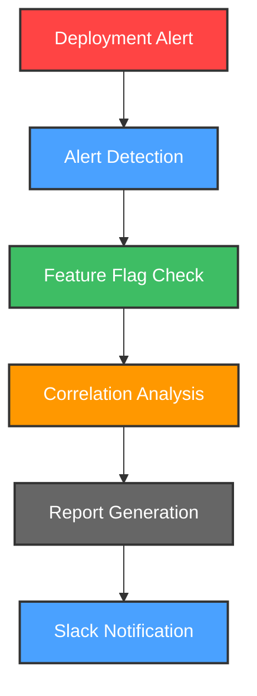
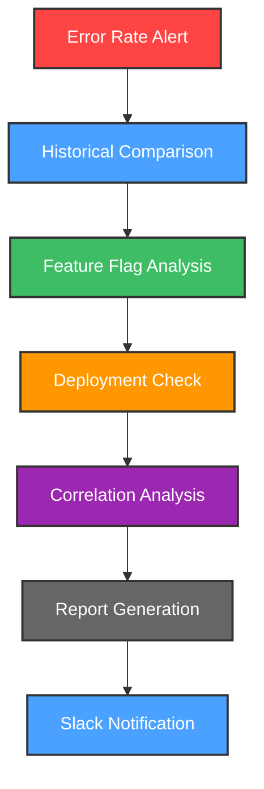

# 🚨 Alert Investigation Assistant

Alert Investigation Assistant is your intelligent companion within the Kubiya platform, designed to automatically correlate and analyze alerts with feature flag changes and deployments. It helps teams quickly identify potential causes of alerts through automated investigation and reporting.


**🎯 Transform your alert response with AI-powered investigation! Automatically analyze alerts, correlate with changes, and get instant insights.**

## 🌟 Features

- 🤖 **AI-Powered Analysis**: Intelligent correlation of alerts with system changes
- 🔍 **Feature Flag Tracking**: Automatic monitoring of feature flag modifications
- 📊 **Deployment Monitoring**: Track and correlate deployment activities
- 📈 **Error Rate Analysis**: Week-over-week error rate comparisons
- 🚨 **Smart Reporting**: Detailed investigation reports with context
- 🔄 **Automated Monitoring**: Continuous scanning of alert channels
- 📱 **Slack Integration**: Real-time notifications and reports

## 🔄 Investigation Flows

### 1. 🔎 Deployment Alert Investigation



### 2. 📊 Error Rate Analysis Flow



## 🛠️ Configuration

Below are the key variables used to configure the Alert Investigation Assistant:

| Variable Name | Description | Type | Default |
|---------------|-------------|------|---------|
| `teammate_name` | Name of the Alert Investigation teammate | `string` | `alert-investigator` |
| `kubiya_runner` | Runner to use for the teammate | `string` | |
| `alert_source_channels` | List of channels to monitor for alerts | `list(string)` | |
| `feature_flags_channels` | Channels for feature flag changes | `list(string)` | |
| `deployment_channel` | Channel for ArgoCD deployment messages | `string` | |
| `report_channel` | Channel where investigation reports are posted | `string` | |
| `lookback_period_hours` | Hours to look back for changes | `number` | `24` |
| `debug_mode` | Enable detailed logging | `bool` | `false` |
| `kubiya_groups_allowed_groups` | Groups allowed to interact | `list(string)` | `["Admin", "Users"]` |

## 🚀 Getting Started

1. **Log into Kubiya Platform**:
   - Visit [app.kubiya.ai](https://app.kubiya.ai)
   - Log in with your credentials

2. **Navigate to Use Cases**:
   - Go to "Teammates" section
   - Click on "Use Cases"
   - Click "Add Use Case"
   - Select "Alert Investigation Assistant"

3. **Configure Settings**:
   Fill in the required fields:
   ```hcl
   module "alert_investigation" {
     source = "path/to/alerts-investigation"
     
     teammate_name = "alert-investigator"
     kubiya_runner = "your-runner"
     
     alert_source_channels = ["#datadog-alerts"]
     feature_flags_channels = ["#feature-flags"]
     deployment_channel = "#deployments"
     report_channel = "#alert-reports"
   }
   ```

4. **Deploy**:
   - Review your configuration
   - Run `terraform init` and `terraform apply`
   - Wait for confirmation

## 📊 Example Reports

### Deployment Failure Investigation
```markdown
## Deployment Failure Alert Investigation
**Alert Details**
- Time: 2024-03-15 14:30 UTC
- Service: payment-service
- Deployment Status: Failed

**Recent Feature Flag Changes**
- EnableNewPaymentFlow: Enabled (14:15 UTC)
- UpdatedAPIVersion: Modified (14:00 UTC)

**Analysis**
- High correlation with payment flow feature flag
- Potential API version compatibility issue
```

### Error Rate Investigation
```markdown
## Error Rate Alert Investigation
**Alert Details**
- Time: 2024-03-15 15:00 UTC
- Service: user-service
- Error Type: 500 Internal Server Error

**Error Rate Comparison**
- Current Week: 0.5%
- Previous Week: 0.1%
- Change: +400%

**Recent Changes**
- Feature Flag Updates: 2
- Deployments: 1 (14:45 UTC)
```

## 📈 Key Benefits

- ⚡ Faster incident response
- 🔍 Automated root cause analysis
- 📊 Comprehensive change tracking
- 🎯 Reduced investigation time
- 📝 Detailed audit trail

---

Ready to streamline your alert investigation process? Deploy your AI assistant today! 🚀

**[Get Started](https://app.kubiya.ai)** | **[Documentation](https://docs.kubiya.ai)** | **[Request Demo](https://kubiya.ai)**

---

*Let Alert Investigation Assistant handle your alert analysis while you focus on resolution! 🔍✨*
