# Confluence Knowledge Assistant

An AI-powered assistant that helps users find answers by intelligently searching through Confluence documentation. The platform enables teams to leverage their existing knowledge base within Confluence spaces through natural language queries.

## 🎯 Overview

The Confluence Knowledge Assistant is designed to:
- Search through Confluence spaces and pages for relevant information
- Provide comprehensive answers based on discovered content
- Include context and references to original Confluence pages
- Handle natural language queries effectively
- Bridge users to knowledge contained in Confluence documentation

## 🏗️ Architecture

```mermaid
flowchart TB
    %% Nodes with icons
    TF["🔧 Terraform Module"]
    VARS["📝 variables.tf"]
    MAIN["⚙️ main.tf"]
    FORM["✨ Kubiya UI Form"]
    CONFIG["🎯 User Configuration"]
    PLAN["👀 Review Changes"]
    DEPLOY["🚀 Deploy Resources"]
    
    %% Kubiya Resources
    ASSISTANT["🤖 Knowledge Assistant"]
    CONFLUENCE_IMPORT["🔍 Confluence Import"]
    KNOWLEDGE_ITEMS["📜 Knowledge Items"]
    
    %% Tool Sources
    TOOLS["⚡ Tool Sources"]
    SLACK_TOOLS["💬 Slack Tools"]
    
    %% Chat Resources
    SLACK["💬 Slack Platform"]
    USER_QUERY["❓ User Question"]
    RESPONSE["✅ AI Response"]
    CONFLUENCE["📚 Confluence"]

    %% Configuration Flow
    subgraph "1️⃣ Setup Phase"
        TF --> |"defines"| VARS
        TF --> |"contains"| MAIN
        VARS --> |"generates"| FORM
        FORM --> |"fill"| CONFIG
        CONFIG --> |"review"| PLAN
        PLAN --> |"apply"| DEPLOY
    end

    %% Resource Creation
    subgraph "2️⃣ Resources"
        DEPLOY --> |"creates"| ASSISTANT
        DEPLOY --> |"enables"| CONFLUENCE_IMPORT
        CONFLUENCE_IMPORT --> |"creates"| KNOWLEDGE_ITEMS
        DEPLOY --> |"configures"| SLACK
    end

    %% Tool Sources
    subgraph "3️⃣ Tools & Actions"
        TOOLS --> SLACK_TOOLS
        ASSISTANT --> |"uses"| TOOLS
        CONFLUENCE --> |"provides content"| CONFLUENCE_IMPORT
    end

    %% Query Flow
    subgraph "4️⃣ Execution"
        USER_QUERY --> |"triggers"| SLACK
        SLACK --> |"activates"| ASSISTANT
        ASSISTANT --> |"searches"| KNOWLEDGE_ITEMS
        KNOWLEDGE_ITEMS --> |"provides context"| ASSISTANT
        ASSISTANT --> |"posts"| RESPONSE
    end

    %% Styling
    classDef setup fill:#e1f5fe,stroke:#01579b,stroke-width:2px,color:black
    classDef resource fill:#f1f8e9,stroke:#33691e,stroke-width:2px,color:black
    classDef tools fill:#6a1b9a,stroke:#4a148c,stroke-width:2px,color:white
    classDef flow fill:#fff3e0,stroke:#e65100,stroke-width:2px,color:black
    
    class TF,VARS,MAIN,FORM,CONFIG,PLAN setup
    class DEPLOY,ASSISTANT,CONFLUENCE_IMPORT,KNOWLEDGE_ITEMS,SLACK resource
    class TOOLS,SLACK_TOOLS,CONFLUENCE tools
    class USER_QUERY,RESPONSE flow
```

## 🚀 Quick Start

### Prerequisites
- Kubiya Platform account
- Confluence instance (Cloud or Server)
- Confluence API token
- Access to target Confluence spaces
- Slack workspace (for interaction)

### Setup Steps
1. **Access Kubiya Platform**
   - Navigate to Use Cases
   - Select "Confluence Knowledge Assistant"

2. **Configure Settings**
   - Provide Confluence URL and credentials
   - Configure source space
   - Set up permissions
   - Define operational boundaries

3. **Review & Deploy**
   - Review the generated configuration
   - Apply to create resources
   - Verify Slack integration

## 🛠️ Features

### Smart Search
- Natural language query processing
- Context-aware search
- Content analysis
- Relevance ranking

### Answer Generation
- Comprehensive response compilation
- Source reference inclusion
- Context preservation
- Clear communication

### Integration
- Confluence space integration
- Content exploration
- Documentation analysis
- Custom tool integration

## 📚 Documentation

For detailed setup instructions and configuration options:
- [Setup Guide](https://docs.kubiya.ai/usecases/confluence-assistant/setup)
- [Configuration Reference](https://docs.kubiya.ai/usecases/confluence-assistant/config)
- [Query Guide](https://docs.kubiya.ai/usecases/confluence-assistant/queries)

## 🤝 Support

Need help? Contact us:
- [Kubiya Support Portal](https://support.kubiya.ai)
- [Community Discord](https://discord.gg/kubiya)
- Email: support@kubiya.ai
