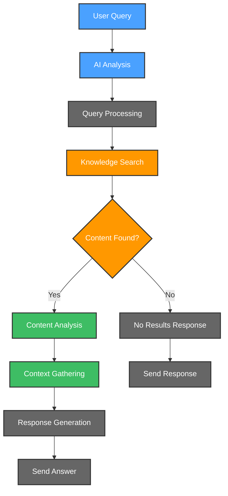

# 🔍 Confluence Knowledge Assistant

Confluence Knowledge Assistant is your intelligent companion within the Kubiya platform, designed to help users find answers by searching through Confluence documentation. It provides AI-driven search and response generation through natural language queries.

**🎯 Transform your team's knowledge discovery with AI-powered search! Find answers, context, and insights from your Confluence documentation through intuitive queries.**

## 🌟 Features

- 🤖 **AI-Powered Search**: Natural language processing for intelligent query understanding
- 📊 **Comprehensive Search**: Searches across multiple Confluence spaces simultaneously
- 🔄 **Context Preservation**: Maintains documentation context in responses
- 📈 **Relevance Ranking**: Prioritizes most relevant information
- 🚨 **Clear Communication**: Indicates when information cannot be found
- 🛡️ **Source References**: Links back to original Confluence pages
- 🔍 **Content Analysis**: Deep dive into documentation content
- 📚 **Multi-Space Support**: Search across one or multiple Confluence spaces

## 🔄 User Flows

### 1. 💬 Query Flow

## 🛠️ Configuration

Below are the key variables used to configure the Confluence Knowledge Assistant:

| Variable Name | Description | Type | Default |
|---------------|-------------|------|---------|
| `teammate_name` | Name of the Knowledge Assistant | `string` | `ask-kubiya` |
| `kubiya_runner` | Runner to use for the teammate | `string` | |
| `confluence_url` | URL of your Confluence instance | `string` | |
| `confluence_username` | Username for Confluence authentication | `string` | |
| `confluence_api_token` | API token for Confluence authentication | `string` | |
| `confluence_space_keys` | List of Confluence space keys to search (e.g., `["DOCS", "TECH"]` or `["SINGLE"]`) | `list(string)` | |
| `kubiya_groups_allowed_groups` | Groups allowed to interact with the teammate | `list(string)` | `['Admin', 'Users']` |
| `import_confluence_blogs` | Whether to import blog posts from Confluence | `bool` | `true` |
| `debug_mode` | Enable detailed debugging output | `bool` | `true` |

## 🚀 Getting Started

1. **Log into Kubiya Platform**:
   - Visit [app.kubiya.ai](https://app.kubiya.ai)
   - Log in with your credentials

2. **Navigate to Use Cases**:
   - Go to "Teammates" section
   - Click on "Use Cases"
   - Click "Add Use Case"
   - Select "Confluence Knowledge Assistant"

3. **Configure Settings**:
   Fill in the required fields:
   - Teammate Name
   - Kubiya Runner
   - Confluence URL
   - Confluence Username
   - Confluence API Token
   - **Confluence Space Keys** (can specify one or multiple spaces):
     - Single space: `["DOCS"]`
     - Multiple spaces: `["DOCS", "TECH", "POLICIES"]`
   - Allowed Groups
   - Debug Mode

4. **Deploy**:
   - Review your configuration
   - Click "Deploy Use Case"
   - Wait for confirmation

## 🎭 Example Scenarios

### Scenario 1: Single Space Search

**Configuration**: `confluence_space_keys = ["TECH"]`

1. **Query**: User asks "How do we deploy to production?"
2. **Search**: Assistant searches the TECH Confluence space
3. **Analysis**: Finds relevant deployment documentation
4. **Response**: Provides answer with links to original Confluence pages

### Scenario 2: Multi-Space Policy Search

**Configuration**: `confluence_space_keys = ["HR", "POLICIES", "LEGAL"]`

1. **Query**: "What's our policy on remote work?"
2. **Search**: Searches across HR, POLICIES, and LEGAL spaces
3. **Analysis**: Compiles information from multiple spaces and pages
4. **Response**: Delivers comprehensive policy summary with sources from different spaces

### Scenario 3: Comprehensive Documentation Search

**Configuration**: `confluence_space_keys = ["DOCS", "TECH", "ONBOARDING", "FAQ"]`

1. **Query**: "How do I set up my development environment?"
2. **Search**: Searches across all specified spaces for setup information
3. **Analysis**: Finds setup guides, FAQs, and troubleshooting info
4. **Response**: Provides comprehensive setup instructions with references

## 📊 Key Benefits

- ⚡ Quick access to documentation across multiple spaces
- 🔒 Preserved documentation context
- 📈 Improved team knowledge sharing
- 🎯 Accurate answer finding across all your knowledge sources
- 📝 Source references included with space identification
- 🚀 Flexible configuration (single or multiple spaces)

---

Ready to transform your team's knowledge discovery? Deploy your Confluence Knowledge Assistant today! 🚀

**[Get Started](https://app.kubiya.ai)** | **[Documentation](https://docs.kubiya.ai)** | **[Request Demo](https://kubiya.ai)**

---

*Let Confluence Knowledge Assistant help your team find the answers they need across all your spaces! 🔍✨*
