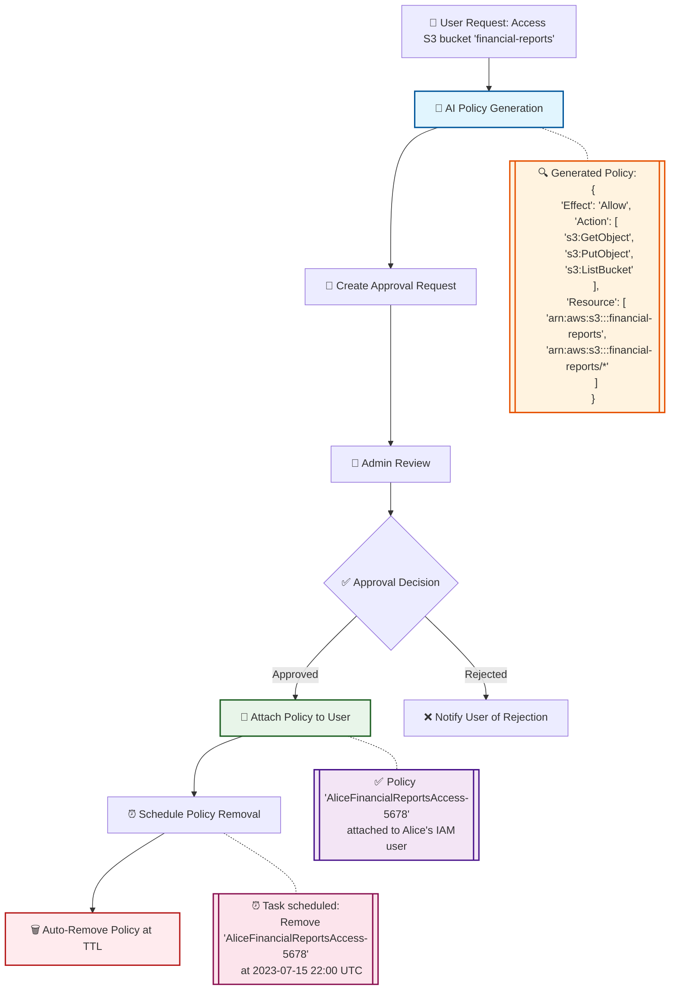

# 🚀 Dynamic AWS IAM Policy Management Workflow

## 🌟 Introduction

This project revolutionizes AWS access management using Kubiya.ai. It provides AI-driven, secure, and efficient temporary access to AWS resources.

## 🔄 Workflow Example

Here's how Alice, a developer, requests access to an S3 bucket:

# 🚶‍♀️ Step-by-Step Breakdown:

## 🙋 User Request

Action: Alice requests access to the 'financial-reports' S3 bucket.
Method: Slack command /request-aws-access

## 🧠 AI Policy Generation

Action: AI creates a least-privilege policy based on the request.
Output: JSON policy allowing specific S3 actions on the 'financial-reports' bucket.

## 📝 Create Approval Request

Action: System logs the request with a unique ID.
Purpose: Tracking and admin notification.

## 👀 Admin Review

Action: Admin (Bob) receives a Slack notification with request details.
Decision: Approve or reject the request.

## ✅ Approval Decision

If Approved: Proceed to policy attachment.
If Rejected: Notify user of rejection.

## 🔗 Attach Policy to User

Action: System creates and attaches the policy to Alice's IAM user.
Result: Alice gains temporary access to the S3 bucket.

## ⏰ Schedule Policy Removal

Action: System schedules a task to remove the policy after the specified duration.

## 🗑️ Auto-Remove Policy at TTL

Action: System automatically detaches and deletes the policy when TTL expires.
Result: Alice's temporary access is revoked.

## 🛠️ Key Components

📥 request_access Tool: Handles user requests and triggers AI policy generation.
👍 approve_request Tool: Manages the admin approval process.
🔒 attach_policy_to_user Tool: Creates and attaches approved policies.
🔓 remove-customer-managed-policy-from-sso Tool: Handles automatic policy removal.

## 🌟 Features

🤖 AI-powered policy generation
👥 Slack-integrated approval workflow
⏳ Auto-expiring access
💬 Real-time Slack notifications
🗄️ Comprehensive request tracking
☁️ Seamless AWS IAM and SSO integration
