# ChatOps Operations Platform

An AI-powered platform that streamlines operations through natural language chat interfaces. The platform enables teams to monitor, troubleshoot, and manage infrastructure and applications directly from their chat tools.

## 🎯 Overview

The ChatOps Operations Platform is designed to:
- Enable infrastructure and application management through chat interfaces
- Automate routine operational tasks via natural language commands
- Provide real-time system monitoring and alerting in chat
- Streamline team collaboration around operational issues
- Integrate with existing tools and workflows

## 🏗️ Architecture

```mermaid
flowchart TB
    %% Nodes with icons
    TF["🔧 Terraform Module"]
    VARS["📝 variables.tf"]
    MAIN["⚙️ main.tf"]
    FORM["✨ Kubiya UI Form"]
    CONFIG["🎯 User Configuration"]
    PLAN["👀 Review Changes"]
    DEPLOY["🚀 Deploy Resources"]
    
    %% Kubiya Resources
    TEAMMATE["🤖 ChatOps Bot"]
    WEBHOOK["📡 Event Listener"]
    KB["📚 Knowledge Base"]
    
    %% Tool Sources
    TOOLS["⚡ Tool Sources"]
    CHAT_TOOLS["💬 Chat Platform Tools"]
    INFRA_TOOLS["🏗️ Infrastructure Tools"]
    SECRETS["🔐 Secrets Store"]
    
    %% Chat Resources
    CHAT_PLATFORM["💬 Chat Platform"]
    USER_REQUEST["📝 User Command"]
    RESPONSE["🔄 Automated Response"]
    PLATFORM_API["🔌 Platform API"]

    %% Configuration Flow
    subgraph "1️⃣ Setup Phase"
        TF --> |"defines"| VARS
        TF --> |"contains"| MAIN
        VARS --> |"generates"| FORM
        FORM --> |"fill"| CONFIG
        CONFIG --> |"review"| PLAN
        PLAN --> |"apply"| DEPLOY
    end

    %% Resource Creation
    subgraph "2️⃣ Resources"
        DEPLOY --> |"creates"| TEAMMATE
        DEPLOY --> |"creates"| WEBHOOK
        DEPLOY --> |"creates"| KB
        DEPLOY --> |"configures"| CHAT_PLATFORM
        DEPLOY --> |"provisions"| SECRETS
    end

    %% Tool Sources
    subgraph "3️⃣ Tools & Actions"
        TOOLS --> CHAT_TOOLS
        TOOLS --> INFRA_TOOLS
        TEAMMATE --> |"uses"| TOOLS
        SECRETS --> |"authenticates"| CHAT_TOOLS
        CHAT_TOOLS --> |"interacts"| PLATFORM_API
    end

    %% Event Flow
    subgraph "4️⃣ Execution"
        USER_REQUEST --> |"triggers"| CHAT_PLATFORM
        CHAT_PLATFORM --> |"notifies"| WEBHOOK
        WEBHOOK --> |"activates"| TEAMMATE
        KB --> |"assists"| TEAMMATE
        TEAMMATE --> |"posts"| RESPONSE
    end

    %% Styling
    classDef setup fill:#e1f5fe,stroke:#01579b,stroke-width:2px,color:black
    classDef resource fill:#f1f8e9,stroke:#33691e,stroke-width:2px,color:black
    classDef tools fill:#6a1b9a,stroke:#4a148c,stroke-width:2px,color:white
    classDef event fill:#fff3e0,stroke:#e65100,stroke-width:2px,color:black
    
    class TF,VARS,MAIN,FORM,CONFIG,PLAN setup
    class DEPLOY,TEAMMATE,WEBHOOK,KB,CHAT_PLATFORM,SECRETS resource
    class TOOLS,CHAT_TOOLS,INFRA_TOOLS,PLATFORM_API tools
    class USER_REQUEST,RESPONSE event
```

## 🚀 Quick Start

### Prerequisites
- Kubiya Platform account
- Slack, Microsoft Teams, or Discord workspace
- Infrastructure access credentials
- API tokens for services to be managed

### Setup Steps
1. **Access Kubiya Platform**
   - Navigate to Use Cases
   - Select "ChatOps Operations Platform"

2. **Configure Settings**
   - Provide chat platform tokens
   - Configure infrastructure credentials
   - Set up command prefixes and permissions
   - Define operational boundaries

3. **Review & Deploy**
   - Review the generated configuration
   - Apply to create resources
   - Verify chat integration

## 🛠️ Features

### Command & Control
- Natural language infrastructure management
- Multi-step operational workflows
- Role-based access controls
- Command confirmation and approval workflows

### Monitoring & Alerting
- Real-time system metrics in chat
- Intelligent alert routing
- Alert context and impact assessment
- Interactive troubleshooting

### Integration & Automation
- Terraform, AWS, GCP, Azure integration
- Kubernetes cluster management
- CI/CD pipeline control
- Custom tool integration

## 📚 Documentation

For detailed setup instructions and configuration options:
- [Setup Guide](https://docs.kubiya.ai/usecases/chatops/setup)
- [Configuration Reference](https://docs.kubiya.ai/usecases/chatops/config)
- [Command Reference](https://docs.kubiya.ai/usecases/chatops/commands)

## 🤝 Support

Need help? Contact us:
- [Kubiya Support Portal](https://support.kubiya.ai)
- [Community Discord](https://discord.gg/kubiya)
- Email: support@kubiya.ai
