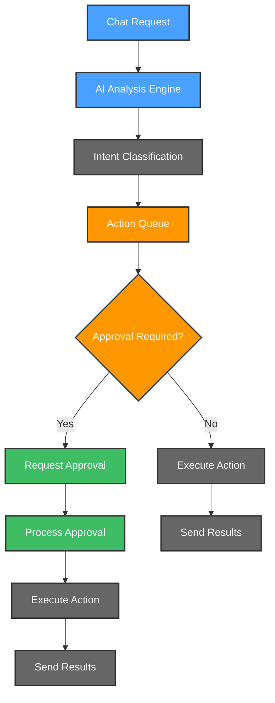
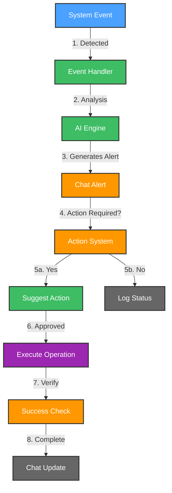

# 🚀 ChatOps Automation Team

ChatOps Automation Team is your intelligent companion within the Kubiya platform, designed to revolutionize operations through chat interfaces. It provides AI-driven automation, monitoring, and management of your infrastructure and services through natural language conversations.

**🎯 Transform your operations with AI-powered ChatOps! Automate tasks, troubleshoot issues, and manage infrastructure through intuitive conversations.**

## 🌟 Features

- 🤖 **AI-Powered Chat Interface**: Natural language processing for intuitive operations
- 📊 **Multi-Platform Support**: Slack, Teams, Discord, and other chat platforms
- 🔄 **Automated Operations**: Infrastructure provisioning and management through chat
- 📈 **Performance Monitoring**: System health checks and alerts via chat interface
- 🚨 **Smart Alerting**: Intelligent notifications with context and suggested actions
- 🛡️ **Security Operations**: Automated security checks and remediation through chat
- 🔍 **Infrastructure Visibility**: Query and visualize infrastructure status in chat

## 🔄 User Flows

### 1. 💬 ChatOps Request Flow

### 2. 🔐 Automated Operations Flow

## 🛠️ Configuration

Below are the key variables used to configure the ChatOps Automation Team:

| Variable Name | Description | Type | Default |
|---------------|-------------|------|---------|
| `teammate_name` | Name of the ChatOps teammate | `string` | |
| `kubiya_runner` | Runner to use for the teammate | `string` | |
| `chat_platforms` | Comma-separated list of chat platforms to integrate | `string` | |
| `notification_channel` | Channel for system alerts | `string` | `""` |
| `command_prefix` | Prefix for chat commands (e.g., !, /, $) | `string` | `!` |
| `kubiya_groups_allowed_groups` | Groups allowed to interact with the teammate (e.g., ['Admin', 'DevOps']). | `list(string)` | `['Admin'] ` |

## 🚀 Getting Started

1. **Log into Kubiya Platform**:
   - Visit [app.kubiya.ai](https://app.kubiya.ai)
   - Log in with your credentials

2. **Navigate to Use Cases**:
   - Go to "Teammates" section
   - Click on "Use Cases"
   - Click "Add Use Case"
   - Select "ChatOps Automation Team"

3. **Configure Settings**:
   Fill in the required fields:
   - Teammate Name (e.g., "ops-bot")
   - Kubiya Runner
   - Chat Platforms
   - Notification Channel
   - GitHub Token
   - Slack Token
   - Command Prefix
   - Allowed groups

4. **Deploy**:
   - Review your configuration
   - Click "Deploy Use Case"
   - Wait for confirmation

## 🎭 Example Scenarios

### Scenario 1: Infrastructure Provisioning

1. **Request**: User asks "Deploy new dev environment"
2. **Processing**: AI understands intent and parameters
3. **Execution**: Creates Terraform plan
4. **Approval**: Shows plan and waits for approval
5. **Deployment**: Executes plan and reports back

### Scenario 2: Incident Response

1. **Alert**: System reports high CPU usage
2. **Analysis**: ChatOps bot analyzes cause
3. **Notification**: Sends alert with context
4. **Resolution**: Suggests scaling action
5. **Execution**: Applies fix with approval

## 📊 Key Benefits

- ⚡ Reduced operational overhead
- 🔒 Secure operations through chat
- 📈 Improved team productivity
- 🎯 Contextual automation
- 📝 Complete audit trail of all actions

---

Ready to revolutionize your operations with ChatOps? Deploy your AI teammate today! 🚀

**[Get Started](https://app.kubiya.ai)** | **[Documentation](https://docs.kubiya.ai)** | **[Request Demo](https://kubiya.ai)**

---

*Let ChatOps Automation Team handle your operations while you focus on innovation! 💬✨* 
