# CI/CD Maintainer V2

An AI-powered teammate that helps diagnose and fix GitHub Actions workflow failures. The maintainer monitors your repositories for failed workflows, analyzes the failures, and provides detailed solutions directly in your pull requests.

## 🎯 Overview

The CI/CD Maintainer is designed to:
- Monitor GitHub Actions workflows for failures
- Analyze logs and error patterns
- Provide detailed root cause analysis
- Suggest fixes with code examples
- Comment solutions directly on PRs

## 🏗️ Architecture

```mermaid
flowchart TB
    %% Nodes with icons
    TF["🔧 Terraform Module"]
    VARS["📝 variables.tf"]
    MAIN["⚙️ main.tf"]
    FORM["✨ Kubiya UI Form"]
    CONFIG["🎯 User Configuration"]
    PLAN["👀 Review Changes"]
    DEPLOY["🚀 Deploy Resources"]
    
    %% Kubiya Resources
    TEAMMATE["🤖 CI/CD Maintainer"]
    WEBHOOK["📡 Event Listener"]
    KB["📚 Knowledge Base"]
    
    %% Tool Sources
    TOOLS["⚡ Tool Sources"]
    GH_TOOLS["🛠️ GitHub Tools"]
    DIAG_TOOLS["📊 Diagram Tools"]
    SECRETS["🔐 Secrets Store"]
    
    %% GitHub Resources
    GHWH["🔗 GitHub Webhooks"]
    PR["❌ Failed Workflow"]
    SOLUTION["💬 Analysis & Fix"]
    GH_API["🐙 GitHub API"]

    %% Configuration Flow
    subgraph "1️⃣ Setup Phase"
        TF --> |"defines"| VARS
        TF --> |"contains"| MAIN
        VARS --> |"generates"| FORM
        FORM --> |"fill"| CONFIG
        CONFIG --> |"review"| PLAN
        PLAN --> |"apply"| DEPLOY
    end

    %% Resource Creation
    subgraph "2️⃣ Resources"
        DEPLOY --> |"creates"| TEAMMATE
        DEPLOY --> |"creates"| WEBHOOK
        DEPLOY --> |"creates"| KB
        DEPLOY --> |"configures"| GHWH
        DEPLOY --> |"provisions"| SECRETS
    end

    %% Tool Sources
    subgraph "3️⃣ Tools & Actions"
        TOOLS --> GH_TOOLS
        TOOLS --> DIAG_TOOLS
        TEAMMATE --> |"uses"| TOOLS
        SECRETS --> |"authenticates"| GH_TOOLS
        GH_TOOLS --> |"interacts"| GH_API
    end

    %% Event Flow
    subgraph "4️⃣ Execution"
        PR --> |"triggers"| GHWH
        GHWH --> |"notifies"| WEBHOOK
        WEBHOOK --> |"activates"| TEAMMATE
        KB --> |"assists"| TEAMMATE
        TEAMMATE --> |"posts"| SOLUTION
    end

    %% Styling
    classDef setup fill:#e1f5fe,stroke:#01579b,stroke-width:2px,color:black
    classDef resource fill:#f1f8e9,stroke:#33691e,stroke-width:2px,color:black
    classDef tools fill:#6a1b9a,stroke:#4a148c,stroke-width:2px,color:white
    classDef event fill:#fff3e0,stroke:#e65100,stroke-width:2px,color:black
    
    class TF,VARS,MAIN,FORM,CONFIG,PLAN setup
    class DEPLOY,TEAMMATE,WEBHOOK,KB,GHWH,SECRETS resource
    class TOOLS,GH_TOOLS,DIAG_TOOLS,GH_API tools
    class PR,SOLUTION event
```

## 🚀 Quick Start

### Prerequisites
- Kubiya Platform account
- GitHub repositories with Actions workflows
- GitHub Personal Access Token with required permissions

### Setup Steps
1. **Access Kubiya Platform**
   - Navigate to Use Cases
   - Select "CI/CD Maintainer V2"

2. **Configure Settings**
   - Provide GitHub token
   - Select repositories to monitor
   - Configure Slack notifications
   - Set event monitoring preferences

3. **Review & Deploy**
   - Review the generated configuration
   - Apply to create resources
   - Verify webhook setup

## 🛠️ Features

### Automated Analysis
- Real-time workflow failure detection
- Log analysis and pattern recognition
- Root cause identification
- Performance bottleneck detection

### Smart Solutions
- Contextual fix recommendations
- Code examples and snippets
- Best practice suggestions
- Security improvement tips

### Integration & Tools
- GitHub Actions integration
- Slack notifications
- Custom organizational knowledge base
- Secure secrets management

## 📚 Documentation

For detailed setup instructions and configuration options:
- [Setup Guide](https://docs.kubiya.ai/usecases/cicd-maintainer/setup)
- [Configuration Reference](https://docs.kubiya.ai/usecases/cicd-maintainer/config)
- [Tool Documentation](https://docs.kubiya.ai/usecases/cicd-maintainer/tools)

## 🤝 Support

Need help? Contact us:
- [Kubiya Support Portal](https://support.kubiya.ai)
- [Community Discord](https://discord.gg/kubiya)
- Email: support@kubiya.ai
