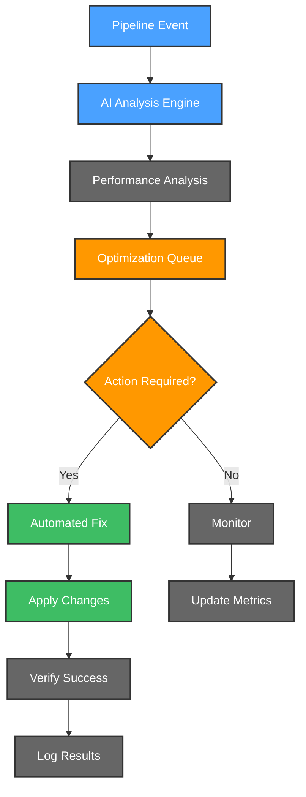
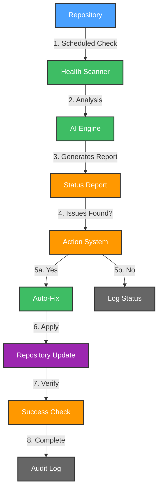

# 🚀 CI/CD Maintainers Crew

CI/CD Maintainers Crew is your intelligent companion within the Kubiya platform, designed to revolutionize CI/CD and source control management. It provides AI-driven monitoring, optimization, and maintenance of your CI/CD pipelines and repositories across multiple platforms.


**🎯 Transform your CI/CD management with AI-powered insights and automated maintenance! Keep your pipelines efficient and repositories well-maintained.**

## 🌟 Features

- 🤖 **AI Pipeline Analysis**: Intelligent analysis of CI/CD failures and bottlenecks
- 📊 **Multi-Platform Support**: GitHub, GitLab, and other source control platforms
- 🔄 **Automated Maintenance**: Automated dependency updates and security fixes
- 📈 **Performance Tracking**: Pipeline performance metrics and optimization
- 🚨 **Smart Alerts**: Real-time notifications for pipeline failures
- 🛡️ **Security Scanning**: Continuous security assessment of pipelines
- 🔍 **Repository Health**: Monitoring and maintenance of repository health

## 🔄 User Flows

### 1. ���� Pipeline Analysis & Optimization Flow



### 2. 🔐 Repository Maintenance Flow



## 🛠️ Configuration

Below are the key variables used to configure the CI/CD Maintainers Crew:

| Variable Name | Description | Type | Default |
|---------------|-------------|------|---------|
| `teammate_name` | Name of the CI/CD Maintainers teammate | `string` | |
| `kubiya_runner` | Runner to use for the teammate | `string` | |
| `repositories` | Comma-separated list of repositories to monitor | `string` | |
| `pipeline_notification_channel` | Channel for pipeline alerts | `string` | `""` |
| `webhook_filter` | JMESPath filter expressions for GitHub webhook events. See https://jmespath.org for syntax. | `string` | `workflow_run.conclusion != null && workflow_run.conclusion != 'success' && workflow_run.conclusion != 'cancelled'` |
| `kubiya_groups_allowed_groups` | Groups allowed to interact with the teammate (e.g., ['Admin', 'DevOps']). | `list(string)` | `['Admin'] ` |

## 🚀 Getting Started

1. **Log into Kubiya Platform**:
   - Visit [app.kubiya.ai](https://app.kubiya.ai)
   - Log in with your credentials

2. **Navigate to Use Cases**:
   - Go to "Teammates" section
   - Click on "Use Cases"
   - Click "Add Use Case"
   - Select "CI/CD Maintainers Crew"

3. **Configure Settings**:
   Fill in the required fields:
   - Teammate Name (e.g., "cicd-crew")
   - Kubiya Runner
   - Repository List
   - Notification Channel
   - Github Token
   - Webhook filter
   - Allowd groups

4. **Deploy**:
   - Review your configuration
   - Click "Deploy Use Case"
   - Wait for confirmation

## 🎭 Example Scenarios

### Scenario 1: Pipeline Optimization

1. **Detection**: CI/CD crew detects slow pipeline
2. **Analysis**: AI analyzes bottlenecks
3. **Optimization**: Suggests improvements
4. **Implementation**: Applies approved changes
5. **Verification**: Monitors improvement

### Scenario 2: Security Vulnerability

1. **Detection**: Security scan finds vulnerability
2. **Assessment**: AI evaluates impact
3. **Resolution**: Generates fix
4. **Review**: Team approves fix
5. **Implementation**: Applies security patch

## 📊 Key Benefits

- ⚡ Reduced pipeline maintenance overhead
- 🔒 Enhanced security monitoring
- 📈 Improved pipeline performance
- 🎯 Automated issue resolution
- 📝 Comprehensive audit trail

---

Ready to revolutionize your CI/CD management? Deploy your AI crew today! 🚀

**[Get Started](https://app.kubiya.ai)** | **[Documentation](https://docs.kubiya.ai)** | **[Request Demo](https://kubiya.ai)**

---

*Let CI/CD Maintainers Crew handle your pipeline management while maintaining security! 🔐✨*

# CI/CD Maintainer Terraform Module

This Terraform module deploys and configures a CI/CD Maintainer agent in Kubiya to monitor GitHub workflow runs and provide automated analysis of failures.

## Features

- **GitHub Webhook Management**: Automatically sets up webhooks for monitoring GitHub workflow runs
- **Repository Discovery**: Can dynamically discover all repositories in an organization if none are specified
- **Validation**: Validates access to repositories before attempting to create webhooks
- **Webhook Filtering**: Configurable filtering of webhook events based on various conditions

## Usage

```hcl
module "cicd_maintainer" {
  source = "path/to/module"

  # Required variables
  GITHUB_TOKEN        = var.github_token
  github_organization = "my-github-org"
  teammate_name       = "cicd-crew-myteam"
  notification_channel = "#devops"
  
  # Repository configuration - choose one of these approaches:
  
  # Option 1: Provide specific repositories to monitor (without organization prefix)
  repositories        = "repo1,repo2,repo3"
  
  # Option 2: Use automatic repository discovery (leave repositories empty)
  repositories        = ""
  
  # Optional configuration
  kubiya_runner       = "gcp-no-vcluster"
  debug_mode          = false
  monitor_failed_runs_only = true
}
```

## Repository Management

The module handles repository management in two ways:

### 1. Specified Repositories

When you provide the `repositories` variable as a comma-separated list:
- Repositories should be specified without the organization prefix
- The module will automatically add the organization prefix using the `github_organization` variable
- Example: `"repo1,repo2,repo3"` (when `github_organization` is set to "myorg")
- The module validates access to each repository
- It will skip any inaccessible repositories instead of failing
- Webhooks are created only for valid repositories

### 2. Dynamic Repository Discovery

When you don't provide the `repositories` variable (empty string):
- The module queries the GitHub API to discover all repositories in the organization
- Webhooks are created for all discovered repositories

## Authentication

The module requires a GitHub token with appropriate permissions:
- For public repositories: `public_repo` scope
- For private repositories: `repo` scope
- For organization-wide access: `repo` and `admin:org_hook` scopes

## Validation Process

The module uses HTTP requests to validate access to repositories before creating webhooks. This happens through:

1. An HTTP request is made to the GitHub API for each repository
2. Only repositories that return a 200 status code are considered valid
3. Webhooks are created only for valid repositories
4. This approach is more reliable than using the GitHub provider's data sources, as it avoids issues with repositories missing license files or other metadata

### Handling Invalid Repositories

When a repository in your list doesn't exist or can't be accessed:

1. The module will automatically skip it and only create webhooks for valid repositories
2. An output named `invalid_repositories` will list all repositories that failed validation
3. This allows you to identify and fix any issues with repository names or access permissions
4. The module will continue to operate normally with the repositories that are valid

### Pre-Validation Script

The module includes a validation script that you can run before applying Terraform to check if your GitHub token has the necessary permissions:

```bash
# Validate token only (when using dynamic repository discovery)
./scripts/validate_github_token.sh <GITHUB_TOKEN>

# Validate token and specific repositories
./scripts/validate_github_token.sh <GITHUB_TOKEN> "org/repo1,org/repo2,org/repo3"
```

This script will:
- Verify the token is valid
- Check token scopes for necessary permissions
- Test access to each repository (if specified)
- Verify admin permissions required for webhook creation

It's recommended to run this script before applying Terraform to avoid failures during the apply phase.

## Webhook Configuration

Webhooks are configured to listen for:
- `check_run` events
- `workflow_run` events

The webhook filter can be customized to monitor:
- Failed runs only (via `monitor_failed_runs_only`)
- PR workflow runs (via `monitor_pr_workflow_runs`)
- Push workflow runs (via `monitor_push_workflow_runs`)
- Specific branches (via `enable_branch_filter` and `head_branch_filter`) 
