# 🚨 Datadog Incident Response

An AI-powered incident response automation system that transforms Datadog alerts into comprehensive investigations and actionable insights. Seamlessly integrates with your existing monitoring and communication workflows.

## 🎯 Overview

The Datadog Incident Response module provides:
- Real-time automated incident investigation using AI agents
- Comprehensive Kubernetes cluster analysis and diagnostics
- Executive-level incident summaries for stakeholders
- Seamless Slack integration with interactive response options
- Multi-region deployment support with topology awareness

## 🏗️ Architecture

```mermaid
flowchart TB
    %% External Systems
    DD["🐕 Datadog Monitor"]
    SLACK["💬 Slack Workspace"]
    K8S["☸️ Kubernetes Cluster"]
    
    %% Core Components
    WEBHOOK["📡 Kubiya Webhook"]
    AGENT["🤖 AI Investigation Agent"]
    WORKFLOW["⚙️ Response Workflow"]
    
    %% Investigation Tools
    KUBECTL["⚡ kubectl Tools"]
    MONITOR["📊 Monitoring Tools"]
    TLS["🔐 TLS Checker"]
    
    %% Output Components
    SUMMARY["📋 Executive Summary"]
    REPORT["📈 Technical Report"]
    BUTTONS["🎯 Action Buttons"]

    %% Flow Connections
    DD -->|"Alert Triggered"| WEBHOOK
    WEBHOOK -->|"Activates"| WORKFLOW
    WORKFLOW -->|"Deploys"| AGENT
    
    AGENT -->|"Investigates"| K8S
    AGENT -->|"Uses"| KUBECTL
    AGENT -->|"Uses"| MONITOR  
    AGENT -->|"Uses"| TLS
    
    AGENT -->|"Generates"| SUMMARY
    AGENT -->|"Creates"| REPORT
    AGENT -->|"Provides"| BUTTONS
    
    SUMMARY -->|"Posts to"| SLACK
    REPORT -->|"Posts to"| SLACK
    BUTTONS -->|"Posts to"| SLACK

    %% Styling
    classDef external fill:#e3f2fd,stroke:#1976d2,stroke-width:2px,color:black
    classDef core fill:#f1f8e9,stroke:#388e3c,stroke-width:2px,color:black  
    classDef tools fill:#fff3e0,stroke:#f57c00,stroke-width:2px,color:black
    classDef output fill:#fce4ec,stroke:#c2185b,stroke-width:2px,color:black
    
    class DD,SLACK,K8S external
    class WEBHOOK,AGENT,WORKFLOW core
    class KUBECTL,MONITOR,TLS tools
    class SUMMARY,REPORT,BUTTONS output
```



## Usage

```hcl
module "incident_response" {
  source = "./terraform-modules/datadog_incident_response/terraform"

  # Required variables
  datadog_api_key = var.datadog_api_key
  datadog_app_key = var.datadog_app_key
  kubiya_api_key  = var.kubiya_api_key
  region          = "na"  # or "eu"
  agent_uuid      = "your-kubiya-agent-uuid"

  # Slack configuration
  notification_channels = "#incident-alerts"
  escalation_channel   = "#sre-escalation"

  # Environment configuration
  dd_environment  = "production"
  k8s_environment = "prod-cluster"

  # Optional: Custom cluster topology context
  cluster_topology_context = "Your custom cluster description..."
}
```

## Cluster Topology Context

The module includes built-in cluster topology context optimized for production Kubernetes environments:

- **External Gateway**: `ingress-nginx` namespace (NGINX Ingress Controller)
- **Internal Gateway**: `internal-gateway` namespace  
- **Application Layer**: `app` namespace (all microservices)
- **Core Infrastructure**: `kube-system` (DNS, metrics)
- **Observability**: `logging-system`, `datadog` namespaces
- **Supporting Services**: `cert-manager`, `argo`, `argo-rollouts`, `kafka-app`

### Key Service Groups
- **Core Services**: user-service, auth-service, api-gateway
- **Data Services**: database-service, cache-service, messaging-service

## Investigation Workflow

1. **Incident Detection**: Datadog triggers webhook on incident creation
2. **Workflow Initialization**: Kubiya receives incident details and starts investigation
3. **Slack Notification**: Initial investigation start message posted
4. **AI Investigation**: Cluster health, service status, TLS certificates, resource utilization
5. **Executive Summary**: AI generates business-focused incident summary
6. **Results Delivery**: Comprehensive investigation results posted to Slack with follow-up buttons

## Key Variables

| Variable | Description | Default |
|----------|-------------|---------|
| `datadog_api_key` | Datadog API key | Required |
| `datadog_app_key` | Datadog application key | Required |
| `kubiya_api_key` | Kubiya API key | Required |
| `region` | Deployment region (na, eu) | Required |
| `agent_uuid` | Kubiya agent UUID | Required |
| `notification_channels` | Slack channels for notifications | `#incident-alerts` |
| `escalation_channel` | Slack channel for escalation | `#sre-escalation` |
| `investigation_timeout` | Investigation timeout (seconds) | `1800` |
| `cluster_topology_context` | Custom cluster context | Built-in context |

## Outputs

| Output | Description |
|--------|-------------|
| `webhook_id` | Datadog webhook ID |
| `webhook_url` | Kubiya webhook URL |
| `service_definition_id` | Datadog service definition ID |
| `workflow_name` | Generated workflow name |

## Prerequisites

1. **Datadog Account**: API and App keys with webhook permissions
2. **Kubiya Account**: API key and configured agent with kubectl access
3. **Slack Integration**: Kubiya agent configured with Slack access
4. **Kubernetes Access**: Agent must have cluster access for investigations

## Example terraform.tfvars

```hcl
# Datadog Configuration
datadog_api_key = "your-datadog-api-key"
datadog_app_key = "your-datadog-app-key"

# Kubiya Configuration  
kubiya_api_key = "your-kubiya-api-key"
agent_uuid     = "your-agent-uuid"

# Deployment Configuration
region          = "na"
dd_environment  = "production"
k8s_environment = "prod-cluster"

# Slack Configuration
notification_channels = "#incident-alerts"
escalation_channel   = "#sre-escalation"

# Service Configuration
incident_owner = "sre"
team_name     = "sre"
```

## Advanced Configuration

### Custom Investigation Prompt

The module supports customizing the AI investigation approach by modifying the cluster topology context or extending the workflow template.

### Multi-Region Deployment

Deploy separate instances for different regions:

```hcl
module "incident_response_na" {
  source = "./terraform-modules/datadog_incident_response/terraform"
  region = "na"
  # ... other config
}

module "incident_response_eu" {
  source = "./terraform-modules/datadog_incident_response/terraform"  
  region = "eu"
  # ... other config
}
```

## Troubleshooting

### Common Issues

1. **Webhook Not Triggering**: Check Datadog webhook configuration and API keys
2. **Agent Timeout**: Increase `investigation_timeout` for complex investigations
3. **Slack Notifications Missing**: Verify agent Slack integration and channel permissions
4. **JSON Parse Errors**: Ensure cluster topology context is single-line format

### Debug Mode

Enable verbose logging by setting environment variables in your Kubiya agent configuration.

## Contributing

1. Fork the repository
2. Create a feature branch
3. Make your changes
4. Test with `terraform plan` and `terraform apply`
5. Submit a pull request

## License

This module is licensed under the MIT License. See LICENSE file for details.