# 🎫 JIRA Crew

JIRA Crew is your intelligent companion within the Kubiya platform, designed to automate and enhance JIRA ticket management. It provides a comprehensive solution for automated ticket resolution, intelligent prioritization, and seamless team notifications, ensuring your JIRA boards stay organized and efficient 24/7.


**🎯 Transform your JIRA operations with an AI team that resolves tickets while you sleep! Let your human team focus on complex issues while JIRA Crew handles the routine tasks.**

## 🌟 Features

- 🤖 **Automated Resolution**: Instant handling of routine tickets
- 📊 **Smart Prioritization**: Intelligent sorting of incoming issues
- 🎯 **Custom Workflows**: Tailored actions for different ticket types
- 📢 **Smart Notifications**: Slack alerts for human intervention
- 📈 **Analytics & Insights**: Track resolution patterns and success rates
- 📋 **Queue Management**: Organized handling of ticket backlogs
- 🔄 **Continuous Learning**: Improves resolution accuracy over time

## 🔄 User Flows

### 1. 🎫 Automated Ticket Resolution

```mermaid
graph TD
    A[📥 New Ticket Received] --> B{🤔 Analyze Ticket Type}
    B --> |Routine| C[🤖 Apply Resolution Template]
    B --> |Complex| D[👤 Route to Human Team]
    C --> E[✍️ Update Ticket Status]
    E --> F[📢 Notify User]
    D --> G[🔔 Send Slack Alert]
    
    style A fill:#f9d71c,stroke:#333,stroke-width:2px
    style B fill:#f9a61c,stroke:#333,stroke-width:2px
    style C fill:#66c256,stroke:#333,stroke-width:2px
    style D fill:#e74c3c,stroke:#333,stroke-width:2px
    style E fill:#3498db,stroke:#333,stroke-width:2px
    style F fill:#2ecc71,stroke:#333,stroke-width:2px
    style G fill:#e67e22,stroke:#333,stroke-width:2px
```



### 2. 📊 Queue Management Process


## 🛠️ Configuration

Below are the key variables used to configure the JIRA Crew agent:

| Variable Name | Description | Type | Default |
|---------------|-------------|------|---------|
| `teammate_name` | Name of the JIRA Crew teammate | `string` | |
| `kubiya_runner` | Runner to use for the teammate | `string` | |
| `jira_project_name` | JIRA project to monitor | `string` | |
| `issues_check_interval` | Interval for checking new issues | `string` | `"1h"` |
| `slack_notification_channel` | Slack channel for notifications | `string` | `""` |
| `automation_rules` | Custom automation rules | `list(object)` | `[]` |
| `priority_matrix` | Ticket priority settings | `map` | |
| `resolution_templates` | Pre-defined resolution templates | `map` | |
| `users` | Authorized users | `list(string)` | |
| `groups` | Authorized groups | `list(string)` | |

## 🚀 Getting Started

### Option 1: Quick Start with Kubiya Web Interface

1. **Log into Kubiya Platform**:
   ```bash
   # Visit app.kubiya.ai and log in
   ```

2. **Deploy JIRA Crew**:
   ```bash
   # Navigate to Teammates > Add Teammate > JIRA Crew
   ```

3. **Configure Settings**:
   Fill in the required fields:
   - `teammate_name`: "jira-crew"
   - `jira_project_name`: "SUPPORT"
   - `slack_notification_channel`: "#support-alerts"

4. **Deploy**:
   Click on Deploy and let JIRA Crew do its magic!

### Option 2: Advanced Setup with Terraform

For more advanced integration, you can use Terraform natively to deploy the JIRA Crew teammate:

1. Clone the [terraform module](https://github.com/kubiyabot/terraform-modules)
2. Go to "Teammates" section in the Kubiya Web App
3. Click on "Use Cases"
4. Click on "Add Use Case"
5. Select "Delegate JIRA Tickets"
6. Fill in the required fields
7. Click on Deploy

## 🎭 Example Scenarios

### Scenario 1: Password Reset Automation

1. **Trigger**: New password reset ticket created
2. **Analysis**: JIRA Crew identifies ticket type
3. **Action**: Applies standard reset procedure
4. **Resolution**: Updates ticket and notifies user
5. **Learning**: Records resolution pattern

### Scenario 2: Batch Processing Access Requests

1. **Collection**: Multiple access request tickets received
2. **Sorting**: Categorized by environment type
3. **Processing**: Automatic approval for DEV/QA
4. **Escalation**: Routes PROD requests for approval
5. **Notification**: Updates stakeholders via Slack

## 📊 Key Benefits

- ⏱️ Up to 80% reduction in routine ticket handling time
- 📈 24/7 automated ticket processing
- 🎯 Consistent resolution procedures
- 📊 Enhanced visibility into ticket patterns
- 👥 Improved team focus on complex issues

---

Ready to transform your JIRA operations? Deploy your AI crew today! 🚀

**[Get Started](https://app.kubiya.ai)** | **[Documentation](https://docs.kubiya.ai)** | **[Request Demo](https://kubiya.ai)**

---

*Let JIRA Crew handle the routine while your team tackles the extraordinary! 🎯✨*
