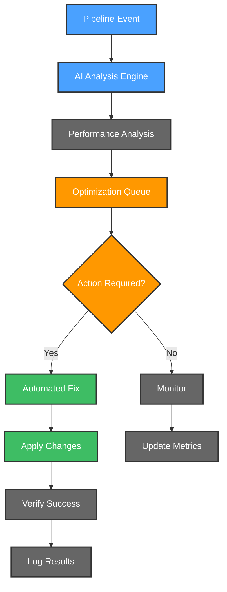
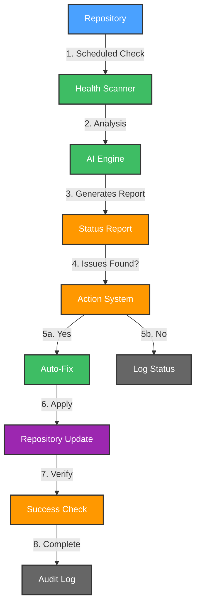

# 🚀 CI/CD Maintainers Crew

CI/CD Maintainers Crew is your intelligent companion within the Kubiya platform, designed to revolutionize CI/CD and source control management. It provides AI-driven monitoring, optimization, and maintenance of your CI/CD pipelines and repositories across multiple platforms.

**🎯 Transform your CI/CD management with AI-powered insights and automated maintenance! Keep your pipelines efficient and repositories well-maintained.**

## 🌟 Features

- 🤖 **AI Pipeline Analysis**: Intelligent analysis of CI/CD failures and bottlenecks
- 📊 **Multi-Platform Support**: GitHub, GitLab, and other source control platforms
- 🔄 **Automated Maintenance**: Automated dependency updates and security fixes
- 📈 **Performance Tracking**: Pipeline performance metrics and optimization
- 🚨 **Smart Alerts**: Real-time notifications for pipeline failures
- 🛡️ **Security Scanning**: Continuous security assessment of pipelines
- 🔍 **Repository Health**: Monitoring and maintenance of repository health

## 🔄 User Flows

### 1. ���� Pipeline Analysis & Optimization Flow

### 2. 🔐 Repository Maintenance Flow

## 🛠️ Configuration

Below are the key variables used to configure the CI/CD Maintainers Crew:

| Variable Name | Description | Type | Default |
|---------------|-------------|------|---------|
| `teammate_name` | Name of the CI/CD Maintainers teammate | `string` | |
| `kubiya_runner` | Runner to use for the teammate | `string` | |
| `repositories` | Comma-separated list of repositories to monitor | `string` | |
| `pipeline_notification_channel` | Channel for pipeline alerts | `string` | `""` |
| `webhook_filter` | JMESPath filter expressions for GitHub webhook events. See https://jmespath.org for syntax. | `string` | `workflow_run.conclusion != null && workflow_run.conclusion != 'success'` |
| `kubiya_groups_allowed_groups` | Groups allowed to interact with the teammate (e.g., ['Admin', 'DevOps']). | `list(string)` | `['Admin'] ` |

## 🚀 Getting Started

1. **Log into Kubiya Platform**:
   - Visit [app.kubiya.ai](https://app.kubiya.ai)
   - Log in with your credentials

2. **Navigate to Use Cases**:
   - Go to "Teammates" section
   - Click on "Use Cases"
   - Click "Add Use Case"
   - Select "CI/CD Maintainers Crew"

3. **Configure Settings**:
   Fill in the required fields:
   - Teammate Name (e.g., "cicd-crew")
   - Kubiya Runner
   - Repository List
   - Notification Channel
   - Github Token
   - Webhook filter
   - Allowd groups

4. **Deploy**:
   - Review your configuration
   - Click "Deploy Use Case"
   - Wait for confirmation

## 🎭 Example Scenarios

### Scenario 1: Pipeline Optimization

1. **Detection**: CI/CD crew detects slow pipeline
2. **Analysis**: AI analyzes bottlenecks
3. **Optimization**: Suggests improvements
4. **Implementation**: Applies approved changes
5. **Verification**: Monitors improvement

### Scenario 2: Security Vulnerability

1. **Detection**: Security scan finds vulnerability
2. **Assessment**: AI evaluates impact
3. **Resolution**: Generates fix
4. **Review**: Team approves fix
5. **Implementation**: Applies security patch

## 📊 Key Benefits

- ⚡ Reduced pipeline maintenance overhead
- 🔒 Enhanced security monitoring
- 📈 Improved pipeline performance
- 🎯 Automated issue resolution
- 📝 Comprehensive audit trail

---

Ready to revolutionize your CI/CD management? Deploy your AI crew today! 🚀

**[Get Started](https://app.kubiya.ai)** | **[Documentation](https://docs.kubiya.ai)** | **[Request Demo](https://kubiya.ai)**

---

*Let CI/CD Maintainers Crew handle your pipeline management while maintaining security! 🔐✨* 
