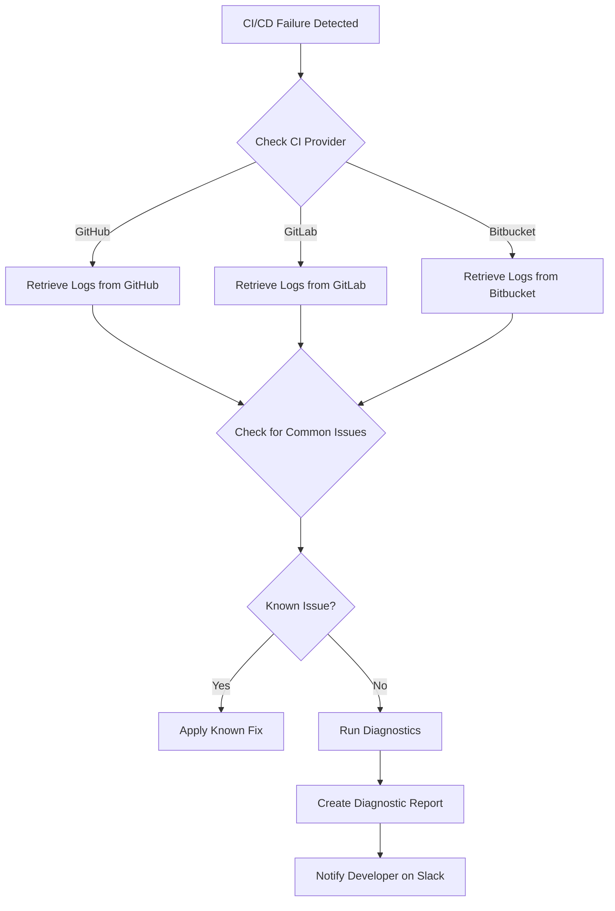
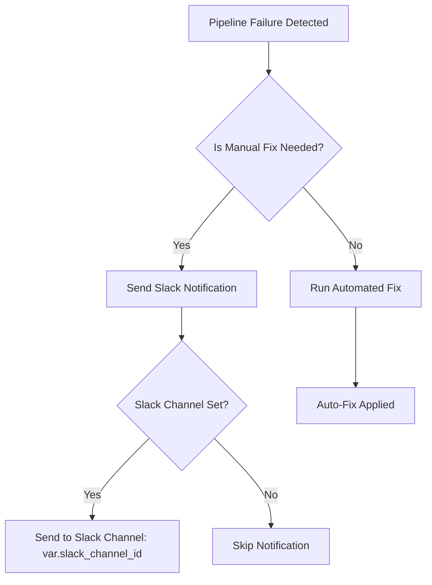
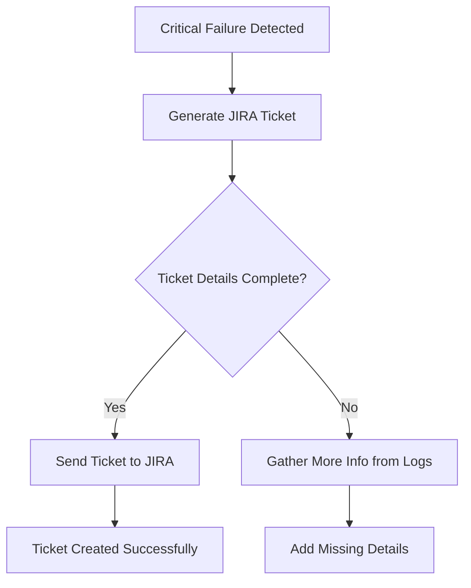

# CI/CD Pipeline Diagnosis

Are your developers drowning in CI failures every day? Is your Slack exploding with DMs about pipeline issues? Enough is enough! 🛑

Introducing the Kubiya CI/CD Pipeline Diagnosis TeamMate - your virtual DevOps expert that never sleeps! 🦸‍♂️

This use case provides automated diagnosis and troubleshooting for CI/CD pipeline failures across multiple providers. Say goodbye to endless debugging sessions and hello to swift, intelligent problem-solving! 🚀


## Why You Need This Delegation 🌟

Imagine a world where:
- 😌 Your Slack is peaceful, free from constant CI failure notifications
- 🏖️ Developers can focus on coding, not debugging pipelines
- 🤖 A tireless TeamMate handles the heavy lifting of CI/CD troubleshooting

This module installs everything you need to sit back, relax, and let Kubiya TeamMates take care of your CI/CD headaches. No more exploding Slack DMs, no more constant interruptions - just smooth, efficient development workflows.

## Key Benefits 🎉

- ⏱️ Reduce downtime and accelerate issue resolution
- 🤖 Automate routine diagnostics and troubleshooting
- 🌐 Support for multiple CI/CD providers (GitHub, GitLab, Bitbucket)
- 📢 Intelligent Slack notifications - only when human intervention is needed
- 🎫 Automatic JIRA ticket creation for seamless issue tracking
- 🧠 AI-powered suggestions for quick fixes
- 🏗️ Continuous learning and improvement of diagnosis capabilities

## Workflow Diagrams

### 1. CI/CD Failure Detection Flow


### 2. Error Notification Flow


### 3. JIRA Ticket Creation Flow


### 4. Terraform Module Reference
```hcl
terraform {
  required_providers {
    kubiya = {
      source = "kubiya-terraform/kubiya"
    }
  }
}

provider "kubiya" {
  // API key is set as an environment variable KUBIYA_API_KEY
}

resource "kubiya_source" "ci_cd_diagnosis_tools" {
  url = "https://github.com/kubiyabot/community-tools/ci-cd-diagnosis"
}

resource "kubiya_agent" "ci_cd_diagnosis" {
  name         = var.agent_name
  runner       = var.kubiya_runner
  description  = var.agent_description
  instructions = var.diagnosis_instructions
  model        = "azure/gpt-4o"
  integrations = concat(
    var.enabled_integrations,
    var.create_jira_ticket ? ["jira"] : []
  )
  users        = var.kubiya_users
  groups       = var.kubiya_groups
  sources      = [kubiya_source.ci_cd_diagnosis_tools.name]

  environment_variables = {
    REPOSITORY_URL           = var.repository_url
    WATCH_EVENTS             = join(",", var.watch_events)
    SLACK_CHANNEL_ID         = var.slack_channel_id
    LOG_LEVEL                = var.log_level
    KUBIYA_TOOL_TIMEOUT      = var.tool_timeout
    TROUBLESHOOTING_DOCS_URL = var.troubleshooting_docs_url
    GITHUB_API_TOKEN         = var.github_api_token
    GITLAB_API_TOKEN         = var.gitlab_api_token
    BITBUCKET_API_TOKEN      = var.bitbucket_api_token
    UPDATE_SLACK             = var.update_slack
    CREATE_JIRA_TICKET       = var.create_jira_ticket
    JIRA_PROJECT_KEY         = var.jira_project_key
    JIRA_ISSUE_TYPE          = var.jira_issue_type
  }
}
```

# Outputs
```hcl
output "agent" {
  value = kubiya_agent.ci_cd_diagnosis
}
```
