# Incident Response Teammate

An AI-powered teammate that helps investigate and resolve incidents by correlating data from multiple sources. This teammate integrates with Datadog, Observe, GitHub, Kubernetes, and ArgoCD to provide a comprehensive view of the incident and actionable insights.

## 🎯 Overview

The Incident Response Teammate is designed to:
- Monitor Datadog for alerts and incidents
- Analyze service dependencies and affected components
- Investigate logs in Observe for error patterns
- Trace issues back to specific code changes in GitHub
- Check deployment status in ArgoCD
- Examine Kubernetes resources when applicable
- Provide focused, actionable remediation steps

## 🏗️ Architecture

```mermaid
flowchart TB
    %% Nodes with icons
    TF["🔧 Terraform Module"]
    VARS["📝 variables.tf"]
    MAIN["⚙️ main.tf"]
    FORM["✨ Kubiya UI Form"]
    CONFIG["🎯 User Configuration"]
    PLAN["👀 Review Changes"]
    DEPLOY["🚀 Deploy Resources"]
    
    %% Kubiya Resources
    TEAMMATE["🤖 Incident Response"]
    WEBHOOK["📡 Event Listener"]
    
    %% Tool Sources
    TOOLS["⚡ Tool Sources"]
    GH_TOOLS["🐙 GitHub Tools"]
    DD_TOOLS["🐕 Datadog Tools"]
    OBS_TOOLS["🔍 Observe Tools"]
    K8S_TOOLS["☸️ Kubernetes Tools"]
    ARGO_TOOLS["🚢 ArgoCD Tools"]
    SECRETS["🔐 Secrets Store"]
    
    %% Incident Flow
    DDINCIDENT["🚨 Datadog Alert"]
    ANALYSIS["📊 Analysis"]
    SOLUTION["💡 Resolution Steps"]

    %% External Systems
    DD_API["🐕 Datadog API"]
    OBS_API["🔍 Observe API"]
    GH_API["🐙 GitHub API"]
    K8S_API["☸️ Kubernetes API"]
    ARGO_API["🚢 ArgoCD API"]

    %% Configuration Flow
    subgraph "1️⃣ Setup Phase"
        TF --> |"defines"| VARS
        TF --> |"contains"| MAIN
        VARS --> |"generates"| FORM
        FORM --> |"fill"| CONFIG
        CONFIG --> |"review"| PLAN
        PLAN --> |"apply"| DEPLOY
    end

    %% Resource Creation
    subgraph "2️⃣ Resources"
        DEPLOY --> |"creates"| TEAMMATE
        DEPLOY --> |"creates"| WEBHOOK
        DEPLOY --> |"provisions"| SECRETS
    end

    %% Tool Sources
    subgraph "3️⃣ Tools & Actions"
        TOOLS --> GH_TOOLS
        TOOLS --> DD_TOOLS
        TOOLS --> OBS_TOOLS
        TOOLS --> K8S_TOOLS
        TOOLS --> ARGO_TOOLS
        TEAMMATE --> |"uses"| TOOLS
        SECRETS --> |"authenticates"| GH_TOOLS
        SECRETS --> |"authenticates"| DD_TOOLS
        SECRETS --> |"authenticates"| OBS_TOOLS
        SECRETS --> |"authenticates"| K8S_TOOLS
        SECRETS --> |"authenticates"| ARGO_TOOLS
        DD_TOOLS --> |"interacts"| DD_API
        OBS_TOOLS --> |"interacts"| OBS_API
        GH_TOOLS --> |"interacts"| GH_API
        K8S_TOOLS --> |"interacts"| K8S_API
        ARGO_TOOLS --> |"interacts"| ARGO_API
    end

    %% Incident Flow
    subgraph "4️⃣ Execution"
        DDINCIDENT --> |"triggers"| WEBHOOK
        WEBHOOK --> |"activates"| TEAMMATE
        TEAMMATE --> |"produces"| ANALYSIS
        ANALYSIS --> |"recommends"| SOLUTION
    end

    %% Styling
    classDef setup fill:#e1f5fe,stroke:#01579b,stroke-width:2px,color:black
    classDef resource fill:#f1f8e9,stroke:#33691e,stroke-width:2px,color:black
    classDef tools fill:#6a1b9a,stroke:#4a148c,stroke-width:2px,color:white
    classDef event fill:#fff3e0,stroke:#e65100,stroke-width:2px,color:black
    classDef api fill:#fffde7,stroke:#f57f17,stroke-width:2px,color:black
    
    class TF,VARS,MAIN,FORM,CONFIG,PLAN setup
    class DEPLOY,TEAMMATE,WEBHOOK,SECRETS resource
    class TOOLS,GH_TOOLS,DD_TOOLS,OBS_TOOLS,K8S_TOOLS,ARGO_TOOLS tools
    class DDINCIDENT,ANALYSIS,SOLUTION event
    class DD_API,OBS_API,GH_API,K8S_API,ARGO_API api
```

## 🚀 Quick Start

### Prerequisites
- Kubiya Platform account
- Datadog account with API and App keys
- Observe account with API key and Dataset ID
- GitHub repository access (token or GitHub App)
- Kubernetes cluster access
- ArgoCD installation with token

### Setup Steps
1. **Access Kubiya Platform**
   - Navigate to Use Cases
   - Select "Incident Response"

2. **Configure Settings**
   - Provide integration credentials
   - Set up notification preferences
   - Configure repository access

3. **Review & Deploy**
   - Review the generated configuration
   - Apply to create resources
   - Test with a sample incident

## 🛠️ Features

### Multi-Source Investigation
- Datadog alerts and metrics analysis
- Service dependency mapping
- Log correlation with Observe
- Code change analysis with GitHub
- Deployment verification with ArgoCD
- Kubernetes resource inspection

### Smart Analysis
- Root cause identification
- Contextual correlation across systems
- Timeline reconstruction
- Impact assessment
- Priority determination

### Actionable Response
- Step-by-step remediation guidance
- Responsible team identification
- Code-level fix suggestions
- Deployment rollback recommendations
- Resource scaling recommendations

## 📚 Configuration Options

### Core Settings
- `teammate_name`: Name of your Incident Response teammate
- `notification_channel`: Channel for incident notifications
- `ms_teams_notification`: Toggle for Microsoft Teams integration
- `debug_mode`: Enable verbose logging for troubleshooting

### GitHub Integration
- `github_repository`: Target repository to analyze for issues
- GitHub App is used for authentication (no token needed)

### Datadog Integration
- `DATADOG_API_KEY`: Datadog API key
- `DATADOG_APP_KEY`: Datadog application key
- `datadog_site`: Datadog site URL

### Observe Integration
- `OBSERVE_API_KEY`: Observe API key
- `OBSERVE_DATASET_ID`: Dataset ID for log analysis

### Kubernetes Integration
- `kubernetes_source_url`: URL to Kubernetes tools

### ArgoCD Integration
- `ARGOCD_TOKEN`: ArgoCD authentication token
- `ARGOCD_DOMAIN`: ArgoCD domain URL

## 🤝 Support

Need help? Contact us:
- [Kubiya Support Portal](https://support.kubiya.ai)
- [Community Discord](https://discord.gg/kubiya)
- Email: support@kubiya.ai 