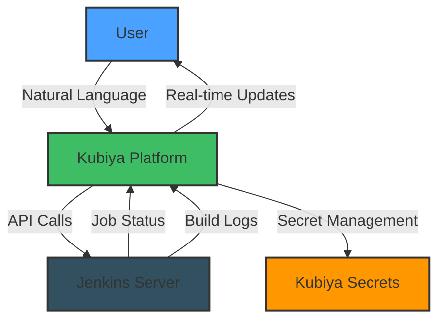

# 🤖 Jenkins Conversational Proxy

Transform your Jenkins CI/CD operations with an AI-powered conversational interface. Execute, monitor, and manage Jenkins jobs through natural language interactions while maintaining security and control.

## 🌟 Features

- 🎯 **Natural Language Control**: Execute Jenkins jobs using conversational commands
- 📊 **Real-time Monitoring**: Stream job logs and status updates
- 🔄 **Smart Job Sync**: Automatically sync and discover available Jenkins jobs
- 🔐 **Secure Authentication**: Token-based authentication with secret management
- 📝 **Live Logging**: Real-time log streaming and monitoring
- ⏱️ **Execution Control**: Handle long-running jobs with configurable timeouts
- 🎛️ **Flexible Configuration**: Support for job inclusion/exclusion patterns
- 👥 **Access Control**: Role-based access through Kubiya groups

## 🏗 Architecture



## 📋 Requirements

- Jenkins server with API access enabled
- Jenkins API token with appropriate permissions
- Kubiya platform access
- `KUBIYA_API_KEY` environment variable set

## 🚀 Quick Start

1. **Configure Variables**:
```hcl
module "jenkins_proxy" {
  source = "github.com/kubiyabot/terraform-modules//terraform_modules_jenkins_jobs"

  # Jenkins Configuration
  jenkins_url      = "https://jenkins.example.com"
  jenkins_username = "admin"
  jenkins_token    = var.jenkins_token  # Pass securely

  # Job Management
  sync_all_jobs = true
  exclude_jobs  = ["internal-", "test-"]
  
  # Execution Settings
  stream_logs = true
  poll_interval = 30
  long_running_threshold = 300

  # Access Control
  name = "jenkins-proxy"
  integrations = ["slack"]
  allowed_groups = ["DevOps"]
}
```

2. **Set Environment Variables**:
```bash
export KUBIYA_API_KEY="your-api-key"
```

3. **Deploy**:
```bash
terraform init
terraform apply
```

## 💬 Example Interactions

```
User: "Run the deploy-production job"
Assistant: "I'll help you execute the deploy-production job. Current status: READY"

User: "Show me the logs"
Assistant: "Streaming logs for deploy-production:
Building in workspace /var/jenkins_home/workspace/deploy-production
[Pipeline] Start
..."

User: "List all available jobs"
Assistant: "Here are the available Jenkins jobs:
1. deploy-production
2. run-tests
3. build-frontend
..."
```

## 📝 Configuration Reference

### Required Variables

| Name | Description | Type | Default |
|------|-------------|------|---------|
| `jenkins_url` | Jenkins server URL | `string` | - |
| `jenkins_token` | Jenkins API token | `string` | - |

### Optional Variables

| Name | Description | Type | Default |
|------|-------------|------|---------|
| `jenkins_username` | Jenkins admin username | `string` | `"admin"` |
| `sync_all_jobs` | Sync all available jobs | `bool` | `true` |
| `include_jobs` | Jobs to include | `list(string)` | `[]` |
| `exclude_jobs` | Jobs to exclude | `list(string)` | `[]` |
| `stream_logs` | Enable log streaming | `bool` | `true` |
| `poll_interval` | Status check interval | `number` | `30` |
| `long_running_threshold` | Long job threshold | `number` | `300` |
| `name` | Assistant name | `string` | `"jenkins-proxy"` |
| `runner` | Infrastructure runner | `string` | `"kubiya-hosted"` |
| `integrations` | Available integrations | `list(string)` | `["slack"]` |
| `allowed_groups` | Allowed groups | `list(string)` | `["Admin"]` |

## 🔒 Security Features

1. **Token Management**:
   - Secure storage in Kubiya's secret management
   - Automatic token rotation support
   - Access control through Kubiya groups

2. **Access Controls**:
   - Role-based access control
   - Integration-specific permissions
   - Audit logging of all operations

3. **Job Security**:
   - Pattern-based job filtering
   - Execution timeouts
   - Controlled log access

## 🔍 Troubleshooting

Common issues and solutions:

1. **Connection Issues**:
   ```
   Error: Failed to connect to Jenkins server
   Solution: Verify Jenkins URL and token permissions
   ```

2. **Authentication Errors**:
   ```
   Error: Invalid credentials
   Solution: Check Jenkins token and username configuration
   ```

3. **Job Access Issues**:
   ```
   Error: Job not found
   Solution: Verify job name and inclusion/exclusion patterns
   ```

## 📚 Additional Resources

- [Jenkins API Documentation](https://www.jenkins.io/doc/book/using/remote-access-api/)
- [Kubiya Documentation](https://docs.kubiya.ai)
- [Security Best Practices](https://docs.kubiya.ai/security)

## 🤝 Contributing

We welcome contributions! Please feel free to submit issues, feature requests, or pull requests.

## 📄 License

This module is released under the MIT License.

```
MIT License

Copyright (c) 2024 Kubiya.ai

Permission is hereby granted, free of charge, to any person obtaining a copy
of this software and associated documentation files (the "Software"), to deal
in the Software without restriction, including without limitation the rights
to use, copy, modify, merge, publish, distribute, sublicense, and/or sell
copies of the Software, and to permit persons to whom the Software is
furnished to do so, subject to the following conditions:

The above copyright notice and this permission notice shall be included in all
copies or substantial portions of the Software.

THE SOFTWARE IS PROVIDED "AS IS", WITHOUT WARRANTY OF ANY KIND, EXPRESS OR
IMPLIED, INCLUDING BUT NOT LIMITED TO THE WARRANTIES OF MERCHANTABILITY,
FITNESS FOR A PARTICULAR PURPOSE AND NONINFRINGEMENT. IN NO EVENT SHALL THE
AUTHORS OR COPYRIGHT HOLDERS BE LIABLE FOR ANY CLAIM, DAMAGES OR OTHER
LIABILITY, WHETHER IN AN ACTION OF CONTRACT, TORT OR OTHERWISE, ARISING FROM,
OUT OF OR IN CONNECTION WITH THE SOFTWARE OR THE USE OR OTHER DEALINGS IN THE
SOFTWARE.
```

---

Need help? Join our [Community Slack](https://slack.kubiya.ai) or [contact support](mailto:support@kubiya.ai).

---

_Built with ❤️ by [Kubiya.ai](https://kubiya.ai)_
