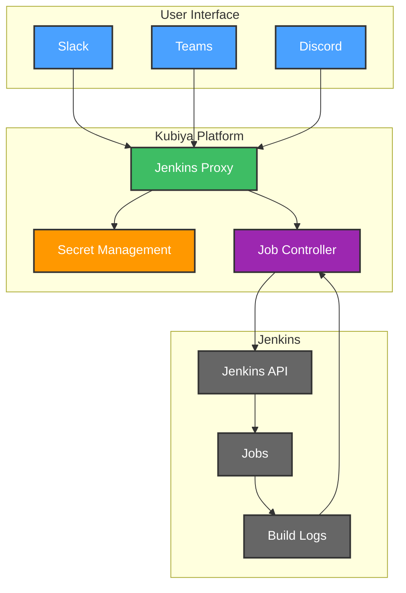

# 🤖 Jenkins Jobs Conversational Proxy

Transform your Jenkins job management with an AI-powered conversational interface. Execute, monitor, and manage Jenkins jobs through natural language interactions while maintaining security and control.


**🎯 Streamline your Jenkins operations with natural language commands! Maintain security while improving developer productivity.**

> **📢 Important Note**: This Jenkins proxy is part of Kubiya's comprehensive DevOps automation suite. Kubiya provides conversational interfaces across your entire DevOps toolchain. Explore our full range of solutions:
> - Browse our [official Terraform repository](https://github.com/kubiyabot/terraform-modules)
> - Visit the Use Cases interface in the Kubiya web UI for more solutions

## 📑 Table of Contents
- [Features](#-features)
- [Architecture](#-architecture)
- [Configuration](#️-configuration)
- [Getting Started](#-getting-started)
- [Example Usage](#-example-usage)
- [Security](#-security)
- [References](#-references)

## 🌟 Features

- 🎯 **Natural Language Control**: Execute Jenkins jobs using conversational commands
- 📊 **Real-time Monitoring**: Stream job logs and status updates
- 🔄 **Job Sync**: Automatically sync available Jenkins jobs
- 🔐 **Secure Authentication**: Token-based authentication with secret management
- 📝 **Smart Logging**: Configurable log streaming and monitoring
- ⏱️ **Execution Control**: Handle long-running jobs with configurable timeouts
- 🎛️ **Flexible Configuration**: Support for job inclusion/exclusion patterns
- 👥 **Access Control**: Role-based access through Kubiya groups

## 🏗 Architecture



## 🚀 Getting Started

1. **Configure Jenkins API Token**:
   - Go to Jenkins > People > Your User > Configure
   - Create a new API token
   - Copy the token value

2. **Deploy the Module**:
   ```hcl
   module "jenkins_proxy" {
     source = "github.com/kubiyabot/terraform-modules//terraform_modules_jenkins_jobs"

     # Jenkins Configuration
     jenkins_url      = "https://jenkins.example.com"
     jenkins_username = "admin"
     jenkins_token    = var.jenkins_token  # Pass securely

     # Job Management
     sync_all_jobs = true
     exclude_jobs  = ["internal-", "test-"]
     
     # Execution Settings
     stream_logs = true
     poll_interval = 30
     long_running_threshold = 300

     # Access Control
     name = "jenkins-proxy"
     integrations = ["slack"]
     allowed_groups = ["DevOps"]
   }
   ```

3. **Set Environment Variables**:
   ```bash
   export KUBIYA_API_KEY="your-api-key"
   ```

## 💬 Example Usage

```
User: "Run the deploy-production job"
Assistant: "I'll help you execute the deploy-production job. Current status: READY"

User: "Show me the logs"
Assistant: "Streaming logs for deploy-production:
Building in workspace /var/jenkins_home/workspace/deploy-production
[Pipeline] Start
..."

User: "List all available jobs"
Assistant: "Here are the available Jenkins jobs:
1. deploy-production
2. run-tests
3. build-frontend
..."
```

## 🔒 Security Features

1. **Token Management**:
   - Secure storage in Kubiya's secret management
   - Automatic token rotation support
   - Access control through Kubiya groups

2. **Access Controls**:
   - Role-based access control
   - Integration-specific permissions
   - Audit logging of all operations

3. **Job Security**:
   - Pattern-based job filtering
   - Execution timeouts
   - Controlled log access

## 📚 References

- [Kubiya Documentation](https://docs.kubiya.ai)
- [Jenkins API Documentation](https://www.jenkins.io/doc/book/using/remote-access-api/)
- [Implementation Guide](https://docs.kubiya.ai/guides/jenkins-proxy)
- [Security Best Practices](https://docs.kubiya.ai/security)
- [Community Forums](https://community.kubiya.ai)

---

Ready to transform your Jenkins operations? Deploy your conversational proxy today! 🚀

**[Get Started](https://app.kubiya.ai)** | **[Documentation](https://docs.kubiya.ai)** | **[Request Demo](https://kubiya.ai)**

---

*Let Jenkins Jobs Proxy handle your job management while you focus on what matters! 🎯✨*