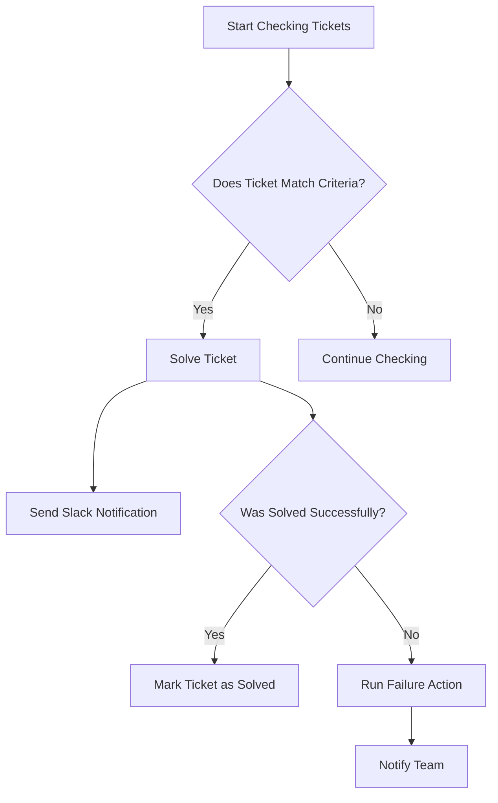
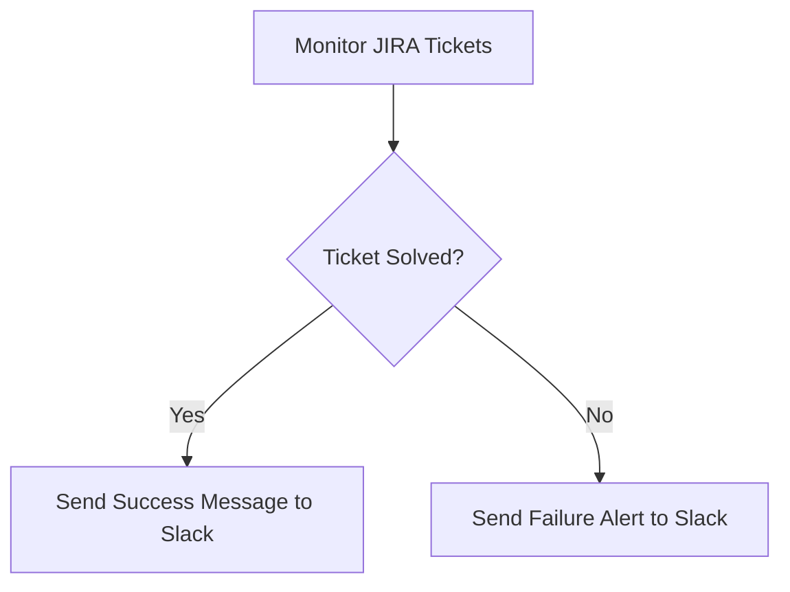

# JIRA Ticket Solver


JIRA Ticket Solver is an intelligent automation feature within the Kubiya platform designed to solve routine JIRA tickets based on predefined criteria and actions. By handling repetitive issues, it allows your team to focus on more complex tasks, streamlining the ticket resolution process.

**Take control of your JIRA workflows! With JIRA Ticket Solver, your team can handle tickets effortlessly, automatically resolving routine problems and sending updates via Slack.**

## Features

- **Automatic ticket solving** based on custom criteria
- **Configurable actions** for successful and failed ticket resolutions
- **Integration with JIRA and Slack** for seamless notifications
- **Customizable check intervals** to suit your team’s needs
- **Support for custom JIRA fields** to fit your specific workflows

## User Flows

### 1. Automatic Ticket Solving

The JIRA Ticket Solver continuously checks for tickets that meet your predefined criteria, runs the appropriate actions, and sends notifications when a ticket is resolved or an issue arises.



### 2. Integration with Slack

Get real-time updates when tickets are resolved or when manual intervention is required, all within your team’s Slack channel. Customize actions for solved and unresolved tickets, ensuring efficient handling of issues.



## Terraform Configuration

Below are the key variables used to configure the JIRA Ticket Solver agent:

| Variable Name                 | Description                                       | Type         | Default    |
|--------------------------------|---------------------------------------------------|--------------|------------|
| `teammate_name`                | Name of the JIRA Ticket Solver teammate           | `string`     |            |
| `kubiya_runner`                | Runner (environment) to use for the agent         | `string`     |            |
| `jira_integration_instance`    | JIRA integration instance for authentication      | `string`     |            |
| `jira_project_name`            | JIRA project to check for tickets                 | `string`     |            |
| `jira_jql`                     | JQL query to filter tickets for solving           | `string`     |            |
| `issues_check_interval`        | Interval for checking tickets                     | `string`     | `"1h"`     |
| `on_solve_action`              | Action to take after solving a ticket             | `string`     | `"close"`  |
| `custom_field_name`            | Custom JIRA field to use for ticket identification| `string`     | `""`       |
| `on_failure_action`            | Action to take after failure to solve a ticket    | `string`     | `"alert"`  |
| `slack_notification_channel`   | Slack channel for notifications                   | `string`     | `""`       |
| `log_level`                    | Log level for the agent                           | `string`     | `"INFO"`   |
| `debug`                        | Enable debug mode                                | `bool`       | `false`    |
| `dry_run`                      | Enable dry run mode (no real actions)             | `bool`       | `false`    |

## Terraform Code Example

```terraform
terraform {
  required_providers {
    kubiya = {
      source = "kubiya-terraform/kubiya"
    }
  }
}

provider "kubiya" {
  // API key is set as an environment variable KUBIYA_API_KEY
}

resource "kubiya_source" "sources" {
  count = length(var.kubiya_sources)
  url   = var.kubiya_sources[count.index]
}

resource "kubiya_agent" "jira_ticket_solver" {
  name         = var.teammate_name
  runner       = var.kubiya_runner
  description  = var.teammate_description
  instructions = ""
  model        = "azure/gpt-4o"
  integrations = [var.jira_integration_instance, "slack"]
  sources      = kubiya_source.sources[*].name

  environment_variables = {
    JIRA_PROJECT_NAME          = var.jira_project_name
    JIRA_INTEGRATION           = var.jira_integration_instance
    ISSUE_DESCRIPTION          = var.issue_description
    JIRA_JQL                   = var.jira_jql
    ISSUES_CHECK_INTERVAL      = var.issues_check_interval
    ON_SOLVE_ACTION            = var.on_solve_action
    CUSTOM_FIELD_NAME          = var.custom_field_name
    ON_FAILURE_ACTION          = var.on_failure_action
    SLACK_NOTIFICATION_CHANNEL = var.slack_notification_channel
  }
}

output "jira_ticket_solver" {
  value = kubiya_agent.jira_ticket_solver
}
```

---

With **JIRA Ticket Solver**, automate your JIRA ticket resolution and focus on what matters most. Delegate routine tasks, stay informed, and ensure that no ticket is left unresolved!
