# 🚀 JIT Infrastructure Builder: Your AI-Powered Cloud Architect Fleet

**Democratize infrastructure provisioning while maintaining control, cost efficiency, and best practices**


> "Empower everyone to build infrastructure, while we ensure it's done right!"

## 🎯 Mission Statement

JIT Infrastructure Builder democratizes cloud infrastructure deployment by enabling anyone in your organization to request and provision resources through natural language, while automatically enforcing best practices, cost controls, and existing workflows. No more bottlenecks with DevOps teams or compromising on quality – our AI-powered builders integrate with your existing processes to maintain security, efficiency, and cost optimization.

## 🌊 Why You Need a JIT Builder

- **👥 Infrastructure for Everyone**: Anyone can request infrastructure using natural language - no technical expertise required
- **🛡️ Built-in Best Practices**: Automatic application of organizational standards and security controls
- **💰 Cost Control & Optimization**: Proactive monitoring prevents waste and suggests optimizations
- **🔄 Workflow Integration**: Seamlessly integrates with your existing GitOps and approval processes
- **🎮 Governance Without Friction**: Maintain control while enabling self-service infrastructure

## 💡 Key Differentiators

### 1. 🤝 True Self-Service
```yaml
Democratization:
  - Natural language infrastructure requests
  - Automated approval workflows
  - Role-based access controls
  - Built-in best practices enforcement
```

### 2. 🔄 Workflow Integration
```yaml
Integration:
  - Automatic PR generation
  - GitOps workflow support
  - CI/CD pipeline integration
  - Existing tools enhancement
```

### 3. 💰 Cost Intelligence
```yaml
Cost Control:
  - Resource usage monitoring
  - Automatic cleanup of idle resources
  - Right-sizing recommendations
  - Budget enforcement
```

## 💬 Example Interactions

### Scenario 1: Developer Requesting Development Environment
```markdown
# In Slack
Developer: @jit-builder I need a development environment with a small RDS instance and ECS cluster

Builder: 📊 Request Analysis:
- Matching Development Environment Template
- Estimated Monthly Cost: $150
- Follows Team Standards: ✅
- Auto-cleanup after 7 days: ✅

I'll create a PR with:
1. Terraform code following our best practices
2. Cost estimation and cleanup policies
3. Required security configurations

Should I proceed with PR creation?

Developer: Yes please

Builder: 🔨 Created PR #123:
- Infrastructure code generated
- Applied development environment policies
- Added cost monitoring
- Included cleanup schedule
- Tagged relevant approvers

PR is ready for review at: github.com/org/repo/pull/123
```

### Scenario 2: Cost Optimization Alert
```markdown
# Automatic Slack Alert
Builder: 💰 Cost Optimization Detected
- Environment: dev-environment-123
- Issue: No activity for 5 days
- Current Cost: $15/day
- Recommendation: Schedule shutdown outside business hours
- Estimated Savings: $200/month

I can:
1. Create PR to add scheduling
2. Notify owner for cleanup
3. Auto-cleanup after 48h

What would you like me to do?
```

## 🔄 Workflow Integration

```mermaid
graph TD
    A[User Request] --> B[AI Analysis]
    B --> C[Template Selection]
    C --> D[Code Generation]
    D --> E[PR Creation]
    E --> F[Approval Process]
    F --> G[Automated Deployment]
    G --> H[Cost Monitoring]
    
    style A fill:#f9d71c,stroke:#333,stroke-width:4px
    style B fill:#3498db,stroke:#333,stroke-width:4px
    style C fill:#2ecc71,stroke:#333,stroke-width:4px
    style D fill:#e74c3c,stroke:#333,stroke-width:4px
    style E fill:#9b59b6,stroke:#333,stroke-width:4px
    style F fill:#f1c40f,stroke:#333,stroke-width:4px
    style G fill:#1abc9c,stroke:#333,stroke-width:4px
    style H fill:#34495e,stroke:#333,stroke-width:4px
```



## 🏆 Benefits At-a-Glance

| Traditional Infrastructure | With JIT Builder |
|---------------------------|------------------|
| DevOps team bottleneck | Self-service for all |
| Inconsistent standards | Automated best practices |
| Cost overruns | Proactive optimization |
| Complex approval process | Streamlined workflows |
| Manual PR creation | Automated code generation |

## 🚀 Quick Start Guide

### 1. Integration Setup
- Connect to your Git repositories
- Define approval workflows
- Set cost policies
- Configure cleanup rules

### 2. Start Building
```slack
You: @jit-builder new development environment for project-x
Builder: Analyzing requirements... Creating PR with standardized development environment...
```

## 🌟 Ready to Transform Your Infrastructure Workflow?

Enable everyone in your organization to provision infrastructure while maintaining control, cost efficiency, and best practices.

**[Get Started Now](#quick-start-guide)** | **[View Documentation](https://docs.kubiya.ai)** | **[Request Demo](https://kubiya.ai)**

---

*Democratize infrastructure provisioning without compromising on quality! 🏗️✨*
