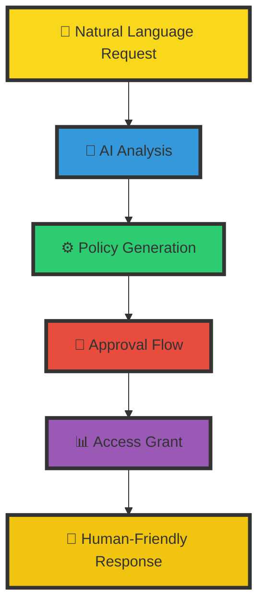

# 🚀 JIT Permissions Guardian: Your AI-Powered Access Control Fleet

**Navigate the complexities of AWS IAM permissions with your dedicated crew of AI-powered security specialists**


> "Let our guardians handle the security while you focus on innovation!"

## 🎯 Mission Statement

The JIT Permissions Guardian transforms complex AWS access management into a streamlined, secure experience. No more struggling with IAM policies or spending hours on access requests – our AI-powered guardians work 24/7 to maintain secure and efficient access control.

## 🌊 Why You Need a JIT Guardian

- **🤖 Natural Language Access Requests**: Simply tell the guardian what you need - they'll handle the policy details
- **🛡️ Automated Security Controls**: Access requests are validated and monitored round-the-clock
- **⚓ Zero Security Compromise**: Maintain tight security while enabling rapid access provisioning
- **🎮 Complete Oversight**: Full audit trail and control while automating the complex tasks
- **🔄 Intelligent Optimization**: The guardian constantly analyzes and improves access patterns

## 👥 Meet Your Guardian Team

### The Command Center
- **🎯 Chief Guardian (Policy Center)**: Orchestrates all access operations
- **🔍 Auditor (Monitoring Specialist)**: Tracks access patterns and usage
- **⚡ Engineer (Policy Expert)**: Optimizes permission boundaries
- **🛡️ Security Officer**: Enforces compliance and security policies

### The Operations Team
- **🔧 Policy Crafters**: Generate least-privilege policies
- **📦 Access Specialists**: Handle temporary access grants
- **📡 Communications**: Manage notifications and approvals
- **🎨 UI/UX Specialists**: Provide human-friendly interfaces

## 🌟 Feature Fleet

### 1. 🤖 AI-Powered Operations
```yaml
Capabilities:
  - Natural Language Processing
  - Context-Aware Policy Generation
  - Predictive Access Analysis
  - Automated Request Processing
```

### 2. 🛡️ Automated Protection
```yaml
Security:
  - Dynamic Policy Generation
  - Continuous Access Monitoring
  - Compliance Enforcement
  - Auto-expiring Permissions
```

### 3. ⚡ Access Optimization
```yaml
Optimization:
  - Usage Pattern Analysis
  - Permission Right-sizing
  - Access Flow Optimization
  - Security Recommendations
```

## 💬 Example Interactions

### Scenario 1: S3 Access Request
```markdown
# In Slack
You: @jit-guardian I need access to the financial-reports S3 bucket

Guardian: 📊 Access Request Analysis:
- Resource: s3://financial-reports
- Suggested Actions: GetObject, PutObject, ListBucket
- Duration: 24 hours
- Risk Level: Medium
- Required Approvals: 1

Would you like me to create this access request?

You: Yes, please proceed

Guardian: 🔒 Access Request Created:
- Request ID: ACC-123456
- Status: Pending Approval
- Notified Approvers: @finance-team-lead
- Estimated Processing: 5 minutes

I'll notify you once approved!
```

### Scenario 2: Auto-Expiry in Action
```markdown
# Automatic Slack Alert
Guardian: 🚨 Access Expiry Notice
- Policy: FinancialReportsAccess-5678
- User: alice@company.com
- Expiry: 30 minutes
- Action: Auto-removal scheduled

Would you like to extend this access?
```

## 🎨 The Power of Natural Interaction



## 🏆 Benefits At-a-Glance

| Traditional IAM Management | With JIT Guardian |
|---------------------------|-------------------|
| Complex IAM policies | Natural language requests |
| Manual approval processes | Automated workflows |
| Static permissions | Dynamic, time-bound access |
| High security overhead | Automated security controls |
| Reactive management | Proactive optimization |

## 🚀 Quick Start Guide

### 1. Summon Your Guardian
Tag the Kubiya app in your Slack workspace with the !aws-access prefix to start a conversation with the guardians.

### 2. Start Requesting
```slack
You: @jit-guardian I need EC2 access for production debugging
Guardian: Analyzing request... Creating temporary EC2 access policy with required permissions...
```

## 🌟 Ready to Secure Your Cloud?

Transform your AWS access management with a guardian that never sleeps, never compromises on security, and always keeps your resources protected.

**[Get Started Now](#quick-start-guide)** | **[View Documentation](https://docs.kubiya.ai)** | **[Request Demo](https://kubiya.ai)**

---

*Let the guardians protect your cloud while you focus on innovation! 🛡️✨*
