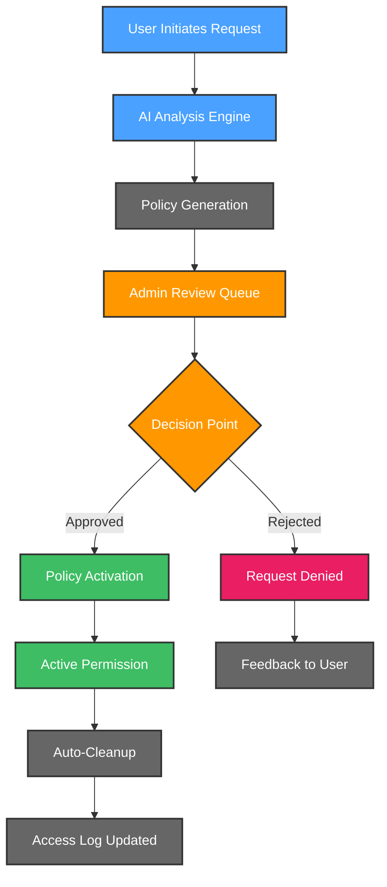
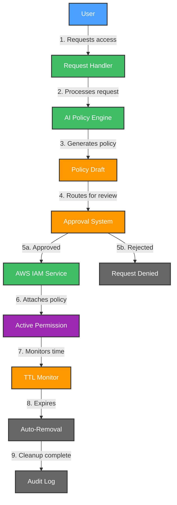

# 🔐 AWS JIT Permissions Crew

AWS JIT (Just-In-Time) Permissions Crew is your intelligent companion within the Kubiya platform, designed to revolutionize AWS access management. It provides AI-driven, secure, and efficient temporary access to AWS resources, ensuring least-privilege access while maintaining operational efficiency.

**🎯 Transform your AWS access management with AI-powered, temporary permissions that expire automatically! Keep your AWS environment secure while maintaining developer productivity.**

## 🌟 Features

- 🤖 **AI Policy Generation**: Intelligent creation of least-privilege policies
- 👥 **Approval Workflow**: Seamless Slack-integrated approval process
- ⏳ **Auto-Expiring Access**: Temporary permissions with automatic removal
- 📢 **Smart Notifications**: Real-time Slack alerts for approvals
- 📈 **Access Analytics**: Track permission patterns and usage
- 🔒 **Security Controls**: Enforced least-privilege access
- 🔄 **AWS Integration**: Native support for IAM and SSO

## 🔄 User Flows

### 1. 🎫 Access Request & Approval Flow

### 2. 🔐 Policy Lifecycle Management

## 🛠️ Configuration

Below are the key variables used to configure the AWS JIT Permissions Crew:

| Variable Name | Description | Type | Default |
|---------------|-------------|------|---------|
| `teammate_name` | Name of the JIT Permissions teammate | `string` | |
| `kubiya_runner` | Runner to use for the teammate | `string` | |
| `aws_region` | AWS region for operations | `string` | |
| `policy_ttl` | Default policy expiration time | `string` | `"8h"` |
| `slack_notification_channel` | Slack channel for notifications | `string` | `""` |
| `approvers` | List of authorized approvers | `list(string)` | |
| `allowed_services` | Permitted AWS services | `list(string)` | |
| `max_duration` | Maximum permission duration | `string` | `"24h"` |

## 🚀 Getting Started

1. **Log into Kubiya Platform**:
   - Visit [app.kubiya.ai](https://app.kubiya.ai)
   - Log in with your credentials

2. **Navigate to Use Cases**:
   - Go to "Teammates" section
   - Click on "Use Cases"
   - Click "Add Use Case"
   - Select "Just-in-Time Permissions Guardian"

3. **Configure Settings**:
   Fill in the required fields:
   - Teammate Name (e.g., "aws-jit")
   - AWS Region
   - Slack Channel for notifications
   - Approvers list
   - Allowed AWS services
   - Maximum permission duration

4. **Deploy**:
   - Review your configuration
   - Click "Deploy Use Case"
   - Wait for confirmation

5. **Set Up Webhook Environment Variable**:
   - Go to Kubiya web UI -> Resources -> Webhooks
   - Find the generated webhook
   - Copy its URL by clicking on the URL button
   - Navigate to Team mates
   - Find your relevant team mate
   - Click Edit
   - Add environment variable `REQUEST_ACCESS_WEBHOOK_URL` with the copied webhook URL as its value
   - Save changes

## 🎭 Example Scenarios

### Scenario 1: S3 Bucket Access

1. **Request**: Developer needs temporary S3 access
2. **AI Analysis**: Generates least-privilege policy
3. **Approval**: Admin reviews in Slack
4. **Access**: Policy attached with 8-hour TTL
5. **Cleanup**: Automatic policy removal

### Scenario 2: Multiple Service Access

1. **Request**: DevOps needs EC2 and RDS access
2. **Analysis**: AI creates comprehensive policy
3. **Review**: Multiple approvers notified
4. **Grant**: Temporary access provided
5. **Monitor**: Usage tracked and logged

## 📊 Key Benefits

- ⏱️ Reduced access management overhead
- 🔒 Enhanced security with temporary access
- 🎯 Precise, AI-generated policies
- 📈 Complete access audit trail
- 👥 Streamlined approval process

---

Ready to transform your AWS access management? Deploy your AI crew today! 🚀

**[Get Started](https://app.kubiya.ai)** | **[Documentation](https://docs.kubiya.ai)** | **[Request Demo](https://kubiya.ai)**

---

*Let AWS JIT Permissions Crew handle your access management while maintaining security! 🔐✨*
