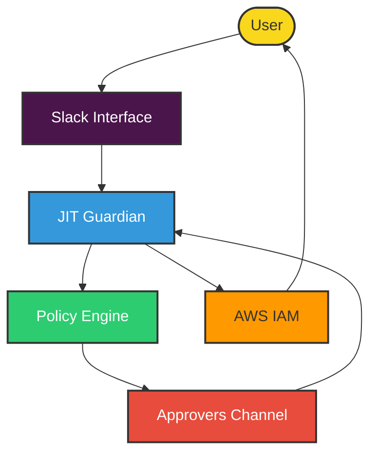
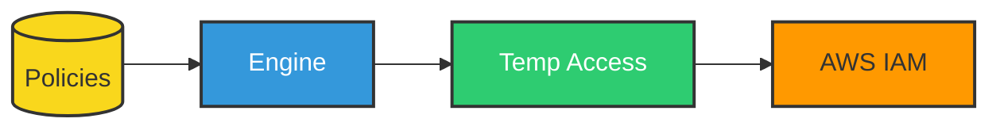
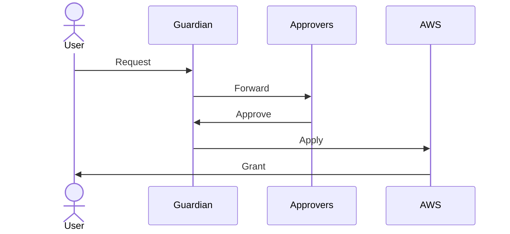
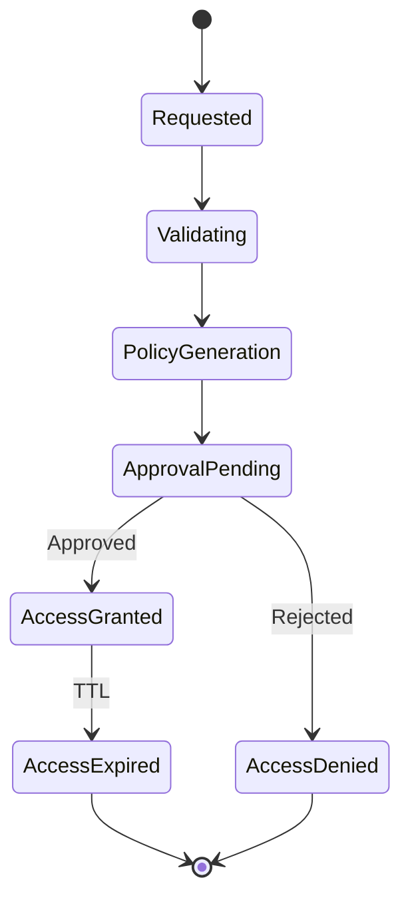
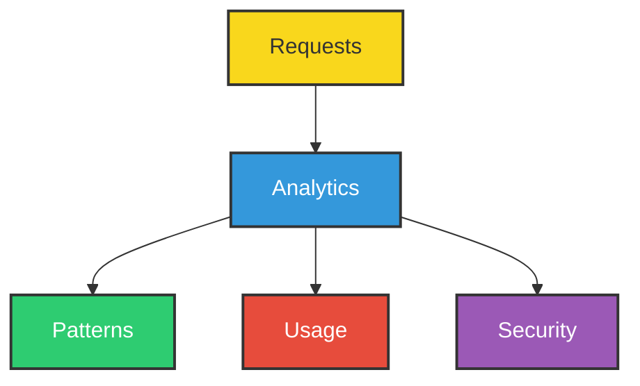

# 🛡️ AWS JIT Permissions Guardian

> Transform your AWS access management with AI-powered, Just-In-Time permissions control


## 🌟 Overview

AWS JIT Permissions Guardian revolutionizes AWS access management by providing secure, temporary, and AI-driven access control. It ensures least-privilege access while maintaining operational efficiency through automated workflows and intelligent policy management.

## 🏗️ Architecture & Workflow



## 🔑 Key Components

### Policy Management Flow


### Approval Process


## 🔄 Request Lifecycle



## 📊 Access Analytics



## ⚙️ Technical Stack

* **Infrastructure**: Terraform
* **Runtime**: Kubiya Runner (Kubernetes)
* **Integration**: AWS IAM, Slack, Okta
* **AI Engine**: GPT-4
* **Storage**: SQLite (for request tracking)

## 🚨 Prerequisites

### Required Configuration

* Kubiya Runner (Kubernetes Cluster)
* AWS IAM Permissions
* Slack Workspace
* Kubiya Groups Configuration
* Approvers Channel

> ⚠️ **IMPORTANT**: 
> - Each policy defined will generate a corresponding virtual access request tool
> - Maximum of 30 policies supported for virtual tool generation
> - `policy_name` must match an existing IAM policy in the specified AWS account
> - Policy names are case-sensitive and must match exactly
> - Virtual tools are generated automatically by Kubiya based on this configuration

### 🔧 Request Tools Configuration

Request tools come in two categories:
1. **AWS Policy Generator** (automatically included and cannot be modified)
   - Handles dynamic generation of policy-specific access request tools
   - Required for processing the policies defined in `available_policies_yaml`
2. **Auxiliary Tools** (configured through source URLs)

```hcl
# Configure only auxiliary tools - AWS policy generator is automatically included
request_tools_sources = [
  "https://github.com/kubiyabot/community-tools/tree/main/jit/list_access_requests",
  "https://github.com/kubiyabot/community-tools/tree/main/jit/view_access_request",
  "https://github.com/kubiyabot/community-tools/tree/main/jit/cancel_access_request"
]
```

> ⚠️ **IMPORTANT**: 
> - AWS policy generator tool is automatically included and cannot be modified
> - This tool creates virtual tools based on your policy configuration
> - Additional tools are loaded from their source repositories
> - Actual permissions are determined by the runner's OPA policies
> - Access to these tools varies based on user roles and policy configurations
> - Refer to your OPA policy repository for specific access controls

## 🚀 Deployment

### Quick Start (Recommended)
The easiest way to deploy AWS JIT Permissions Guardian is through the Kubiya web interface or API:

1. Visit [Kubiya Use Cases](https://docs.kubiya.ai/docs/get-started/choose-a-use-case-and-identify-prerequisites)
2. Select "AWS JIT Permissions Guardian" use case
3. Follow the guided setup process

This method automatically handles all infrastructure provisioning and configuration for you.

### Advanced Deployment (Optional)
For teams who prefer managing their infrastructure as code directly:

#### 1. Configure Variables
```hcl
teammate_name           = "jit-guardian"
kubiya_runner          = "your-cluster"
approvers_slack_channel = "#aws-access-approvers"
kubiya_groups_allowed_groups = ["Admin"]

kubiya_integrations    = [
  "aws-123456789012",  # AWS integration with account ID
  "slack"              # Required for approvals
]

available_policies_yaml = <<-EOT
policies:
  - policy_name: "AWSReadOnlyAccess"     # Must match IAM policy name
    aws_account_id: "123456789012"
    request_name: "Read Only Access"
EOT

request_tools_sources = [
  "https://github.com/kubiyabot/community-tools/tree/main/jit/list_access_requests",
  "https://github.com/kubiyabot/community-tools/tree/main/jit/view_access_request"
]
```

> ⚠️ **IMPORTANT**: 
> - AWS integrations must include the account ID in the format: `aws-123456789012`
> - Slack integration is automatically added and required for approvals
> - Multiple AWS accounts can be specified for cross-account access

#### 2. Deploy Infrastructure
```bash
terraform init
terraform plan
terraform apply
```

## 🔐 Access Control

### Kubiya Groups
* Only members of specified Kubiya groups can request access
* Groups are defined in `kubiya_groups_allowed_groups` variable
* Access requests from users outside these groups will be automatically rejected

### Request Flow
1. User (from allowed Kubiya group) requests access
2. Guardian validates group membership
3. Request forwarded to approvers channel
4. Approvers review and decide
5. Access granted/denied based on approval

## 🎯 Best Practices

### Policy Configuration
* Define clear policy names
* Use descriptive request names
* Keep policies minimal

### Approval Process
* Set up dedicated approvers channel
* Define clear approval criteria
* Document approval decisions

### Access Management
* Use time-bound access
* Monitor access patterns
* Regular policy reviews

## 🔍 Troubleshooting

### Common Issues and Solutions

#### Policy Not Found
* Verify policy configuration
* Check AWS account ID
* Validate policy name

#### Approval Timeout
* Check approvers channel
* Verify approver permissions
* Review notification settings

## 📚 Additional Resources

* [Kubiya Documentation](https://docs.kubiya.ai)
* [AWS IAM Best Practices](https://aws.amazon.com/iam/best-practices/)
* [Okta Integration Guide](https://docs.kubiya.ai/integrations/okta)
* [Terraform Documentation](https://terraform.io/docs)

---

> 🔐 Secure by default, simple by design

Built with ❤️ by [Kubiya.ai](https://kubiya.ai)
