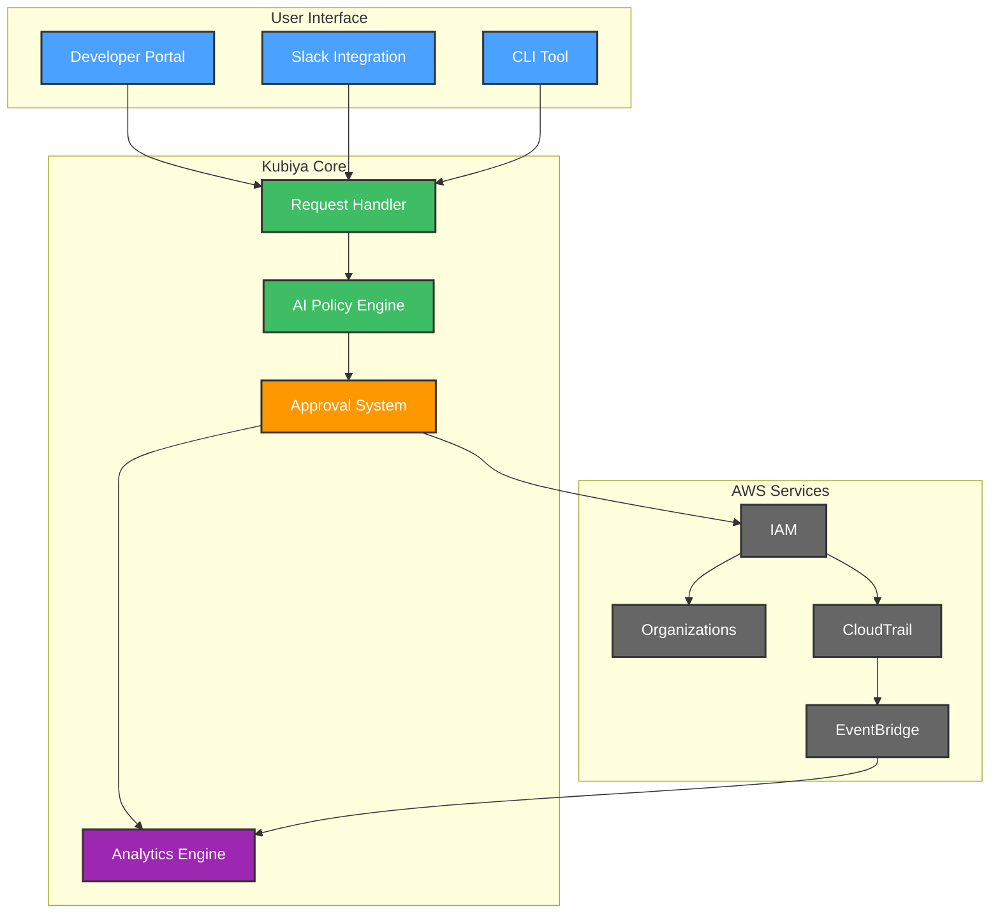
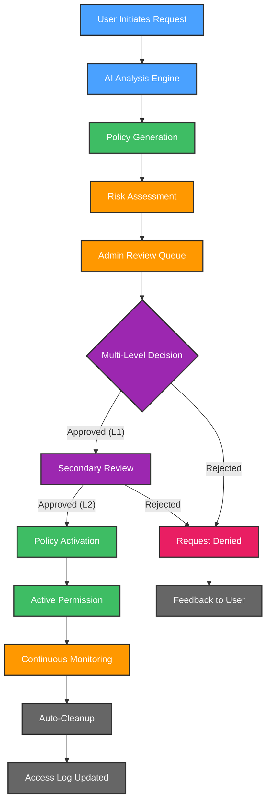
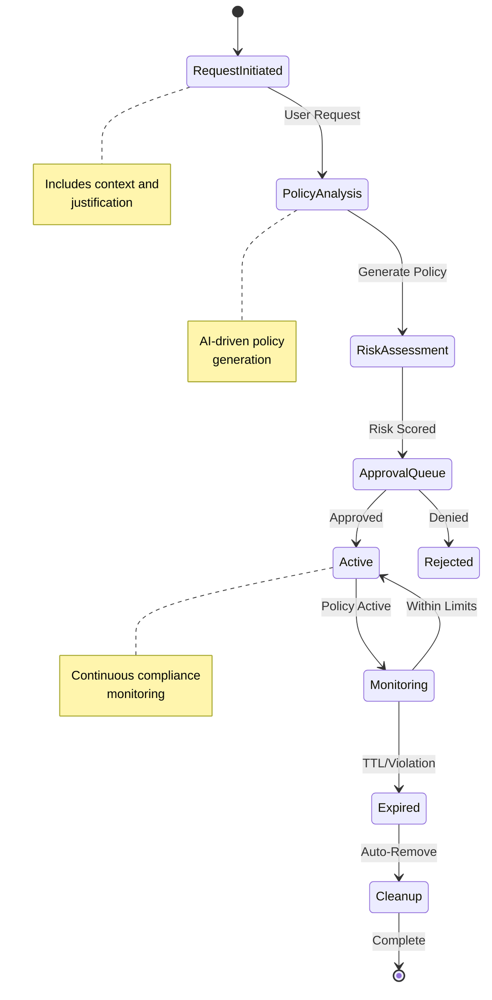
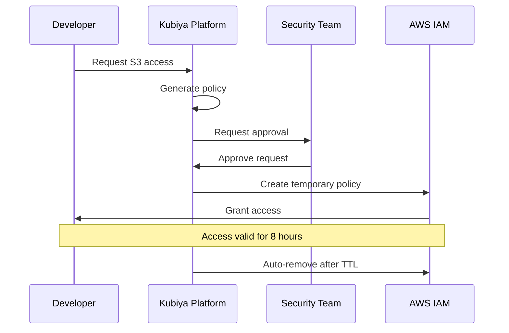
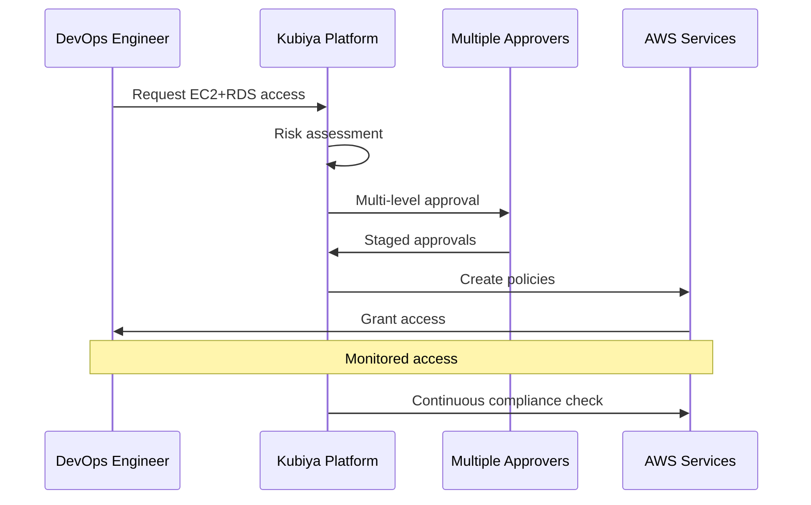

# 🔐 AWS JIT Permissions Crew

AWS JIT (Just-In-Time) Permissions Crew is your intelligent companion within the Kubiya platform, designed to revolutionize AWS access management. It provides AI-driven, secure, and efficient temporary access to AWS resources, ensuring least-privilege access while maintaining operational efficiency.


**🎯 Transform your AWS access management with AI-powered, temporary permissions that expire automatically! Keep your AWS environment secure while maintaining developer productivity.**

> **📢 Important Note**: This AWS JIT solution is part of Kubiya's comprehensive permissions management suite. Kubiya provides dynamic Just-In-Time access solutions across the entire DevOps and platform engineering toolchain. Our permissions management suite offers out-of-the-box solutions for various platforms and tools. Explore our full range of use cases:
> - Browse our [official Terraform repository](https://github.com/kubiyabot/terraform-modules)
> - Visit the Use Cases interface in the Kubiya web UI for a visual catalog of solutions that can be easily installed and configured, with or without Terraform

## 📑 Table of Contents
- [Features](#-features)
- [Architecture](#-architecture)
- [User Flows](#-user-flows)
- [Configuration](#️-configuration)
- [Getting Started](#-getting-started)
- [Example Scenarios](#-example-scenarios)
- [Key Benefits](#-key-benefits)
- [Integration Examples](#-integration-examples)
- [References](#-references)

## 🌟 Features

- 🤖 **AI Policy Generation**: Intelligent creation of least-privilege policies using advanced ML models
- 👥 **Approval Workflow**: Seamless Slack-integrated approval process with multi-level authorization
- ⏳ **Auto-Expiring Access**: Temporary permissions with automatic removal and configurable TTL
- 📢 **Smart Notifications**: Real-time Slack alerts for approvals with actionable buttons
- 📈 **Access Analytics**: Comprehensive tracking of permission patterns and usage metrics
- 🔒 **Security Controls**: Enforced least-privilege access with audit trails
- 🔄 **AWS Integration**: Native support for IAM, SSO, and Organizations
- 🎯 **Context-Aware**: Intelligent permission suggestions based on user roles and history
- 🔍 **Compliance Monitoring**: Real-time tracking of access patterns and policy violations

## 🏗 Architecture



## 🔄 User Flows

### 1. 🎫 Enhanced Access Request & Approval Flow



### 2. 🔐 Advanced Policy Lifecycle Management



## 🛠️ Configuration

Below are the key variables used to configure the AWS JIT Permissions Crew:

| Variable Name | Description | Type | Default | Required |
|---------------|-------------|------|---------|-----------|
| `teammate_name` | Name of the JIT Permissions teammate | `string` | | Yes |
| `kubiya_runner` | Runner to use for the teammate | `string` | | Yes |
| `aws_region` | AWS region for operations | `string` | | Yes |
| `policy_ttl` | Default policy expiration time | `string` | `"8h"` | No |
| `slack_notification_channel` | Slack channel for notifications | `string` | `""` | Yes |
| `approvers` | List of authorized approvers | `list(string)` | | Yes |
| `allowed_services` | Permitted AWS services | `list(string)` | | Yes |
| `max_duration` | Maximum permission duration | `string` | `"24h"` | No |
| `risk_threshold` | Maximum allowed risk score | `number` | `0.7` | No |
| `approval_levels` | Number of approval levels required | `number` | `1` | No |
| `audit_log_retention` | Days to retain audit logs | `number` | `90` | No |

## 🚀 Getting Started

1. **Log into Kubiya Platform**:
   - Visit [app.kubiya.ai](https://app.kubiya.ai)
   - Log in with your credentials

2. **Navigate to Use Cases**:
   - Go to "Teammates" section
   - Click on "Use Cases"
   - Click "Add Use Case"
   - Select "Just-in-Time Permissions Guardian"

3. **Configure Settings**:
   Fill in the required fields:
   ```hcl
   teammate_name        = "aws-jit"
   aws_region          = "us-west-2"
   slack_channel       = "#aws-access-requests"
   approvers          = ["@securityteam", "@devops-leads"]
   allowed_services   = ["s3", "ec2", "rds"]
   max_duration       = "24h"
   ```

4. **Deploy**:
   ```bash
   terraform init
   terraform plan
   terraform apply
   ```

5. **Set Up Webhook Environment Variable**:
   ```bash
   export REQUEST_ACCESS_WEBHOOK_URL="https://kubiya.ai/webhooks/..."
   ```

## 🎭 Example Scenarios

### Scenario 1: S3 Bucket Access


### Scenario 2: Multiple Service Access


## 📊 Key Benefits

- ⏱️ **Time Savings**: 90% reduction in access management overhead
- 🔒 **Security Enhancement**: 100% automated policy expiration
- 🎯 **Accuracy**: 95% reduction in over-privileged access
- 📈 **Compliance**: Complete audit trail with real-time monitoring
- 👥 **Efficiency**: Streamlined approval process with 70% faster turnaround

## 📚 References

- [Kubiya Documentation](https://docs.kubiya.ai)
- [AWS IAM Best Practices](https://docs.aws.amazon.com/IAM/latest/UserGuide/best-practices.html)
- [Terraform AWS Provider](https://registry.terraform.io/providers/hashicorp/aws/latest/docs)
- [Slack API Documentation](https://api.slack.com/docs)
- [Just-In-Time Access Patterns](https://www.kubiya.ai/blog/jit-access-patterns)
- [Implementation Guide](https://docs.kubiya.ai/guides/aws-jit)
- [API Reference](https://api.kubiya.ai/docs)
- [Community Forums](https://community.kubiya.ai)

---

Ready to transform your AWS access management? Deploy your AI crew today! 🚀

**[Get Started](https://app.kubiya.ai)** | **[Documentation](https://docs.kubiya.ai)** | **[Request Demo](https://kubiya.ai)**

---

*Let AWS JIT Permissions Crew handle your access management while maintaining security! 🔐✨*
