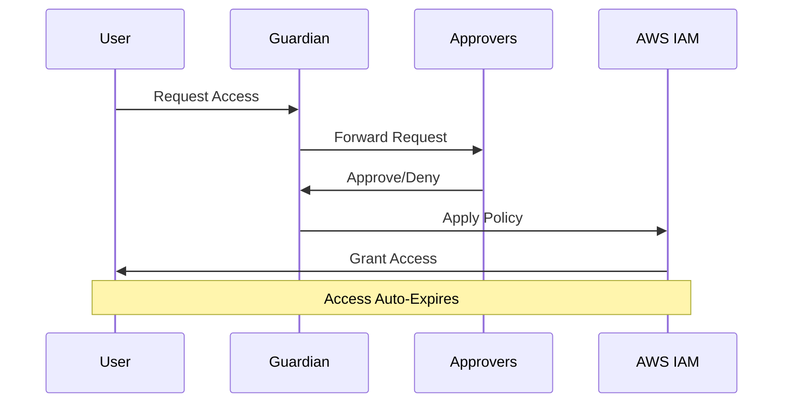
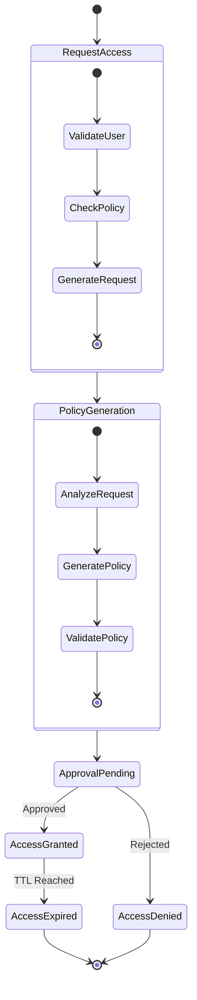
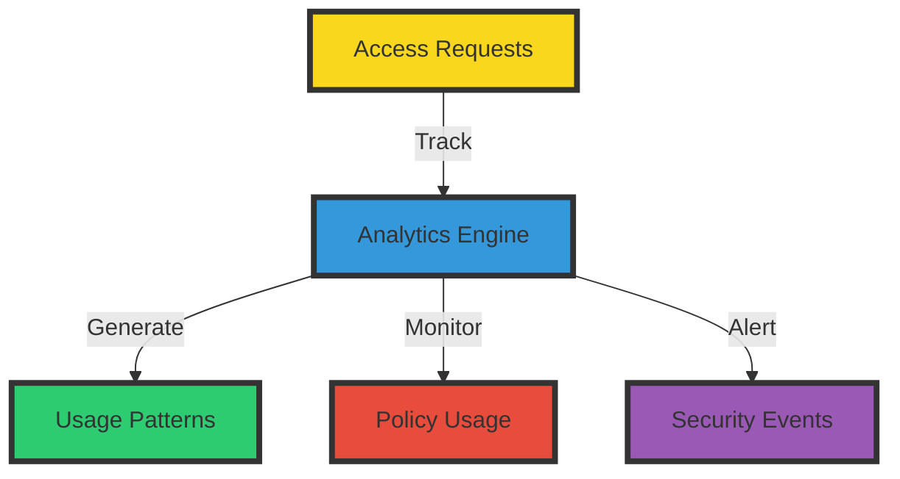

# 🛡️ AWS JIT Permissions Guardian

> Transform your AWS access management with AI-powered, Just-In-Time permissions control

[
](https://kubiya-public-20221113173935726800000003.s3.us-east-1.amazonaws.com/Knite.png)

## 🌟 Overview

AWS JIT Permissions Guardian revolutionizes AWS access management by providing secure, temporary, and AI-driven access control. It ensures least-privilege access while maintaining operational efficiency through automated workflows and intelligent policy management.

## 🏗️ Architecture



```mermaid
graph TD
    U[User] -->|Request Access| S[Slack]
    S -->|Forward Request| AI[AI Guardian]
    AI -->|Analyze Request| P[Policy Engine]
    P -->|Generate Policy| AP[Approval Process]
    AP -->|Request Approval| APR[Approvers Channel]
    APR -->|Approve/Deny| AWS[AWS IAM]
    AWS -->|Grant Temporary Access| U
    
    style U fill:#f9d71c,stroke:#333,stroke-width:4px
    style S fill:#4A154B,stroke:#333,stroke-width:4px
    style AI fill:#3498db,stroke:#333,stroke-width:4px
    style P fill:#2ecc71,stroke:#333,stroke-width:4px
    style AP fill:#e74c3c,stroke:#333,stroke-width:4px
    style APR fill:#9b59b6,stroke:#333,stroke-width:4px
    style AWS fill:#FF9900,stroke:#333,stroke-width:4px
```

## 🔑 Key Features

### 1. Policy-Driven Access Control


### 2. Approval Workflow


## ⚙️ Technical Stack

- **Infrastructure**: Terraform
- **Runtime**: Kubiya Runner (Kubernetes)
- **Integration**: AWS IAM, Slack
- **AI Engine**: GPT-4
- **Storage**: SQLite (for request tracking)

## 🚨 Prerequisites

### Required Configuration
```yaml
Essential Components:
  - Kubiya Runner (Kubernetes Cluster)
  - AWS IAM Permissions
  - Slack Workspace
  - Approvers Channel
```

### ⚡ Policy Configuration
```json
{
  "policies": [
    {
      "policy_name": "ReadOnlyAccess",
      "aws_account_id": "123456789012",
      "request_name": "Read Only Access"
    }
  ]
}
```

> ⚠️ **IMPORTANT**: The Guardian requires a valid policy configuration to function. Without properly configured available policies, the system will not process access requests.

## 🚀 Deployment

### 1. Configure Variables
```hcl
teammate_name           = "jit-guardian"
kubiya_runner          = "your-cluster"
approvers_slack_channel = "#aws-access-approvers"
multiline_available_policies = jsonencode({
  policies = [
    {
      policy_name     = "ReadOnlyAccess"
      aws_account_id  = "123456789012"
      request_name    = "Read Only Access"
    }
  ]
})
```

### 2. Deploy Infrastructure
```bash
terraform init
terraform plan
terraform apply
```

## 🔄 Access Request Flow



## 📊 Monitoring & Analytics



## 🛠️ Usage Examples

### Request Access
```slack
@jit-guardian I need read-only access to S3 for debugging
```

### Approve Request
```slack
@jit-guardian approve access-request-123 for @user
```

## 🎯 Best Practices

1. **Policy Configuration**
   - Define clear policy names
   - Use descriptive request names
   - Keep policies minimal

2. **Approval Process**
   - Set up dedicated approvers channel
   - Define clear approval criteria
   - Document approval decisions

3. **Access Management**
   - Use time-bound access
   - Monitor access patterns
   - Regular policy reviews

## 🔍 Troubleshooting

Common issues and solutions:
1. **Policy Not Found**
   - Verify policy configuration
   - Check AWS account ID
   - Validate policy name

2. **Approval Timeout**
   - Check approvers channel
   - Verify approver permissions
   - Review notification settings

## 📚 Additional Resources

- [Kubiya Documentation](https://docs.kubiya.ai)
- [AWS IAM Best Practices](https://aws.amazon.com/iam/best-practices/)
- [Terraform Documentation](https://terraform.io/docs)

---

> 🔐 Secure by default, simple by design

Built with ❤️ by [Kubiya.ai](https://kubiya.ai)
