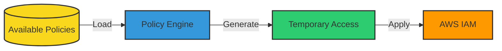
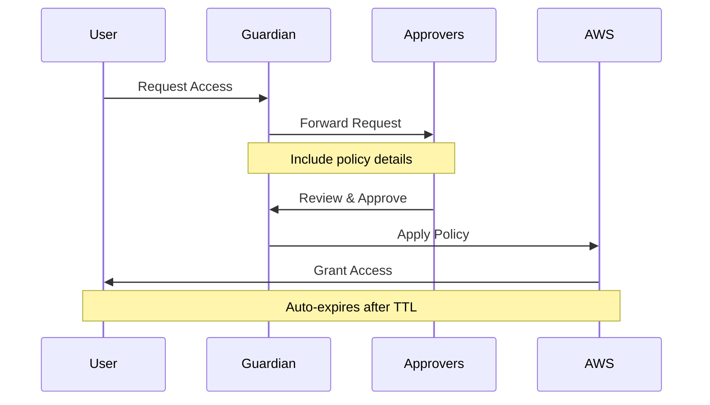
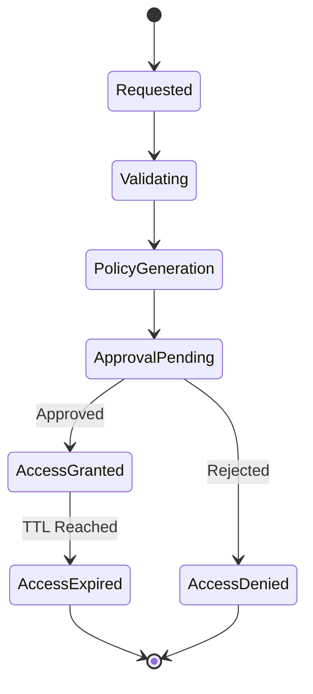
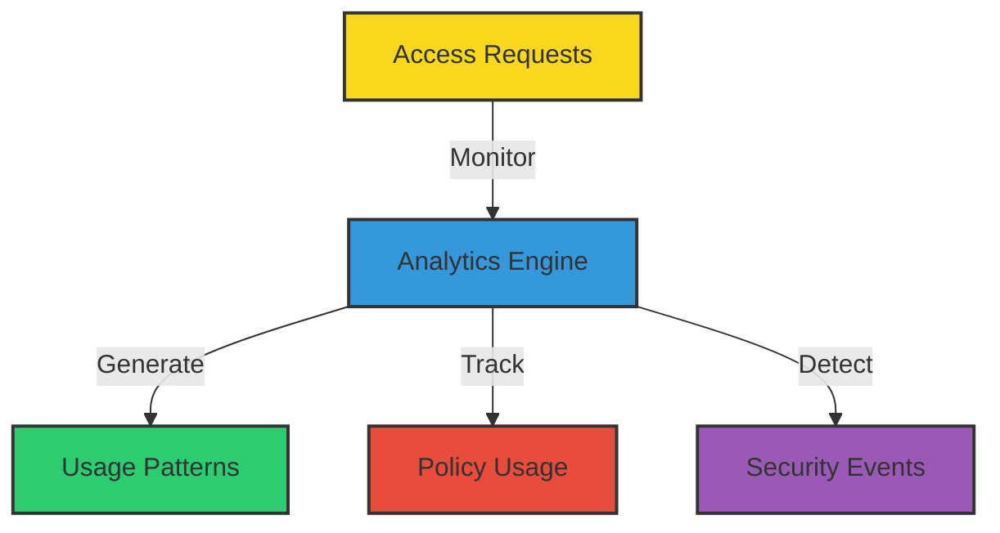

# 🛡️ AWS JIT Permissions Guardian

> Transform your AWS access management with AI-powered, Just-In-Time permissions control


## 🌟 Overview

AWS JIT Permissions Guardian revolutionizes AWS access management by providing secure, temporary, and AI-driven access control. It ensures least-privilege access while maintaining operational efficiency through automated workflows and intelligent policy management.

## 🏗️ Architecture & Workflow

```mermaid
flowchart TD
    User([User])
    Slack[Slack Interface]
    Guardian[JIT Guardian]
    Policy[Policy Engine]
    Approvers[Approvers Channel]
    AWS[AWS IAM]

    User -->|1. Request Access| Slack
    Slack -->|2. Process Request| Guardian
    Guardian -->|3. Validate & Generate| Policy
    Policy -->|4. Request Approval| Approvers
    Approvers -->|5. Approve/Deny| Guardian
    Guardian -->|6. Apply Policy| AWS
    AWS -->|7. Grant Access| User

    classDef user fill:#f9d71c,stroke:#333,stroke-width:2px
    classDef slack fill:#4A154B,stroke:#333,stroke-width:2px
    classDef guardian fill:#3498db,stroke:#333,stroke-width:2px
    classDef policy fill:#2ecc71,stroke:#333,stroke-width:2px
    classDef approvers fill:#e74c3c,stroke:#333,stroke-width:2px
    classDef aws fill:#FF9900,stroke:#333,stroke-width:2px

    class User user
    class Slack slack
    class Guardian guardian
    class Policy policy
    class Approvers approvers
    class AWS aws
```



## 🔑 Key Components

### Policy Management Flow


### Approval Process


## 🔄 Request Lifecycle



## 📊 Access Analytics



## ⚙️ Technical Stack

* **Infrastructure**: Terraform
* **Runtime**: Kubiya Runner (Kubernetes)
* **Integration**: AWS IAM, Slack
* **AI Engine**: GPT-4
* **Storage**: SQLite (for request tracking)

## 🚨 Prerequisites

### Required Configuration

* Kubiya Runner (Kubernetes Cluster)
* AWS IAM Permissions
* Slack Workspace
* Approvers Channel

### ⚡ Policy Configuration

```json
{
  "policies": [
    {
      "policy_name": "ReadOnlyAccess",
      "aws_account_id": "123456789012",
      "request_name": "Read Only Access"
    }
  ]
}
```

> ⚠️ **IMPORTANT**: The Guardian requires a valid policy configuration to function. Without properly configured available policies, the system will not process access requests.

## 🚀 Deployment

### 1. Configure Variables

```hcl
teammate_name           = "jit-guardian"
kubiya_runner          = "your-cluster"
approvers_slack_channel = "#aws-access-approvers"
multiline_available_policies = jsonencode({
  policies = [
    {
      policy_name     = "ReadOnlyAccess"
      aws_account_id  = "123456789012"
      request_name    = "Read Only Access"
    }
  ]
})
```

## 🚀 Deployment

### Quick Start (Recommended)
The easiest way to deploy AWS JIT Permissions Guardian is through the Kubiya web interface or API:

1. Visit [Kubiya Use Cases](https://docs.kubiya.ai/docs/get-started/choose-a-use-case-and-identify-prerequisites)
2. Select "AWS JIT Permissions Guardian" use case
3. Follow the guided setup process

This method automatically handles all infrastructure provisioning and configuration for you.

### Advanced Deployment (Optional)
For teams who prefer managing their infrastructure as code directly, you can use any terraform flavor:

#### 1. Configure Variables
```hcl
teammate_name           = "jit-guardian"
kubiya_runner          = "your-cluster"
approvers_slack_channel = "#aws-access-approvers"
multiline_available_policies = jsonencode({
  policies = [
    {
      policy_name     = "ReadOnlyAccess"
      aws_account_id  = "123456789012"
      request_name    = "Read Only Access"
    }
  ]
})
```

#### 2. Deploy Infrastructure
```bash
terraform init
terraform plan
terraform apply
```

> 💡 **Note**: While Kubiya uses Terraform as its backend, most users don't need to interact with it directly. The web interface and API provide a streamlined deployment experience.

## 🛠️ Usage Examples

### Request Access

```slack
@jit-guardian I need read-only access to S3 for debugging
```

### Approve Request

```slack
@jit-guardian approve access-request-123 for @user
```

## 🎯 Best Practices

### Policy Configuration

* Define clear policy names
* Use descriptive request names
* Keep policies minimal

### Approval Process

* Set up dedicated approvers channel
* Define clear approval criteria
* Document approval decisions

### Access Management

* Use time-bound access
* Monitor access patterns
* Regular policy reviews

## 🔍 Troubleshooting

### Common Issues and Solutions

#### Policy Not Found

* Verify policy configuration
* Check AWS account ID
* Validate policy name

#### Approval Timeout

* Check approvers channel
* Verify approver permissions
* Review notification settings

## 📚 Additional Resources

* [Kubiya Documentation](https://docs.kubiya.ai)
* [AWS IAM Best Practices](https://aws.amazon.com/iam/best-practices/)
* [Terraform Documentation](https://terraform.io/docs)

---

> 🔐 Secure by default, simple by design

Built with ❤️ by [Kubiya.ai](https://kubiya.ai)
