# 🚀 The Kubernetes Watcher: Your Virtual DevOps Fleet Tal

**Navigate the seas of Kubernetes complexity with your own dedicated crew of AI-powered specialists**


> "Let our crew handle the heavy lifting while you chart the course to success!"

## 🎯 Mission Statement

The Kubernetes Crew transforms complex cluster management into a smooth sailing experience. No more struggling with kubectl commands or spending hours troubleshooting – our AI-powered crew members work 24/7 to keep your Kubernetes fleet running at peak performance.

## 🌊 Why You Need a Kubernetes Crew

- **🤖 Turn Natural Language into Action**: Simply tell the crew what you need - they'll handle the technical details
- **🛡️ Automated Self-Healing**: Your cluster's health is monitored round-the-clock with automatic incident response
- **⚓ Zero Learning Curve**: New team members become Kubernetes experts instantly through natural conversations
- **🎮 Complete Control**: Maintain full oversight while delegating the complex tasks to your virtual crew
- **🔄 Continuous Optimization**: The crew constantly analyzes and improves your cluster's performance

## 🛠️ Core Capabilities

### 1. 🔄 Pod Management
```yaml
Pod Operations:
  Actions:
    - Get pod information
    - Delete pods
    - Retrieve pod logs
  Parameters:
    - action: [get, delete, logs]
    - name: pod name
    - namespace: required
    - container: optional for logs
```

### 2. 📊 Resource Monitoring & Health
```yaml
Monitoring Capabilities:
  - Cluster health summaries
  - Node resource usage
  - Pod resource consumption
  - High restart detection:
      threshold: default 5
      namespace: optional
```

### 3. 🚀 Deployment Operations
```yaml
Deployment Management:
  Actions:
    - Create deployments
    - Delete deployments
    - Scale resources
  Parameters:
    - action: [create, delete, get]
    - name: deployment name
    - namespace: required
    - image: for create
    - replicas: for scaling
```

### 4. 🛡️ Security & Networking
```yaml
Security Features:
  - Network policy analysis
  - Service exposure checks
  - Ingress configuration monitoring
  - Suspicious activity detection
Parameters:
  - namespace: required
  - scope: [cluster, namespace]
```

### 5. 🔍 Diagnostic Tools
```yaml
Diagnostic Capabilities:
  - Error detection
  - Event monitoring
  - Log analysis
  - Resource troubleshooting
Parameters:
  - resource_type: [pod, deployment, service]
  - resource_name: name
  - namespace: required
  - container: optional
  - tail: log line count
```

## 👥 Meet Your Crew

### The Bridge Team
- **🎯 Captain (Command Center)**: Orchestrates all cluster operations
- **🔍 Navigator (Monitoring Specialist)**: Keeps watch over cluster health
- **⚡ Engineer (Performance Expert)**: Optimizes resource utilization
- **🛡️ Security Officer**: Manages RBAC and security policies

### The Deck Crew
- **🔧 Mechanics**: Auto-healing and maintenance
- **📦 Cargo Specialists**: Handle deployments and scaling
- **📡 Communications**: Manage notifications and alerts
- **🎨 UI/UX Specialists**: Provide human-friendly interfaces

## 🛠️ Setup & Configuration

### Terraform Configuration

To deploy your Kubernetes Crew, use the following Terraform configuration:

```hcl
# Core Configuration
variable "teammate_name" {
  description = "Name of the Kubernetes crew teammate"
  type        = string
  default     = "k8s-watcher"
}

variable "kubiya_runner" {
  description = "Runner (cluster) to use for the teammate"
  type        = string
}

variable "notification_channel" {
  description = "Primary Slack channel for notifications"
  type        = string
  default     = "#devops-oncall"
}

# Access Control
variable "kubiya_groups_allowed_groups" {
  description = "Groups allowed to interact with the teammate"
  type        = list(string)
  default     = ["Admin"]
}
```

### Example Deployment

```hcl
module "k8s_crew" {
  source = "kubiya/kubernetes-crew/module"

  teammate_name             = "k8s-watcher"
  kubiya_runner            = "production-cluster"
  notification_channel     = "#k8s-alerts"
  kubiya_groups_allowed_groups = ["Admin", "DevOps", "SRE"]
}
```

### Configuration Parameters

| Parameter | Description | Default |
|-----------|-------------|---------|
| `teammate_name` | Your K8s crew teammate identifier | k8s-watcher |
| `kubiya_runner` | Target Kubernetes cluster for deployment | Required |
| `notification_channel` | Slack channel for alerts and notifications | #devops-oncall |
| `kubiya_groups_allowed_groups` | Authorized groups for teammate interaction | ["Admin"] |

## 💬 Example Interactions

### Scenario 1: Pod Troubleshooting
```markdown
You: @k8s-crew Check why pods in payment-service are crashing

Crew: 🔍 Analyzing payment-service pods:
1. Checking restart counts
2. Retrieving recent logs
3. Verifying resource consumption
4. Analyzing events

Found: Memory pressure in pod payment-service-785bf
Action: Adjusting resource limits and restarting pods
Would you like to see the detailed logs?
```

### Scenario 2: Resource Scaling
```markdown
You: @k8s-crew Scale the authentication deployment to 5 replicas

Crew: Executing scaling operation:
- Current replicas: 3
- Target replicas: 5
- Namespace: default
- Deployment: authentication

Scaling in progress...
✅ Successfully scaled. Monitoring deployment rollout...
```

### Scenario 3: Cluster Health Check
```markdown
You: @k8s-crew How's our cluster doing?

Crew: 📊 Cluster Health Report (Last 24h):
- Nodes: 8/8 Healthy
- Pod Success Rate: 99.8%
- Resource Utilization: 72%
- Recent Events: 2 automatic scaling events
- Alert: High memory usage in namespace: analytics

Would you like details about any specific component?
```

## 🏆 Best Practices

1. **Namespace Management**
   - Always specify namespaces for targeted operations
   - Use namespace isolation for different environments

2. **Resource Troubleshooting**
   - Check logs for error messages
   - Verify resource limits and requests
   - Ensure proper image pull configuration
   - Monitor pod restart counts

3. **Security Guidelines**
   - Regularly audit network policies
   - Review service exposures
   - Monitor for suspicious activities
   - Maintain proper RBAC configuration

## 🌟 Feature Fleet

### 1. 🤖 AI-Powered Operations
```yaml
Capabilities:
  - Natural Language Processing
  - Context-Aware Decision Making
  - Predictive Analysis
  - Automated Problem Resolution
```

### 2. 🛡️ Automated Protection
```yaml
Security:
  - Dynamic RBAC Management
  - Continuous Security Scanning
  - Compliance Monitoring
  - Access Control Automation
```

### 3. ⚡ Performance Optimization
```yaml
Optimization:
  - Resource Usage Analysis
  - Automatic Scaling
  - Cost Optimization
  - Performance Recommendations
```

## 🚀 Quick Start Guide

### 1. Summon Your Crew
Use the `!kubernetes` prefix in your chat platform to engage with the crew.

### 2. Start Delegating
```markdown
You: !kubernetes show cluster health
Crew: Running cluster diagnostics...
- Nodes: 4/4 Ready
- System pods: All healthy
- Resource pressure: None detected
```

## 🔄 Automated Tasks

The Kubernetes Crew comes with pre-configured scheduled tasks:
- Hourly health checks
- Daily resource optimization
- Weekly security audits
- Monthly performance reports

## 🎨 The Power of Natural Interaction

```mermaid
graph TD
    A[💭 Natural Language Request] --> B[🤖 AI Analysis]
    B --> C[⚙️ Technical Translation]
    C --> D[🔄 Execution]
    D --> E[📊 Results]
    E --> F[💬 Human-Friendly Response]
    
    style A fill:#f9d71c,stroke:#333,stroke-width:4px
    style B fill:#3498db,stroke:#333,stroke-width:4px
    style C fill:#2ecc71,stroke:#333,stroke-width:4px
    style D fill:#e74c3c,stroke:#333,stroke-width:4px
    style E fill:#9b59b6,stroke:#333,stroke-width:4px
    style F fill:#f1c40f,stroke:#333,stroke-width:4px
```



## 🏆 Benefits At-a-Glance

| Traditional K8s Management | With Kubernetes Crew |
|---------------------------|---------------------|
| Complex kubectl commands | Natural language requests |
| Manual troubleshooting | Automated problem resolution |
| Hours of monitoring | 24/7 AI-powered oversight |
| Steep learning curve | Instant team productivity |
| Reactive management | Proactive optimization |

## 🌟 Ready to Set Sail?

Transform your Kubernetes experience with a crew that never sleeps, never tires, and always keeps your clusters running at peak performance.

**[Get Started Now](#quick-start-guide)** | **[View Documentation](https://docs.kubiya.ai)** | **[Request Demo](https://kubiya.ai)**

---

*Let the crew handle the waves while you steer the ship! 🚢✨*
