# 🚀 The Kubernetes Watcher: Your Virtual DevOps Fleet

**Navigate the seas of Kubernetes complexity with your own dedicated crew of AI-powered specialists**


> "Let our crew handle the heavy lifting while you chart the course to success!"

## 🎯 Mission Statement

The Kubernetes Crew transforms complex cluster management into a smooth sailing experience. No more struggling with kubectl commands or spending hours troubleshooting – our AI-powered crew members work 24/7 to keep your Kubernetes fleet running at peak performance.

## 🌊 Why You Need a Kubernetes Crew

- **🤖 Turn Natural Language into Action**: Simply tell the crew what you need - they'll handle the technical details
- **🛡️ Automated Self-Healing**: Your cluster's health is monitored round-the-clock with automatic incident response
- **⚓ Zero Learning Curve**: New team members become Kubernetes experts instantly through natural conversations
- **🎮 Complete Control**: Maintain full oversight while delegating the complex tasks to your virtual crew
- **🔄 Continuous Optimization**: The crew constantly analyzes and improves your cluster's performance

## 👥 Meet Your Crew

### The Bridge Team
- **🎯 Captain (Command Center)**: Orchestrates all cluster operations
- **🔍 Navigator (Monitoring Specialist)**: Keeps watch over cluster health
- **⚡ Engineer (Performance Expert)**: Optimizes resource utilization
- **🛡️ Security Officer**: Manages RBAC and security policies

### The Deck Crew
- **🔧 Mechanics**: Auto-healing and maintenance
- **📦 Cargo Specialists**: Handle deployments and scaling
- **📡 Communications**: Manage notifications and alerts
- **🎨 UI/UX Specialists**: Provide human-friendly interfaces

## 🌟 Feature Fleet

### 1. 🤖 AI-Powered Operations
```yaml
Capabilities:
  - Natural Language Processing
  - Context-Aware Decision Making
  - Predictive Analysis
  - Automated Problem Resolution
```

### 2. 🛡️ Automated Protection
```yaml
Security:
  - Dynamic RBAC Management
  - Continuous Security Scanning
  - Compliance Monitoring
  - Access Control Automation
```

### 3. ⚡ Performance Optimization
```yaml
Optimization:
  - Resource Usage Analysis
  - Automatic Scaling
  - Cost Optimization
  - Performance Recommendations
```

## 💬 Example Interactions

### Scenario 1: Automated Health Reporting
```markdown
# In Slack
You: @k8s-crew How's our cluster doing?

Crew: 📊 Cluster Health Report (Last 24h):
- Nodes: 8/8 Healthy
- Pod Success Rate: 99.8%
- Resource Utilization: 72%
- Recent Events: 2 automatic scaling events
- Alert: High memory usage in namespace: analytics

Would you like details about any specific component?

You: Tell me more about the analytics namespace

Crew: 🔍 Analytics Namespace Analysis:
- Memory Usage: 85% (↑12% from yesterday)
- Running Pods: 15/16 (1 pending)
- Top Consumer: data-processor-785bf
- Recommendation: Consider increasing memory limits or optimizing the data-processor deployment

Should I prepare a scaling plan for the data-processor?
```

### Scenario 2: Self-Healing in Action
```markdown
# Automatic Slack Alert
Crew: 🚨 Alert: Detected failing pods in payment-service
- Issue: Liveness probe failing
- Action: Initiating automatic restart
- Status: Monitoring recovery

# 2 minutes later
Crew: ✅ Recovery Successful:
- All pods healthy
- Response time normalized
- Root cause: Memory pressure
- Preventive Action: Adjusted resource limits

Would you like me to prepare a detailed incident report?
```

### Scenario 3: Natural Language Operations
```markdown
You: @k8s-crew Can you deploy the latest version of our monitoring stack?

Crew: I'll help you update the monitoring stack:
1. Current version detected: v2.5.0
2. Latest available version: v2.6.1
3. Checking compatibility... ✅
4. Estimated update time: 5 minutes

Should I proceed with the update using our standard deployment strategy?

You: Yes, go ahead

Crew: 🚀 Initiating deployment:
- Updating Helm values
- Rolling update in progress
- Monitoring metrics
- Verifying endpoints

✅ Deployment successful! New features available:
- Enhanced metrics collection
- Improved dashboard templates
- Better alert correlation

Would you like me to show you the new monitoring dashboards?
```

## 🎨 The Power of Natural Interaction

```mermaid
graph TD
    A[💭 Natural Language Request] --> B[🤖 AI Analysis]
    B --> C[⚙️ Technical Translation]
    C --> D[🔄 Execution]
    D --> E[📊 Results]
    E --> F[💬 Human-Friendly Response]
    
    style A fill:#f9d71c,stroke:#333,stroke-width:4px
    style B fill:#3498db,stroke:#333,stroke-width:4px
    style C fill:#2ecc71,stroke:#333,stroke-width:4px
    style D fill:#e74c3c,stroke:#333,stroke-width:4px
    style E fill:#9b59b6,stroke:#333,stroke-width:4px
    style F fill:#f1c40f,stroke:#333,stroke-width:4px
```



## 🏆 Benefits At-a-Glance

| Traditional K8s Management | With Kubernetes Crew |
|---------------------------|---------------------|
| Complex kubectl commands | Natural language requests |
| Manual troubleshooting | Automated problem resolution |
| Hours of monitoring | 24/7 AI-powered oversight |
| Steep learning curve | Instant team productivity |
| Reactive management | Proactive optimization |

## 🚀 Quick Start Guide

Note: After installing this delegation, you will benefit from scheduled tasks that are coming out of out box as part of the bundle. Those tasks will summon the teammates to check on your cluster on fixed intervals.


### 1. Summon Your Crew
Tag the Kubiya app on the relevant chat platform (eg. Slack), with the !kubernetes prefix. eg: `!kubernetes` which will start a conversation with the team mates

### 2. Start Delegating
```slack
You: @k8s-crew We need more resources for the payment service
Crew: Analyzing current usage... Scaling payment-service deployment from 3 to 5 replicas. Monitoring performance...
```

## 🌟 Ready to Set Sail?

Transform your Kubernetes experience with a crew that never sleeps, never tires, and always keeps your clusters running at peak performance.

**[Get Started Now](#quick-start-guide)** | **[View Documentation](https://docs.kubiya.ai)** | **[Request Demo](https://kubiya.ai)**

---

*Let the crew handle the waves while you steer the ship! 🚢✨*
