# 🚀 The Kubernetes Crew: Your Virtual DevOps Fleet

**Navigate the seas of Kubernetes complexity with your own dedicated crew of AI-powered specialists**


> "Let our crew handle the heavy lifting while you chart the course to success!"

## 🎯 Mission Statement

The Kubernetes Crew transforms complex cluster management into a smooth sailing experience. No more struggling with kubectl commands or spending hours troubleshooting – our AI-powered crew members work 24/7 to keep your Kubernetes fleet running at peak performance.

## 🌊 Why You Need a Kubernetes Crew

- **🤖 Turn Natural Language into Action**: Simply tell the crew what you need - they'll handle the technical details
- **🛡️ Automated Self-Healing**: Your cluster's health is monitored round-the-clock with automatic incident response
- **⚓ Zero Learning Curve**: New team members become Kubernetes experts instantly through natural conversations
- **🎮 Complete Control**: Maintain full oversight while delegating the complex tasks to your virtual crew
- **🔄 Continuous Optimization**: The crew constantly analyzes and improves your cluster's performance

## 👥 Meet Your Crew

### The Bridge Team
- **🎯 Captain (Command Center)**: Orchestrates all cluster operations
- **🔍 Navigator (Monitoring Specialist)**: Keeps watch over cluster health
- **⚡ Engineer (Performance Expert)**: Optimizes resource utilization
- **🛡️ Security Officer**: Manages RBAC and security policies

### The Deck Crew
- **🔧 Mechanics**: Auto-healing and maintenance
- **📦 Cargo Specialists**: Handle deployments and scaling
- **📡 Communications**: Manage notifications and alerts
- **🎨 UI/UX Specialists**: Provide human-friendly interfaces

## 🚀 Deployment Options

### 1. 🎨 Quick Deploy via Kubiya Web Interface

1. Navigate to **Teammates** → **Use Cases** in Kubiya
2. Click **New Use Case** and select **Kubernetes Crew**
3. Configure:
   - Runner name
   - Notification channel
   - Access permissions
4. Deploy and start interacting!

### 2. 🏗️ Infrastructure as Code (Terraform)

1. Clone the repository:
```bash
git clone https://github.com/kubiyabot/terraform-modules
cd terraform-modules/kubernetes-crew
```

2. Create `terraform.tfvars`:
```hcl
kubiya_runner              = "my-cluster-runner"
notification_slack_channel = "#k8s-alerts"
users                     = ["user@example.com"]
groups                    = ["platform-team"]

scheduled_tasks = {
  health_check = {
    enabled    = true
    start_time = "2024-01-01T09:00:00Z"
    repeat     = "daily"
  }
  capacity_check = {
    enabled    = true
    start_time = "2024-01-01T10:00:00Z"
    repeat     = "weekly"
  }
}
```

3. Deploy:
```bash
terraform init
terraform apply
```

## 📦 Resource Structure

### 1. 📚 Knowledge Base
The crew comes with built-in knowledge about Kubernetes operations:

```bash
kubernetes-crew/
└── knowledge/
    └── kubernetes_ops.md    # Core Kubernetes knowledge
        ├── Cluster Health Indicators
        ├── Common Issues & Solutions
        ├── Best Practices
        └── Optimization Guidelines
```

### 2. 🤖 Built-in Prompts
Pre-configured prompts that power the crew's automated tasks:

```bash
kubernetes-crew/
└── prompts/
    ├── health_check.md       # Daily cluster health assessment
    ├── capacity_check.md     # Resource usage and optimization
    ├── deployment_monitor.md # Deployment status tracking
    ├── app_creation.md      # New application setup assistant
    └── gitops_pr.md         # GitOps PR automation
```

### 3. ⚙️ Configuration Options

#### Core Variables
```hcl
# Required
kubiya_runner              = "my-cluster"        # Your runner name
notification_slack_channel = "#k8s-alerts"       # Slack channel

# Optional
teammate_name = "k8s-crew"                      # Custom crew name
users         = ["user@company.com"]            # Authorized users
groups        = ["platform-team"]               # Authorized groups
log_level     = "INFO"                          # Logging detail
```

#### Scheduled Tasks
```hcl
scheduled_tasks = {
  # Daily Health Check
  health_check = {
    enabled    = true
    start_time = "2024-01-01T09:00:00Z"
    repeat     = "daily"
  }
  
  # Weekly Capacity Analysis
  capacity_check = {
    enabled    = true
    start_time = "2024-01-01T10:00:00Z"
    repeat     = "weekly"
  }
  
  # Custom Task Example
  custom_check = {
    enabled       = true
    start_time    = "2024-01-01T11:00:00Z"
    repeat        = "hourly"
    custom_prompt = "Check the status of critical services"
  }
}
```

### 4. 🔄 Task Schedule Options
Available scheduling intervals:
- `hourly`: Run every hour
- `daily`: Run once per day
- `weekly`: Run once per week
- `monthly`: Run once per month

### 5. 🎯 Default Tasks

| Task | Schedule | Purpose |
|------|----------|---------|
| Health Check | Daily | Comprehensive cluster health assessment |
| Capacity Check | Weekly | Resource usage analysis and optimization |
| Deployment Monitor | Hourly | Track deployment status and health |
| Security Scan | Daily | Security and compliance verification |
| Backup Verification | Daily | Validate backup status |
| Cost Analysis | Weekly | Resource cost optimization |
| Compliance Check | Weekly | Policy compliance verification |
| Update Check | Weekly | Version and update management |

## 🗣️ Your Crew in Action

### 1. Automated Health Checks
```plaintext
# The crew automatically reports every morning
Crew: 🏥 Daily Health Check Report
> Good morning! I've completed our morning inspection:
> 
> ✅ Fleet Status:
> - All 5 nodes standing strong
> - Control plane sailing smoothly
> - Resource seas are calm
> 
> ⚠️ Weather Warning:
> - Storm brewing in 'analytics' namespace (85% memory pressure)
> - Two pods have gone overboard in 'backend' waters
> 
> Shall I:
> 1. Launch a rescue mission for the failing pods
> 2. Navigate around the memory pressure
> 3. Chart a detailed course of action
```

### 2. Resource Optimization
```plaintext
# Weekly automated check
Crew: 📊 Weekly Resource Analysis
> I've analyzed your cluster's resource usage:
>
> 💡 Optimization Opportunities:
> 1. frontend-app is overprovisioned
>    - Current: 2CPU/4GB
>    - Recommended: 1CPU/2GB
>    - Potential savings: $120/month
>
> 2. Found 3 idle deployments
>    - test-env (unused for 30 days)
>    - staging-db (no traffic)
>    - old-cache (deprecated)
>
> Would you like me to:
> 1. Prepare resource adjustment PR
> 2. Clean up idle resources
> 3. Show detailed analysis
```

### 3. Interactive Troubleshooting
```plaintext
@Kubiya investigate high latency in payment service
> 🔍 Investigating payment service latency...
>
> Found several contributing factors:
> 1. Database connection pool near limit (90%)
> 2. High pod CPU throttling (75%)
> 3. Network policy limiting connections
>
> Recommended actions:
> 1. Increase connection pool size
> 2. Scale up CPU limits
> 3. Adjust network policy
>
> Should I help you implement these fixes?
```

### 4. Deployment Management
```plaintext
@Kubiya deploy new version of auth-service
> 🚀 Planning deployment for auth-service
>
> Pre-deployment checks:
> ✅ Target cluster healthy
> ✅ Sufficient resources available
> ✅ Backup exists
> ⚠️ High traffic period
>
> Recommended strategy:
> - Canary deployment (20% traffic)
> - 15-minute observation window
> - Automatic rollback on errors
>
> Shall we proceed with this approach?
```

### 5. Security Monitoring
```plaintext
# Daily automated security scan
Crew: 🔒 Security Scan Results
> Completed daily security assessment:
>
> 🛡️ Findings:
> - 3 pods running as root
> - Outdated base image in 'payment-processor'
> - Missing network policies in 'data' namespace
>
> Critical Updates Available:
> - ingress-nginx: 1.8.1 -> 1.9.0 (security fix)
> - cert-manager: 1.11.0 -> 1.12.0
>
> Would you like me to:
> 1. Generate security fix PRs
> 2. Apply critical updates
> 3. Show detailed report
```

## 🎨 The Power of Natural Interaction

```mermaid
graph TD
    A[💭 Natural Language Request] --> B[🤖 AI Analysis]
    B --> C[⚙️ Technical Translation]
    C --> D[🔄 Execution]
    D --> E[📊 Results]
    E --> F[💬 Human-Friendly Response]
    
    style A fill:#f9d71c,stroke:#333,stroke-width:4px
    style B fill:#3498db,stroke:#333,stroke-width:4px
    style C fill:#2ecc71,stroke:#333,stroke-width:4px
    style D fill:#e74c3c,stroke:#333,stroke-width:4px
    style E fill:#9b59b6,stroke:#333,stroke-width:4px
    style F fill:#f1c40f,stroke:#333,stroke-width:4px
```



## 🏆 Benefits At-a-Glance

| Traditional K8s Management | With Kubernetes Crew |
|---------------------------|---------------------|
| Complex kubectl commands | Natural language requests |
| Manual troubleshooting | Automated problem resolution |
| Hours of monitoring | 24/7 AI-powered oversight |
| Steep learning curve | Instant team productivity |
| Reactive management | Proactive optimization |

## 📚 Extending Your Crew

### 1. Custom Knowledge
Add your own knowledge in markdown format:
```bash
kubernetes-crew/
└── knowledge/
    ├── kubernetes_ops.md     # Core operations knowledge
    ├── runbooks/            # Custom runbooks
    ├── procedures/          # Standard procedures
    └── best_practices/      # Best practices
```

### 2. Custom Prompts
Define new automated tasks through prompts:
```bash
kubernetes-crew/
└── prompts/
    ├── health_check.md      # Cluster health checks
    ├── capacity_check.md    # Resource capacity analysis
    ├── deployment_monitor.md # Deployment tracking
    └── app_creation.md      # Application setup assistance
```

## 🔧 Configuration Reference

### Required Variables
- `kubiya_runner`: Your Kubiya runner name
- `notification_slack_channel`: Slack channel for alerts

### Optional Variables
- `teammate_name`: Custom name for your crew (default: "k8s-crew")
- `users`: List of authorized users
- `groups`: List of authorized groups
- `scheduled_tasks`: Custom task schedules

## 📚 Additional Resources

- [How to Use Your Teammate](https://docs.kubiya.ai/docs/get-started/use-your-teammate)
- [Slack Integration Guide](https://docs.kubiya.ai/docs/integrations/slack)
- [Knowledge Base Guide](https://docs.kubiya.ai/docs/kubiya-resources/knowledge)
- [Prompts Documentation](https://docs.kubiya.ai/docs/kubiya-resources/prompts)

---

*Let the crew handle the waves while you steer the ship! 🚢✨*
