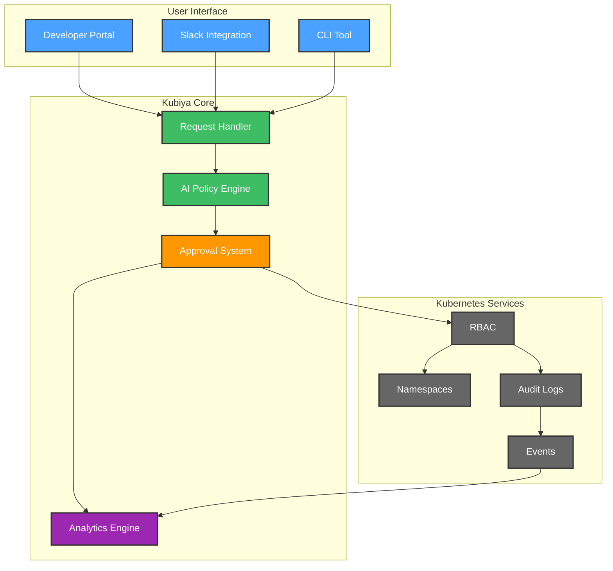
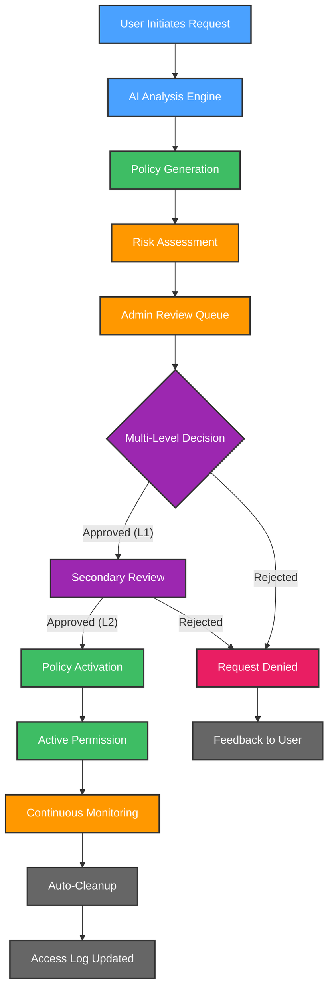
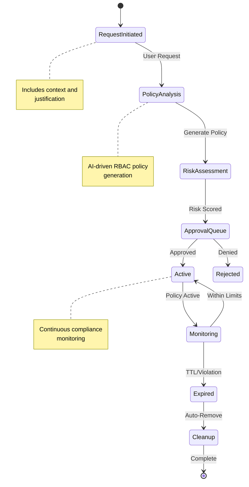
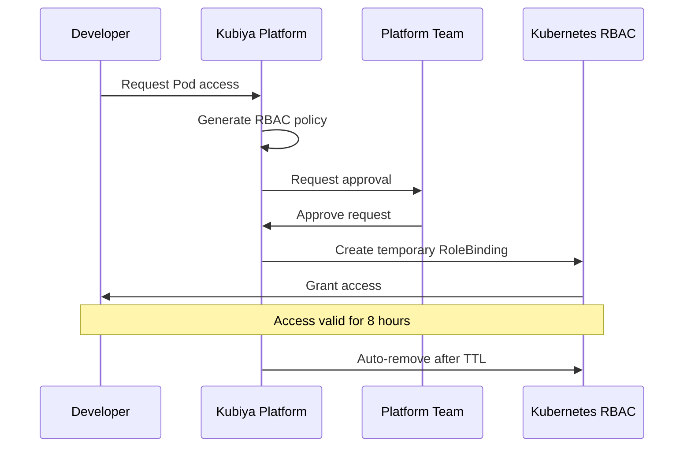
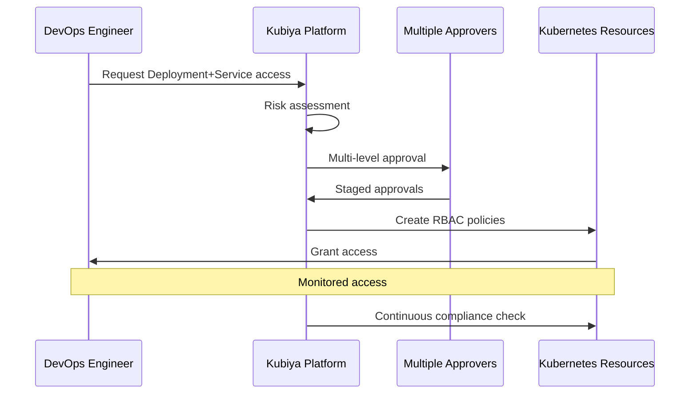

# 🔐 Kubernetes JIT Permissions Crew

Kubernetes JIT (Just-In-Time) Permissions Crew is your intelligent companion within the Kubiya platform, designed to revolutionize Kubernetes access management. It provides AI-driven, secure, and efficient temporary access to Kubernetes resources, ensuring least-privilege access while maintaining operational efficiency.


**🎯 Transform your Kubernetes access management with AI-powered, temporary permissions that expire automatically! Keep your K8s clusters secure while maintaining developer productivity.**

> **📢 Important Note**: This Kubernetes JIT solution is part of Kubiya's comprehensive permissions management suite. Kubiya provides dynamic Just-In-Time access solutions across the entire DevOps and platform engineering toolchain. Our permissions management suite offers out-of-the-box solutions for various platforms and tools. Explore our full range of use cases:
> - Browse our [official Terraform repository](https://github.com/kubiyabot/terraform-modules)
> - Visit the Use Cases interface in the Kubiya web UI for a visual catalog of solutions that can be easily installed and configured, with or without Terraform

## 📑 Table of Contents
- [🔐 Kubernetes JIT Permissions Crew](#-kubernetes-jit-permissions-crew)
  - [📑 Table of Contents](#-table-of-contents)
  - [🌟 Features](#-features)
  - [🏗 Architecture](#-architecture)
  - [🔄 User Flows](#-user-flows)
    - [1. 🎫 Enhanced Access Request \& Approval Flow](#1--enhanced-access-request--approval-flow)
    - [2. 🔐 Advanced Policy Lifecycle Management](#2--advanced-policy-lifecycle-management)
  - [🛠️ Configuration](#️-configuration)
  - [🚀 Getting Started](#-getting-started)
  - [🎭 Example Scenarios](#-example-scenarios)
    - [Scenario 1: Pod Access](#scenario-1-pod-access)
    - [Scenario 2: Multiple Resource Access](#scenario-2-multiple-resource-access)
  - [📊 Key Benefits](#-key-benefits)
  - [📚 References](#-references)

## 🌟 Features

- 🤖 **AI Policy Generation**: Intelligent creation of least-privilege RBAC policies using advanced ML models
- 👥 **Approval Workflow**: Seamless Slack-integrated approval process with multi-level authorization
- ⏳ **Auto-Expiring Access**: Temporary permissions with automatic removal and configurable TTL
- 📢 **Smart Notifications**: Real-time Slack alerts for approvals with actionable buttons
- 📈 **Access Analytics**: Comprehensive tracking of permission patterns and usage metrics
- 🔒 **Security Controls**: Enforced least-privilege access with audit trails
- 🔄 **K8s Integration**: Native support for RBAC, ServiceAccounts, and ClusterRoles
- 🎯 **Context-Aware**: Intelligent permission suggestions based on user roles and history
- 🔍 **Compliance Monitoring**: Real-time tracking of access patterns and policy violations

## 🏗 Architecture



## 🔄 User Flows

### 1. 🎫 Enhanced Access Request & Approval Flow



### 2. 🔐 Advanced Policy Lifecycle Management



## 🛠️ Configuration

Below are the key variables used to configure the Kubernetes JIT Permissions Crew:

| Variable Name | Description | Type | Default | Required |
|---------------|-------------|------|---------|-----------|
| `teammate_name` | Name of the JIT Permissions teammate | `string` | `"k8s-jit-guardian"` | Yes |
| `kubiya_runner` | Runner to use for the teammate | `string` | | Yes |
| `k8s_context` | Kubernetes context for operations | `string` | | Yes |
| `policy_ttl` | Default policy expiration time | `string` | `"8h"` | No |
| `approves_group_name` | Name of the group that can approve requests | `string` | `"Admin"` | No |
| `approvers_slack_channel` | Slack channel for approval requests (must start with #) | `string` | `"#devops-oncall"` | Yes |
| `restricted_tools` | Tools to be restricted by the policy | `list(string)` | `[]` | No |
| `tool_validation_rules` | Validation rules for specific tool parameters | `map(object)` | See variables.tf | No |
| `kubiya_groups_allowed_groups` | Kubiya groups who can request access | `list(string)` | `["Admin"]` | No |
| `kubiya_integrations` | List of Kubiya integrations to enable | `list(string)` | `["slack"]` | No |
| `okta_enabled` | Enable Okta Integration | `bool` | `false` | No |
| `okta_base_url` | Your Okta domain URL | `string` | `"https://org.okta.com"` | No |
| `okta_client_id` | Okta application client ID | `string` | | No |
| `okta_private_key` | Private key for Okta authentication | `string` | | No |
| `dd_enabled` | Enable DataDog Integration | `bool` | `false` | No |
| `dd_site` | DataDog site | `string` | `"us5.datadoghq.com"` | No |
| `dd_api_key` | DataDog API key | `string` | | No |
| `allowed_namespaces` | Permitted Kubernetes namespaces | `list(string)` | | Yes |
| `max_duration` | Maximum permission duration | `string` | `"24h"` | No |
| `risk_threshold` | Maximum allowed risk score | `number` | `0.7` | No |
| `approval_levels` | Number of approval levels required | `number` | `1` | No |
| `audit_log_retention` | Days to retain audit logs | `number` | `90` | No |
| `kubiya_tool_timeout` | Timeout for Kubiya tools in seconds | `number` | `500` | No |
| `debug_mode` | Enable detailed information during runtime | `bool` | `false` | No |

## 🚀 Getting Started

1. **Log into Kubiya Platform**:
   - Visit [app.kubiya.ai](https://app.kubiya.ai)
   - Log in with your credentials

2. **Navigate to Use Cases**:
   - Go to "Teammates" section
   - Click on "Use Cases"
   - Click "Add Use Case"
   - Select "Just-in-Time Permissions Guardian"

3. **Configure Settings**:
   Fill in the required fields:
   ```hcl
   teammate_name        = "k8s-jit"
   k8s_context         = "production-cluster"
   slack_channel       = "#k8s-access-requests"
   approvers          = ["@platform-team", "@security-leads"]
   allowed_namespaces = ["development", "staging", "monitoring"]
   max_duration       = "12h"
   ```

4. **Deploy**:
   ```bash
   terraform init
   terraform plan
   terraform apply
   ```

5. **Set Up Webhook Environment Variable**:
   ```bash
   export REQUEST_ACCESS_WEBHOOK_URL="https://kubiya.ai/webhooks/..."
   ```

## 🎭 Example Scenarios

### Scenario 1: Pod Access


### Scenario 2: Multiple Resource Access


## 📊 Key Benefits

- ⏱️ **Time Savings**: 90% reduction in access management overhead
- 🔒 **Security Enhancement**: 100% automated policy expiration
- 🎯 **Accuracy**: 95% reduction in over-privileged access
- 📈 **Compliance**: Complete audit trail with real-time monitoring
- 👥 **Efficiency**: Streamlined approval process with 70% faster turnaround

## 📚 References

- [Kubiya Documentation](https://docs.kubiya.ai)
- [Kubernetes RBAC Best Practices](https://kubernetes.io/docs/reference/access-authn-authz/rbac/)
- [Terraform Kubernetes Provider](https://registry.terraform.io/providers/hashicorp/kubernetes/latest/docs)
- [Slack API Documentation](https://api.slack.com/docs)
- [Just-In-Time Access Patterns](https://www.kubiya.ai/blog/jit-access-patterns)
- [Implementation Guide](https://docs.kubiya.ai/guides/k8s-jit)
- [API Reference](https://api.kubiya.ai/docs)
- [Community Forums](https://community.kubiya.ai)

---

Ready to transform your Kubernetes access management? Deploy your AI crew today! 🚀

**[Get Started](https://app.kubiya.ai)** | **[Documentation](https://docs.kubiya.ai)** | **[Request Demo](https://kubiya.ai)**

---

*Let Kubernetes JIT Permissions Crew handle your access management while maintaining security! 🔐✨*
