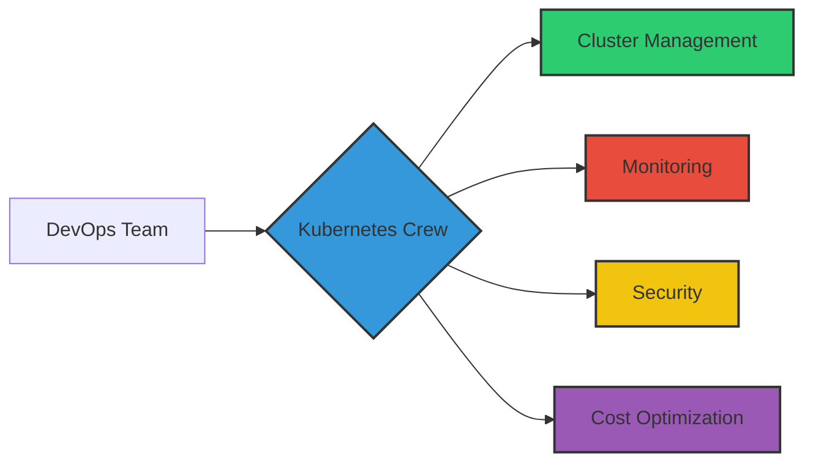
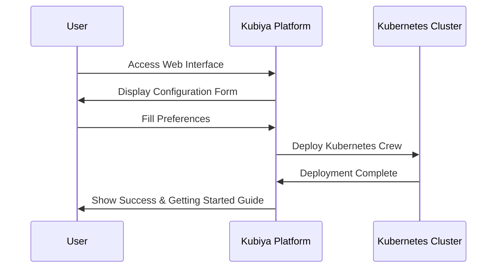
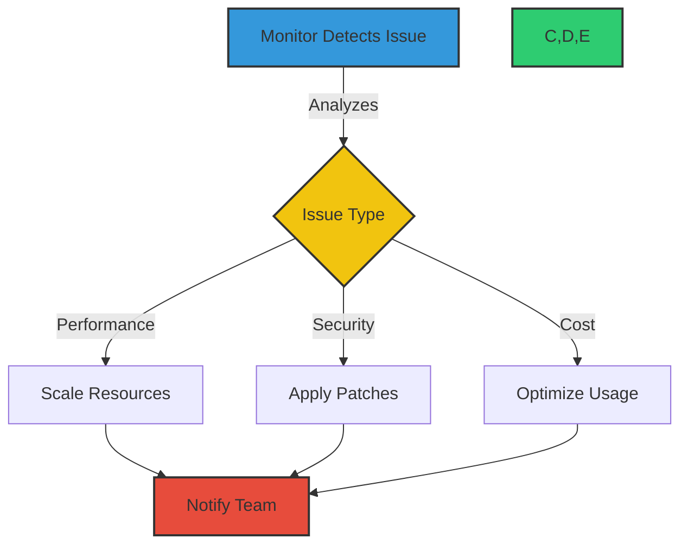

# 🚀 Kubernetes Crew

<div align="center">


*Your AI-Powered Kubernetes Operations Team*

[](https://app.kubiya.ai)
[](https://registry.terraform.io/providers/kubiya/kubiya/latest)

</div>

## 🎯 Overview

Kubernetes Crew is your intelligent DevOps companion that transforms Kubernetes operations from complex to effortless. Whether you're a seasoned Kubernetes expert or just getting started, Kubernetes Crew provides an intuitive interface to manage, monitor, and maintain your clusters with confidence.



## 🌟 Key Features

### Intelligent Operations
- 🤖 **AI-Powered Assistance**: Natural language interactions for complex Kubernetes operations
- 🔄 **Automated Remediation**: Smart detection and resolution of common cluster issues
- 📊 **Predictive Analytics**: Proactive resource optimization and scaling recommendations

### Comprehensive Monitoring
- 🩺 **Real-time Health Checks**: Continuous cluster vitals monitoring
- 🚨 **Smart Alerting**: Context-aware notifications with suggested actions
- 📈 **Performance Tracking**: Detailed metrics and trend analysis

### Security & Compliance
- 🔒 **Security Scanning**: Regular vulnerability assessments
- 📋 **Compliance Checks**: Automated policy enforcement
- 🔐 **RBAC Management**: Simplified access control administration

### Cost Optimization
- 💰 **Resource Optimization**: Intelligent resource allocation recommendations
- 📉 **Cost Analysis**: Detailed cost breakdowns and trending
- 💡 **Efficiency Insights**: Actionable recommendations for cost reduction

## 🚀 Deployment Options

### Option 1: Deploy via Kubiya Web Interface

If you're viewing this from [app.kubiya.ai](https://app.kubiya.ai), deployment is just a few clicks away:

1. Click the "Deploy" button at the top of the page
2. Configure your preferences in the intuitive UI:
   - Select which monitoring tasks to enable
   - Set monitoring intervals
   - Configure notification channels
3. Click "Deploy" and you're ready to go!



### Option 2: Deploy with Terraform

For infrastructure-as-code enthusiasts:

1. Configure your Terraform environment:
```hcl
terraform {
  required_providers {
    kubiya = {
      source = "kubiya/kubiya"
    }
  }
}
```

2. Create your configuration:
```hcl
module "kubernetes_crew" {
  source = "kubiya/kubernetes-crew/kubiya"
  
  teammate_name = "k8s-crew"
  kubiya_runner = "prod-cluster"
  enable_cluster_health_monitoring = true
  notification_slack_channel = "#k8s-alerts"
}
```

3. Deploy:
```bash
terraform init
terraform apply
```

## 💡 Intelligent Features in Action

### Natural Language Operations
Transform complex kubectl commands into natural conversations:

```bash
# Instead of:
kubectl get pods -n production -l app=frontend --field-selector status.phase=Failed

# Just say:
@k8s-crew "Show me failed frontend pods in production"
```

### Smart Monitoring
Kubernetes Crew doesn't just monitor - it understands and acts:



## 📊 Scheduled Tasks

Kubernetes Crew comes with pre-configured tasks that can be enabled/disabled based on your needs:

| Task | Description | Default Schedule |
|------|-------------|------------------|
| Health Check | Cluster vitals monitoring | Hourly |
| Resource Optimization | Resource usage analysis | Daily |
| Security Scan | Vulnerability assessment | Daily |
| Cost Analysis | Resource cost optimization | Weekly |
| Compliance Check | Policy compliance verification | Weekly |
| Backup Verification | Backup system health check | Daily |

## 🔧 Advanced Configuration

### Custom Monitoring Rules
Create specialized monitoring rules:

```yaml
monitoring_rules:
  - name: "High Priority Apps"
    namespaces: ["prod"]
    labels:
      priority: high
    checks:
      - type: "availability"
        threshold: 99.9
      - type: "latency"
        threshold: 100ms
```

### Integration Options
Connect with your existing tools:

- 🔄 **CI/CD**: Jenkins, GitLab, GitHub Actions
- 📊 **Monitoring**: Prometheus, Grafana
- 💬 **Communication**: Slack, Teams, Discord
- 🔒 **Security**: Snyk, Aqua, Twistlock

## 📚 Resources

- [📖 Full Documentation](https://docs.kubiya.ai/kubernetes-crew)
- [🎓 Tutorials](https://learn.kubiya.ai/kubernetes-crew)
- [👥 Community Forum](https://community.kubiya.ai)
- [📺 Video Guides](https://youtube.com/kubiya)

## 🤝 Support

- 💬 Join our [Slack Community](https://slack.kubiya.ai)
- 📧 Email: support@kubiya.ai
- 🐛 [Issue Tracker](https://github.com/kubiya/kubernetes-crew/issues)

---

<div align="center">

**Start managing your Kubernetes clusters the smart way!**

[Get Started with Kubernetes Crew](https://app.kubiya.ai/deploy/kubernetes-crew) • [View on GitHub](https://github.com/kubiya/kubernetes-crew)

</div> 