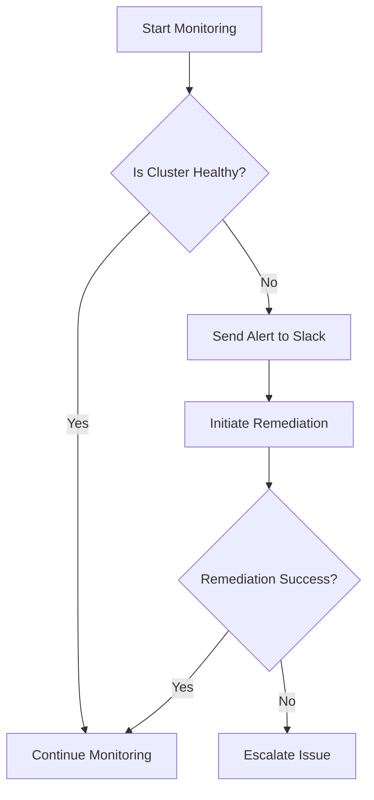
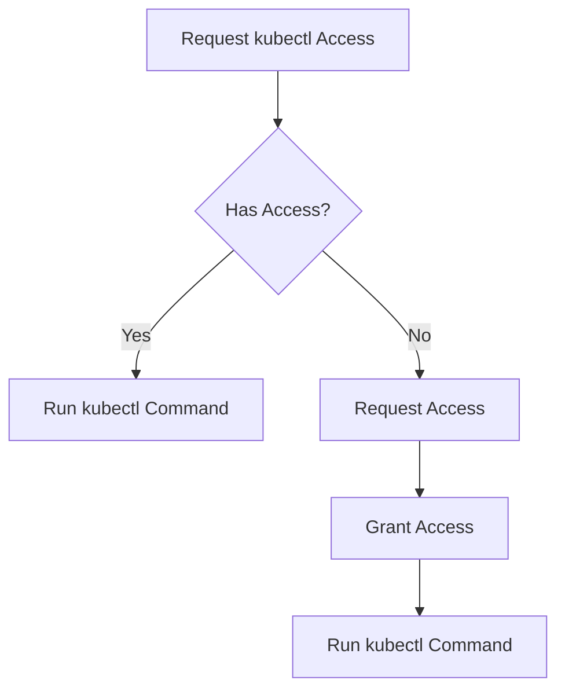

# Kubernetes Sidekick

Kubernetes Sidekick is an intelligent delegation within the Kubiya platform designed to simplify and enhance Kubernetes cluster management. It provides various tools to interact with Kubernetes clusters, handling end-to-end processes for monitoring, kubectl access, Helm chart management, and much more.

**Become an expert in Kubernetes in no time! With Kubernetes Sidekick, everyone on your team can master Kubernetes effortlessly, managing clusters like a pro.**

## Features

- **Cluster health monitoring**
- **Intelligent event scraping**
- **kubectl access**
- **Helm chart application (optional)**
- **Argo CD integration (optional)**
- **Custom kubeconfig support**
- **In-cluster context support**
- **Slack notifications**

## User Flows

### 1. Cluster Health Monitoring

Kubernetes Sidekick continuously monitors cluster health, scraping events, analyzing node and pod statuses, and sending alerts. This ensures timely detection of issues and automatic remediation processes.

### 2. kubectl Access
Kubernetes Sidekick grants users direct access to kubectl commands without needing extensive Kubernetes knowledge. Manage deployments, services, and more right from Slack!

## Terraform Variables

Below are the key variables used to configure the Kubernetes Sidekick agent:

| Variable Name                    | Description                                         | Type     | Default   |
|-----------------------------------|-----------------------------------------------------|----------|-----------|
| `teammate_name`                      | Name of the Kubernetes Sidekick teammate               | `string` |           |
| `kubiya_runner`                   | Runner (cluster) to use for the teammate               | `string` |           |
| `teammate_name`               | Description of the Kubernetes Sidekick teammate        | `string` |           |
| `use_custom_kubeconfig`           | Whether to use a custom kubeconfig                  | `bool`   | `false`   |
| `custom_kubeconfig`               | Custom kubeconfig as a string                       | `string` | `""`      |
| `use_in_cluster_context`          | Whether to use in-cluster context                   | `bool`   | `true`    |
| `enable_cluster_health_monitoring`| Enable cluster health monitoring                    | `bool`   | `true`    |
| `cluster_health_check_interval`   | Interval for cluster health checks                  | `string` | `"1h"`    |
| `enable_intelligent_event_scraping`| Enable intelligent event scraping                   | `bool`   | `true`    |
| `enable_kubectl_access`           | Enable kubectl access                               | `bool`   | `true`    |
| `enable_helm_chart_application`   | Enable applying Helm charts                         | `bool`   | `false`   |
| `enable_argo_cd_integration`      | Enable Argo CD integration                          | `bool`   | `false`   |
| `notification_slack_channel`      | Slack channel for notifications                     | `string` | `""`      |
| `users`                           | Users who can interact with the teammate               | `list(string)` |    |
| `groups`                          | Groups who can interact with the teammate              | `list(string)` |    |
| `integrations`                    | Integrations for the teammate                          | `list(string)` |    |
| `log_level`                       | Log level                                           | `string` | `"INFO"`  |
| `debug`                           | Enable debug mode                                   | `bool`   | `false`   |
| `dry_run`                         | Enable dry run mode                                 | `bool`   | `false`   |

---

With **Kubernetes Sidekick**, managing Kubernetes clusters is now easier than ever. Delegate tasks, stay informed, and manage your clusters like a pro!
