# Query Assistant Platform

An AI-powered assistant that helps users find answers by intelligently searching through Slack conversation history. The platform enables teams to leverage their existing knowledge base within Slack channels through natural language queries.

## 🎯 Overview

The Query Assistant Platform is designed to:
- Search through Slack channel history and thread replies for relevant information
- Provide comprehensive answers based on discovered content
- Include context and references to original messages
- Handle natural language queries effectively
- Bridge users to knowledge contained in Slack conversations

## 🏗️ Architecture

```mermaid
flowchart TB
    %% Nodes with icons
    TF["🔧 Terraform Module"]
    VARS["📝 variables.tf"]
    MAIN["⚙️ main.tf"]
    FORM["✨ Kubiya UI Form"]
    CONFIG["🎯 User Configuration"]
    PLAN["👀 Review Changes"]
    DEPLOY["🚀 Deploy Resources"]
    
    %% Kubiya Resources
    ASSISTANT["🤖 Query Assistant"]
    SLACK_SEARCH["🔍 Slack Search"]
    THREAD_FETCH["📜 Thread Fetcher"]
    
    %% Tool Sources
    TOOLS["⚡ Tool Sources"]
    SLACK_TOOLS["💬 Slack Tools"]
    
    %% Chat Resources
    SLACK["💬 Slack Platform"]
    USER_QUERY["❓ User Question"]
    RESPONSE["✅ AI Response"]
    SLACK_API["🔌 Slack API"]

    %% Configuration Flow
    subgraph "1️⃣ Setup Phase"
        TF --> |"defines"| VARS
        TF --> |"contains"| MAIN
        VARS --> |"generates"| FORM
        FORM --> |"fill"| CONFIG
        CONFIG --> |"review"| PLAN
        PLAN --> |"apply"| DEPLOY
    end

    %% Resource Creation
    subgraph "2️⃣ Resources"
        DEPLOY --> |"creates"| ASSISTANT
        DEPLOY --> |"enables"| SLACK_SEARCH
        DEPLOY --> |"enables"| THREAD_FETCH
        DEPLOY --> |"configures"| SLACK
    end

    %% Tool Sources
    subgraph "3️⃣ Tools & Actions"
        TOOLS --> SLACK_TOOLS
        ASSISTANT --> |"uses"| TOOLS
        SLACK_TOOLS --> |"interacts"| SLACK_API
    end

    %% Query Flow
    subgraph "4️⃣ Execution"
        USER_QUERY --> |"triggers"| SLACK
        SLACK --> |"activates"| ASSISTANT
        ASSISTANT --> |"searches"| SLACK_SEARCH
        SLACK_SEARCH --> |"finds threads"| THREAD_FETCH
        THREAD_FETCH --> |"provides context"| ASSISTANT
        ASSISTANT --> |"posts"| RESPONSE
    end

    %% Styling
    classDef setup fill:#e1f5fe,stroke:#01579b,stroke-width:2px,color:black
    classDef resource fill:#f1f8e9,stroke:#33691e,stroke-width:2px,color:black
    classDef tools fill:#6a1b9a,stroke:#4a148c,stroke-width:2px,color:white
    classDef flow fill:#fff3e0,stroke:#e65100,stroke-width:2px,color:black
    
    class TF,VARS,MAIN,FORM,CONFIG,PLAN setup
    class DEPLOY,ASSISTANT,SLACK_SEARCH,THREAD_FETCH,SLACK resource
    class TOOLS,SLACK_TOOLS,SLACK_API tools
    class USER_QUERY,RESPONSE flow
```

## 🚀 Quick Start

### Prerequisites
- Kubiya Platform account
- Slack workspace
- Access to target Slack channels
- API tokens for Slack

### Setup Steps
1. **Access Kubiya Platform**
   - Navigate to Use Cases
   - Select "Query Assistant"

2. **Configure Settings**
   - Provide Slack tokens
   - Configure source channel
   - Set up permissions
   - Define operational boundaries

3. **Review & Deploy**
   - Review the generated configuration
   - Apply to create resources
   - Verify Slack integration

## 🛠️ Features

### Smart Search
- Natural language query processing
- Context-aware search
- Thread reply analysis
- Relevance ranking

### Answer Generation
- Comprehensive response compilation
- Source reference inclusion
- Context preservation
- Clear communication

### Integration
- Slack channel integration
- Thread exploration
- Message history analysis
- Custom tool integration

## 📚 Documentation

For detailed setup instructions and configuration options:
- [Setup Guide](https://docs.kubiya.ai/usecases/query-assistant/setup)
- [Configuration Reference](https://docs.kubiya.ai/usecases/query-assistant/config)
- [Query Guide](https://docs.kubiya.ai/usecases/query-assistant/queries)

## 🤝 Support

Need help? Contact us:
- [Kubiya Support Portal](https://support.kubiya.ai)
- [Community Discord](https://discord.gg/kubiya)
- Email: support@kubiya.ai
