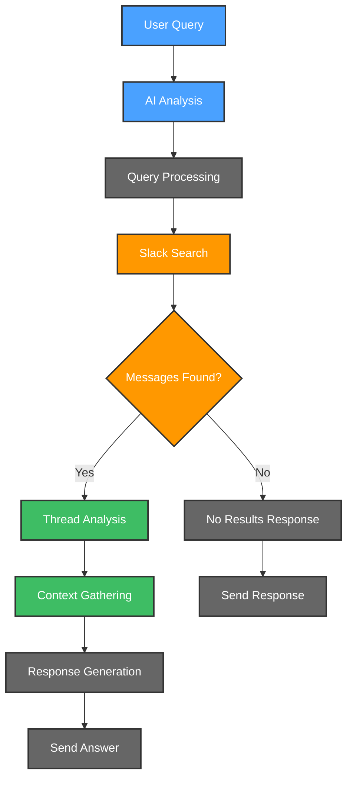

# 🔍 Query Assistant

Query Assistant is your intelligent companion within the Kubiya platform, designed to help users find answers by searching through Slack conversation history. It provides AI-driven search and response generation through natural language queries.

**🎯 Transform your team's knowledge discovery with AI-powered search! Find answers, context, and insights from your Slack conversations through intuitive queries.**

## 🌟 Features

- 🤖 **AI-Powered Search**: Natural language processing for intelligent query understanding
- 📊 **Comprehensive Search**: Searches both messages and thread replies
- 🔄 **Context Preservation**: Maintains conversation context in responses
- 📈 **Relevance Ranking**: Prioritizes most relevant information
- 🚨 **Clear Communication**: Indicates when information cannot be found
- 🛡️ **Source References**: Links back to original messages
- 🔍 **Thread Analysis**: Deep dive into conversation threads

## 🔄 User Flows

### 1. 💬 Query Flow

## 🛠️ Configuration

Below are the key variables used to configure the Query Assistant:

| Variable Name | Description | Type | Default |
|---------------|-------------|------|---------|
| `teammate_name` | Name of the Query Assistant | `string` | `query-assistant` |
| `kubiya_runner` | Runner to use for the teammate | `string` | |
| `source_channel` | Slack channel ID to search for answers | `string` | |
| `kubiya_groups_allowed_groups` | Groups allowed to interact with the teammate | `list(string)` | `['Admin', 'Users']` |
| `debug_mode` | Enable detailed debugging output | `bool` | `false` |

## 🚀 Getting Started

1. **Log into Kubiya Platform**:
   - Visit [app.kubiya.ai](https://app.kubiya.ai)
   - Log in with your credentials

2. **Navigate to Use Cases**:
   - Go to "Teammates" section
   - Click on "Use Cases"
   - Click "Add Use Case"
   - Select "Query Assistant"

3. **Configure Settings**:
   Fill in the required fields:
   - Teammate Name
   - Kubiya Runner
   - Source Channel ID
   - Allowed Groups
   - Debug Mode

4. **Deploy**:
   - Review your configuration
   - Click "Deploy Use Case"
   - Wait for confirmation

## 🎭 Example Scenarios

### Scenario 1: Technical Question

1. **Query**: User asks "How do we deploy to production?"
2. **Search**: Assistant searches channel history
3. **Analysis**: Finds relevant deployment discussions
4. **Response**: Provides answer with links to original messages

### Scenario 2: Policy Question

1. **Query**: "What's our policy on remote work?"
2. **Search**: Searches for policy discussions
3. **Analysis**: Compiles information from multiple threads
4. **Response**: Delivers comprehensive policy summary

## 📊 Key Benefits

- ⚡ Quick access to information
- 🔒 Preserved conversation context
- 📈 Improved team knowledge sharing
- 🎯 Accurate answer finding
- 📝 Source references included

---

Ready to transform your team's knowledge discovery? Deploy your Query Assistant today! 🚀

**[Get Started](https://app.kubiya.ai)** | **[Documentation](https://docs.kubiya.ai)** | **[Request Demo](https://kubiya.ai)**

---

*Let Query Assistant help your team find the answers they need! 🔍✨*
