# Advanced Workflow for Dynamic Approval Flow for Infrastructure Resources

This project implements an advanced workflow for dynamic approval flow for infrastructure resources using Kubiya.ai. Most of the options are configurable and dynamic as part of the Terraform configuration in the `terraform` folder. The `tools` folder includes tool definitions for different parts of the workflow, and the `src` folder includes the source code (business logic) called from the YAML definitions of the tools in the `tools` folder.

## End-to-End Workflow

This project supports a comprehensive workflow to manage infrastructure resources efficiently. The workflow is as follows:

```mermaid
graph TD
    URR["📩 User Requests Resource(s) (e.g., EC2 instance, S3 bucket, RDS instance)"] --> GTM["🧠 Generate Terraform Module (using LLM)"]
    GTM --> TFO["🧠 Generate Terraform Files"]
    TFO --> GTP["🛠️ Generate Terraform Plan"]
    GTP --> GPC["💰 Get Plan Cost (using Infracost)"]
    GPC --> CAMC["⚖️ Compare with Average Monthly Cost"]
    CAMC -->|">= 10%"| RA["🔔 Request Approval if >= 10%"]
    CAMC -->|"< 10%"| CR["✅ Create Resource(s) if < 10%"]
    CR --> SF["📅 Schedule Follow-up in a Week"]
    SF --> AD["👨‍💻 Ask Developer to Keep or Delete Resource(s)"]
    AD -->|Keep| KS["🔄 Keep Resource(s) and Schedule Next Follow-up"]
    AD -->|Delete| DR["🗑️ Delete Resource(s)"]
    KS --> SF
    CR --> CD["📢 Communicate Decision to Developer"]
    RA --> WBA["📬 Webhook to Approvers to Approve"]
    WBA --> AAP["✔️ After Approval, Get Plan, Get TF Code"]
    AAP --> TFA["🚀 Terraform Apply"]
    TFA --> STF["📦 Store the TF State from the Apply"]
    STF --> NR["🔔 Notify Requester"]
    NR --> SF
    CR --> SPR["📊 Store Plan, Store Request"]
    TFO --> SPR

    SF --> GSD["🗄️ Get State from DB"]
    GSD --> DR["🗑️ Destroy Resource(s) (TTL Expires)"]
    DR --> UAP["🔔 Update All Parties"]

    TFA --> RC["🌐 Resource(s) Created"]
    RC --> IU["🧠 Give User Instructions on How to Access (using LLM)"]

    style URR fill:#FFE5B4,stroke:#000,stroke-width:1px
    style GTM fill:#ADD8E6,stroke:#000,stroke-width:1px
    style TFO fill:#ADD8E6,stroke:#000,stroke-width:1px
    style GTP fill:#FFB6C1,stroke:#000,stroke-width:1px
    style GPC fill:#FFD700,stroke:#000,stroke-width:1px
    style CAMC fill:#DDA0DD,stroke:#000,stroke-width:1px
    style RA fill:#FFA07A,stroke:#000,stroke-width:1px
    style CR fill:#98FB98,stroke:#000,stroke-width:1px
    style SF fill:#AFEEEE,stroke:#000,stroke-width:1px
    style AD fill:#FFDAB9,stroke:#000,stroke-width:1px
    style KS fill:#E0FFFF,stroke:#000,stroke-width:1px
    style DR fill:#FFC0CB,stroke:#000,stroke-width:1px
    style CD fill:#E6E6FA,stroke:#000,stroke-width:1px
    style WBA fill:#F5DEB3,stroke:#000,stroke-width:1px
    style AAP fill:#FFB6C1,stroke:#000,stroke-width:1px
    style TFA fill:#E0FFFF,stroke:#000,stroke-width:1px
    style STF fill:#F0E68C,stroke:#000,stroke-width:1px
    style NR fill:#FF69B4,stroke:#000,stroke-width:1px
    style SPR fill:#FFA07A,stroke:#000,stroke-width:1px
    style GSD fill:#98FB98,stroke:#000,stroke-width:1px
    style UAP fill:#FFD700,stroke:#000,stroke-width:1px
    style RC fill:#FFB6C1,stroke:#000,stroke-width:1px
    style IU fill:#ADD8E6,stroke:#000,stroke-width:1px

    linkStyle default stroke:#2d7dd2,stroke-width:2px
    classDef default fill:#f9f9f9,stroke:#000,stroke-width:1px,font-family:Arial
```

## Terraform reference:
| Variable Name            | Description                                                                                      | Type          | Default                                     |
|--------------------------|--------------------------------------------------------------------------------------------------|---------------|---------------------------------------------|
| `agent_name`             | Name of the agent                                                                                | `string`      |                                             |
| `kubiya_runner`          | Runner for the agent                                                                             | `string`      |                                             |
| `agent_description`      | Description of the agent                                                                         | `string`      |                                             |
| `agent_instructions`     | Instructions for the agent                                                                       | `string`      |                                             |
| `llm_model`              | Model to be used by the agent                                                                    | `string`      |                                             |
| `agent_image`            | Image for the agent                                                                              | `string`      |                                             |
| `secrets`                | Secrets for the agent                                                                            | `list(string)`|                                             |
| `integrations`           | Integrations for the agent                                                                       | `list(string)`|                                             |
| `users`                  | Users for the agent                                                                              | `list(string)`|                                             |
| `groups`                 | Groups for the agent                                                                             | `list(string)`|                                             |
| `agent_tool_sources`     | Sources (can be URLs such as GitHub repositories or gist URLs) for the tools accessed by the agent| `list(string)`| `["https://github.com/kubiyabot/community-tools"]` |
| `links`                  | Links for the agent                                                                              | `list(string)`| `[]`                                        |
| `log_level`              | Log level                                                                                        | `string`      | `INFO`                                      |
| `grace_period`           | Grace period for nagging reminders                                                               | `string`      | `5h`                                       |
| `max_ttl`                | Maximum TTL for a request                                                                        | `string`      | `30d`                                      |
| `approval_slack_channel` | Slack channel for approval notifications                                                         | `string`      |                                             |
| `tf_modules_urls`        | URLs for the Terraform modules                                                                   | `list(string)`| `[]`                                        |
| `allowed_vendors`        | Allowed cloud vendors                                                                            | `string`      | `aws`                                       |
| `extension_period`       | Extension period for resource TTL                                                                | `string`      | `1w`                                       |
| `approving_users`        | List of users who can approve                                                                    | `list(string)`|                                             |
| `debug`                  | Enable debug mode                                                                                | `bool`        | `false`                                     |
| `dry_run`                | Enable dry run mode (no changes will be made to infrastructure from the agent)                   | `bool`        | `false`                                     |
