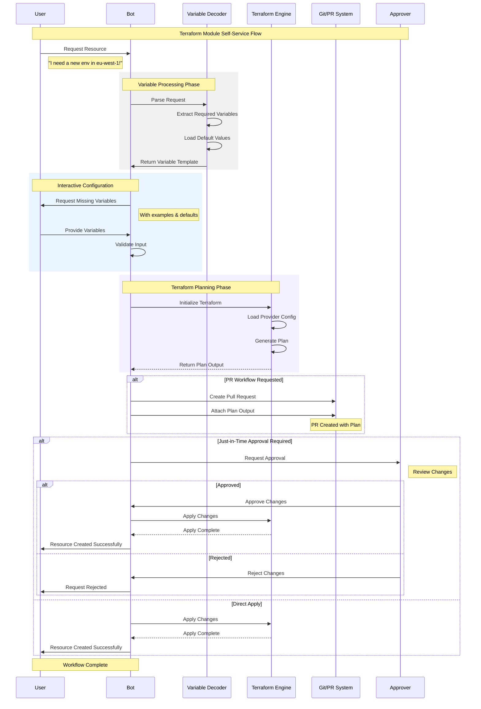

# 🚀 Terraform Modules Self-Service Kiosk

The **Terraform Modules Self-Service Kiosk** is your intelligent assistant within the Kubiya platform, designed to empower users to deploy infrastructure effortlessly using Terraform modules. It provides a dynamic tool that ingests any Terraform module and allows users to self-serve resources with features like Just-In-Time (JIT) approvals, TTLs, and more.

With this kiosk, you can offload the complexity of Terraform knowledge and enable users to provision infrastructure safely and efficiently!

---


## 🌟 Key Features

- **Dynamic Module Ingestion**: Ingest any Terraform module and make it available for self-service.
- **Interactive Variable Resolution**: Parses user requests and dynamically resolves variables with defaults and examples.
- **Just-In-Time (JIT) Approvals**: Enforce JIT approval workflows for resource provisioning.
- **Time-To-Live (TTL) Management**: Set TTLs on resources to ensure they are automatically cleaned up.
- **Self-Service with Guardrails**: Empower users to provision infrastructure while maintaining compliance and control.
- **Knowledge Offloading**: Abstract complex Terraform knowledge, making infrastructure deployment accessible to all team members.

---

## 🧩 Architecture Overview



---

## 🎯 Use Cases

- **Self-Service Infrastructure**: Enable developers and team members to provision infrastructure without deep Terraform expertise.
- **JIT Deployment**: Enforce approval workflows for critical changes or high-risk environments.
- **Temporary Environments**: Allow users to create environments with TTL to support short-term projects or testing.
- **Compliance and Governance**: Maintain control over infrastructure changes with approval processes and automated audit trails.

---

## 🛠 Configuration

Below are the key variables used to configure the Terraform Modules Self-Service Kiosk:

| Variable Name                   | Description                                                                                 | Type          | Default                        | Required |
|---------------------------------|---------------------------------------------------------------------------------------------|---------------|--------------------------------|----------|
| `teammate_name`                 | Name of your Terraform Kiosk teammate                                                       | `string`      | `"iac-self-service-manager"`   | Yes      |
| `kubiya_runner`                 | Runner to use for the teammate                                                              | `string`      | `"default"`                    | Yes      |
| `kubiya_integrations`           | List of integrations required for the teammate (e.g., `["slack", "github"]`)                | `list(string)`| `["slack"]`                    | Yes      |
| `kubiya_groups_allowed_groups`  | Groups allowed to interact with the teammate (e.g., `["Admin", "DevOps"]`)                  | `list(string)`| `["Admin"]`                    | Yes      |
| `tf_module_config_yaml`         | Terraform module configuration in YAML format                                               | `string`      | *(Example provided)*           | Yes      |
| `kubiya_secrets`                | List of secrets to pass to the teammate (e.g., AWS credentials)                             | `list(string)`| `["MY_TOOL_SECRET"]`           | Yes      |
| `module_knowledge_yaml`         | Additional organizational knowledge to help the teammate understand the Terraform modules   | `string`      | See example below              | No       |

### Example `tf_module_config_yaml`:

```yaml
aws_sqs:
  name: "AWS SQS"
  description: "Creates an SQS queue with all configurations"
  source:
    location: "https://github.com/terraform-aws-modules/terraform-aws-sqs"
    version: "master"

aws_s3:
  name: "AWS S3"
  description: "Creates an S3 bucket with optional configurations"
  source:
    location: "https://github.com/terraform-aws-modules/terraform-aws-s3-bucket"
    version: "master"
```

### Example `module_knowledge_yaml`:

```yaml
Try to adjust to the module names and descriptions to find the best match for user requests when it comes to infrastructure requests.
```

---

## 🚀 Getting Started

1. **Log into Kubiya Platform**:
   - Visit [app.kubiya.ai](https://app.kubiya.ai)
   - Log in with your credentials

2. **Navigate to Use Cases**:
   - Go to the "Teammates" section
   - Click on "Use Cases"
   - Click "Add Use Case"
   - Select "Terraform Modules Self-Service Kiosk"

3. **Configure Settings**:
   - Fill in the required fields:
     - Teammate Name (e.g., `"iac-self-service-manager"`)
     - Runner (e.g., `"default"`)
     - Integrations (e.g., `["slack"]`)
     - Groups Allowed (e.g., `["Admin", "DevOps"]`)
     - Provide your `tf_module_config_yaml` and `module_knowledge_yaml`

4. **Deploy**:
   - Review your configuration
   - Run `terraform init` and `terraform apply`
   - Wait for confirmation

---

## 🤖 How It Works

### 1. **User Request**

- **Users** interact with the bot using natural language.
- Example: "I need a new environment in eu-west-1!"

### 2. **Variable Processing**

- **Bot** parses the request and identifies which Terraform module matches best.
- **Variable Decoder** extracts required variables and applies defaults.

### 3. **Interactive Configuration**

- **Bot** engages with the user to fill in any missing information.
- Provides examples and default values to assist the user.

### 4. **Terraform Planning**

- **Bot** triggers the Terraform Engine to generate a plan.
- User can review the plan before applying changes.

### 5. **Approval Workflow**

- Depending on the configuration, the bot may:
  - Create a Pull Request in Git for code review.
  - Request Just-In-Time approval from an **Approver**.
  - Apply changes directly if allowed.

### 6. **Deployment**

- Upon approval, the **Terraform Engine** applies the changes.
- **Bot** notifies the user of success or any issues.

---

## 🎭 Example Scenarios

### Scenario 1: Developer Needs a New Database

**User**: "Hey, I need a new PostgreSQL database for testing."

**Bot**:

- Identifies the appropriate Terraform module.
- Asks for required variables (e.g., database name, size).
- Provides defaults and examples.
- Generates a Terraform plan and shares it with the user.
- Requests approval if necessary.
- Provisions the database upon approval.

### Scenario 2: Temporary Environment for QA

**User**: "Set up a temporary environment for QA testing."

**Bot**:

- Matches the request to a Terraform module that sets up environments.
- Collects necessary information interactively.
- Sets a TTL on the resources to ensure automatic teardown.
- Deploys the environment.
- Notifies the user and schedules resource cleanup.

---

## 🔒 Security and Compliance

- **Just-In-Time Approvals**: Ensure that all changes are authorized before deployment.
- **Time-To-Live (TTL)**: Automatically clean up resources after a set period to prevent sprawl.
- **Audit Trails**: All interactions and changes are logged for compliance and auditing purposes.
- **Access Control**: Define which users or groups can interact with the kiosk.

---

## 📈 Benefits

- **Empowers Users**: Allow team members to provision infrastructure without deep Terraform knowledge.
- **Improves Efficiency**: Speeds up the provisioning process by automating variable resolution and deployment.
- **Enhances Compliance**: Keeps infrastructure changes within approved guidelines and processes.
- **Reduces Errors**: Interactive configuration and validation help prevent misconfigurations.

---

## 🛡️ Integrations

- **Slack**: For interactive communication and notifications.
- **GitHub/GitLab**: For PR workflows and code reviews.
- **Terraform**: Core engine for infrastructure provisioning.
- **Approval Systems**: Integrate with existing approval processes or tools.

---

## 🧑‍💻 Contributing

We welcome contributions to enhance the **Terraform Modules Self-Service Kiosk**. Please feel free to submit issues, feature requests, or pull requests.

---

With the **Terraform Modules Self-Service Kiosk**, you can revolutionize how your team interacts with infrastructure, bringing agility, compliance, and empowerment together!

**Let's build the future of self-service infrastructure provisioning!** 🚀🎉 
